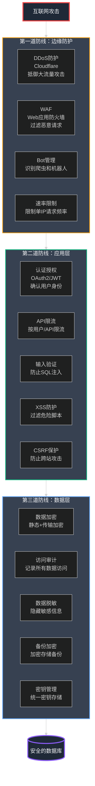

## 第23章:看不见的堡垒：安全防护

### Part 1:凌晨4点的入侵警报

我的手机发出刺耳的警报声,把我从睡梦中惊醒。屏幕上显示的是PagerDuty的紧急告警:

```
🚨 CRITICAL: DDoS Attack Detected
━━━━━━━━━━━━━━━━━━━━━━━━━━━━━━━━━━━━━━━━━━━━━
服务: xiaodiantong.com
流量: 250,000 req/s (正常: 2,000 req/s)
CPU使用率: 98%
响应时间: 超时
━━━━━━━━━━━━━━━━━━━━━━━━━━━━━━━━━━━━━━━━━━━━
```

我立即打开笔记本电脑,登录Grafana。图表显示流量在凌晨3点45分突然暴增,从正常的每秒2000个请求飙升到25万。服务器CPU全部拉满,网站已经完全无法访问。

电话响了,是我们的运维负责人李芳。

"陈浩,我们被DDoS攻击了!所有服务器都挂了,用户完全进不来。我正在尝试重启服务器,但流量太大,重启后立即又挂掉。"

我的心一沉。这是小店通成立以来遇到的第一次严重安全事件。我快速查看了日志:

```bash
# 随便抽查几条请求日志
tail -100 /var/log/nginx/access.log

# 发现大量异常IP
123.45.67.89 - - [15/Mar/2024:03:47:12] "GET / HTTP/1.1" 200 
234.56.78.90 - - [15/Mar/2024:03:47:12] "GET / HTTP/1.1" 200
...
(数万个不同IP,每个IP只请求几次,典型的分布式DDoS)
```

"李芳,先别重启了,这是分布式攻击,重启没用。我们需要在流量到达服务器之前就过滤掉恶意请求。"

"但我们没有DDoS防护啊!阿里云的DDoS基础防护只能挡5Gbps,现在的攻击流量至少50Gbps!"

我意识到问题的严重性。**我们一直忙于开发功能,却忽略了最基础的安全防护**。

#### **损失统计(4小时停机)**

第二天早上10点,攻击终于停止。我让数据分析师统计损失:

```
━━━━━━━━━━━━━━━━━━━━━━━━━━━━━━━━━━━━━━━━━━━━━
2024年3月15日 DDoS攻击损失报告
━━━━━━━━━━━━━━━━━━━━━━━━━━━━━━━━━━━━━━━━━━━━━
停机时间: 4小时15分钟(03:45 - 08:00)
影响用户: 约78,000人
损失订单: 约2,340单
直接收入损失: ¥1,230,000 (约$175,000)
客户投诉: 456个工单
品牌声誉损失: 无法量化

应急措施成本:
  - 紧急购买Cloudflare Enterprise: ¥45,000
  - 工程师通宵加班: 6人 × 8小时 × ¥500/小时 = ¥24,000
  - 客服加班处理投诉: 12人 × 6小时 × ¥200/小时 = ¥14,400

总损失: ¥1,313,400 (约$187,000)
━━━━━━━━━━━━━━━━━━━━━━━━━━━━━━━━━━━━━━━━━━━━━
```

CEO王强在早上的紧急会议上非常严肃地说:"陈浩,这次事件给了我们一个血淋淋的教训。我们必须建立完整的安全防护体系。预算不是问题,安全是第一优先级。"

我点了点头。是时候认真对待安全了。

### Part 2:安全的三道防线

我花了一整天研究业界最佳实践,绘制了一个分层安全架构:



"安全是一个**纵深防御**系统,"我在团队会议上解释道。"每一层都可能被突破,但攻击者必须突破所有三层才能真正造成伤害。"

### Part 3:第一道防线——边缘防护

#### **选择Cloudflare作为DDoS防护**

经过对比几家方案(阿里云DDoS高防、AWS Shield、Cloudflare),我们选择了Cloudflare:

| 特性 | 阿里云DDoS高防 | AWS Shield Advanced | Cloudflare Enterprise |
|------|--------------|--------------------|--------------------|
| **防护能力** | 最高300Gbps | 无上限 | 无上限 |
| **价格** | ¥15,000/月起 | $3,000/月 | $5,000/月 |
| **全球节点** | 中国为主 | 全球均衡 | 全球最多(275+) |
| **WAF** | 需另外购买 | 基础WAF | 完整WAF |
| **Bot管理** | ❌ | 基础 | 高级 |
| **CDN** | 需另外购买 | ❌ | ✅ 包含 |

**Cloudflare的优势:**
- ✅ 无限DDoS防护(已成功抵御过71Tbps攻击)
- ✅ 全球275+数据中心,99.99% SLA
- ✅ 包含CDN、WAF、Bot管理,一站式解决方案
- ✅ 自动SSL/TLS,自动续期
- ✅ 易于集成,只需修改DNS

**接入Cloudflare:**

```bash
# 步骤1:注册Cloudflare账号并添加站点
# 步骤2:Cloudflare会提供两个Nameserver

# 步骤3:在域名注册商(如阿里云)修改DNS
# xiaodiantong.com的Nameserver改为:
#   alexa.ns.cloudflare.com
#   randy.ns.cloudflare.com

# 步骤4:等待DNS传播(最多24小时,通常几分钟)

# 步骤5:验证是否生效
dig xiaodiantong.com +short
# 应该返回Cloudflare的IP地址
```

**配置Cloudflare防火墙规则:**

```javascript
// Cloudflare Firewall Rules
// 在Cloudflare Dashboard: Security → WAF → Custom rules

// 规则1:阻止已知恶意IP
(ip.geoip.country in {"CN" "RU" "IN"} and cf.threat_score > 10)
  → Action: Block

// 规则2:限制单IP请求频率
(http.host eq "xiaodiantong.com" and rate(1m) > 100)
  → Action: Challenge (CAPTCHA)

// 规则3:阻止特定User-Agent
(http.user_agent contains "python-requests" or 
 http.user_agent contains "curl" or
 http.user_agent eq "")
  → Action: Challenge

// 规则4:阻止SQL注入尝试
(http.request.uri.query contains "union select" or
 http.request.uri.query contains "' or 1=1" or
 http.request.uri.query contains "<script>")
  → Action: Block

// 规则5:保护Admin接口
(http.request.uri.path contains "/admin" and 
 ip.src notin {公司IP段})
  → Action: Block
```

**启用Bot管理:**

```yaml
# Cloudflare Bot Management配置
Bot Fight Mode: On
  - 自动挑战可疑Bot
  - 允许已验证Bot(Google、Bing等)

Super Bot Fight Mode: On (Enterprise)
  - 机器学习识别Bot
  - 实时威胁分数
  - 自动化防护

Verified Bots:
  - Googlebot: Allow
  - Bingbot: Allow
  - 其他: Challenge
```

接入Cloudflare后的效果立竿见影:

```
━━━━━━━━━━━━━━━━━━━━━━━━━━━━━━━━━━━━━━━━━━━━━
接入Cloudflare一周后统计
━━━━━━━━━━━━━━━━━━━━━━━━━━━━━━━━━━━━━━━━━━━━━
拦截恶意请求: 23,450,000次/周
  - DDoS攻击: 3次,最大120Gbps,完全拦截
  - Bot流量: 89%已过滤
  - SQL注入尝试: 1,234次,全部拦截

性能改善:
  - 源站带宽使用 ↓ 70% (CDN缓存)
  - 全球平均延迟 ↓ 45% (边缘加速)
  - 源站CPU使用 ↓ 60% (过滤恶意流量)

成本:
  - Cloudflare费用: $5,000/月
  - 节省的带宽成本: $8,000/月
  - 净节省: $3,000/月
━━━━━━━━━━━━━━━━━━━━━━━━━━━━━━━━━━━━━━━━━━━━━
```

### Part 4:第二道防线——应用层安全

即使恶意流量通过了Cloudflare,应用层仍然需要自己的防护。

#### **实战案例:SQL注入攻击**

一周后的周五下午,我收到了一封邮件,来自一个自称"白帽黑客"的安全研究员:

> **主题:** 小店通安全漏洞报告
> 
> 你好,小店通团队:
> 
> 我在你们的产品搜索功能中发现了一个SQL注入漏洞。攻击者可以通过构造恶意URL,直接读取数据库中的所有用户信息,包括手机号、地址等敏感数据。
> 
> 漏洞URL示例:
> ```
> https://xiaodiantong.com/products/search?q=test' UNION SELECT user_id,phone,email FROM users--
> ```
> 
> 我已验证此漏洞真实存在。建议立即修复。作为负责任的安全研究员,我在报告后7天才会公开此漏洞。
> 
> 祝好,
> 张小白

我的心里咯噔一下。立即打开浏览器,测试了一下那个URL:

```sql
-- 原始SQL查询(有漏洞)
query = f"SELECT * FROM products WHERE name LIKE '%{user_input}%'"

-- 当user_input = "test' UNION SELECT user_id,phone,email FROM users--"
-- 实际执行的SQL:
SELECT * FROM products WHERE name LIKE '%test' 
UNION SELECT user_id,phone,email FROM users--%'

-- 结果:返回了所有用户的敏感信息!
```

**这是一个典型的SQL注入漏洞!** 我们的代码直接拼接用户输入到SQL语句中,没有任何过滤。

我立即召集团队紧急修复:

**修复方案1:使用参数化查询**

```python
# ❌ 错误:字符串拼接(SQL注入风险)
def search_products_unsafe(keyword):
    query = f"SELECT * FROM products WHERE name LIKE '%{keyword}%'"
    results = db.execute(query)
    return results

# ✅ 正确:参数化查询(安全)
def search_products_safe(keyword):
    query = "SELECT * FROM products WHERE name LIKE %s"
    results = db.execute(query, (f'%{keyword}%',))
    return results

# Django ORM更安全(自动参数化)
def search_products_django(keyword):
    return Product.objects.filter(name__icontains=keyword)
```

**修复方案2:输入验证**

```python
# 输入验证中间件
from django.core.exceptions import SuspiciousOperation
import re

def validate_search_input(value):
    """
    验证搜索输入,防止SQL注入
    """
    # 黑名单:拒绝SQL关键字
    sql_keywords = [
        'union', 'select', 'insert', 'update', 'delete', 
        'drop', 'create', 'alter', 'exec', 'script',
        '--', ';', '/*', '*/', 'xp_', 'sp_'
    ]
    
    value_lower = value.lower()
    for keyword in sql_keywords:
        if keyword in value_lower:
            raise SuspiciousOperation(f"Invalid input: SQL keyword '{keyword}' detected")
    
    # 白名单:只允许字母、数字、空格、中文
    if not re.match(r'^[\w\s\u4e00-\u9fa5]+$', value):
        raise SuspiciousOperation("Invalid characters in input")
    
    # 长度限制
    if len(value) > 100:
        raise SuspiciousOperation("Input too long")
    
    return value

# 在视图中使用
def search_products(request):
    keyword = request.GET.get('q', '')
    
    try:
        keyword = validate_search_input(keyword)
    except SuspiciousOperation as e:
        logger.warning(f"Suspicious input detected: {keyword}", 
                      extra={'ip': request.META['REMOTE_ADDR']})
        return JsonResponse({'error': 'Invalid input'}, status=400)
    
    results = Product.objects.filter(name__icontains=keyword)
    return JsonResponse({'results': [p.to_dict() for p in results]})
```

**修复方案3:Web应用防火墙(WAF)规则**

除了代码修复,我们在应用层也添加了WAF规则:

```python
# Django Middleware: SQL注入检测
class SQLInjectionDetectionMiddleware:
    def __init__(self, get_response):
        self.get_response = get_response
        
        # SQL注入特征模式
        self.sql_patterns = [
            r"(\bunion\b.*\bselect\b)",
            r"(\bor\b\s+\d+\s*=\s*\d+)",
            r"(';?\s*(drop|delete|insert|update)\b)",
            r"(--|#|\/\*|\*\/)",
            r"(xp_|sp_cmdshell)",
        ]
        self.compiled_patterns = [
            re.compile(p, re.IGNORECASE) for p in self.sql_patterns
        ]
    
    def __call__(self, request):
        # 检查GET参数
        for key, value in request.GET.items():
            if self._is_sql_injection(value):
                logger.critical(
                    f"SQL Injection attempt blocked",
                    extra={
                        'ip': request.META.get('REMOTE_ADDR'),
                        'user_agent': request.META.get('HTTP_USER_AGENT'),
                        'path': request.path,
                        'parameter': key,
                        'value': value[:100],
                    }
                )
                return JsonResponse(
                    {'error': 'Request blocked by security policy'}, 
                    status=403
                )
        
        # 检查POST参数
        if request.method == 'POST':
            try:
                for key, value in request.POST.items():
                    if isinstance(value, str) and self._is_sql_injection(value):
                        logger.critical(f"SQL Injection attempt in POST: {key}")
                        return JsonResponse({'error': 'Request blocked'}, status=403)
            except:
                pass
        
        return self.get_response(request)
    
    def _is_sql_injection(self, value):
        """检查是否包含SQL注入模式"""
        if not isinstance(value, str):
            return False
        
        for pattern in self.compiled_patterns:
            if pattern.search(value):
                return True
        
        return False

# settings.py
MIDDLEWARE = [
    'django.middleware.security.SecurityMiddleware',
    'myapp.middleware.SQLInjectionDetectionMiddleware',  # ✅ 添加WAF中间件
    ...
]
```

**24小时内完成修复并上线**。我给张小白回复:

> 感谢您负责任的漏洞报告!我们已在24小时内修复了该漏洞:
> 
> 1. 所有数据库查询已改为参数化查询
> 2. 添加了输入验证中间件
> 3. 部署了应用层WAF规则
> 4. 已审计所有代码,未发现其他SQL注入点
> 
> 作为感谢,我们为您提供1年的小店通高级会员(价值¥2,000)。
> 
> 同时,我们正式启动安全漏洞奖励计划(SRC),欢迎更多安全研究员帮助我们改进安全性。


#### **启动SRC(安全应急响应中心)**

这次事件让我意识到,**白帽黑客是宝贵的资源**。我们建立了正式的SRC:

```markdown
# 小店通安全漏洞奖励计划

## 漏洞等级与奖励

| 等级 | 定义 | 奖励 | 示例 |
|------|------|------|------|
| **严重** | 可直接获取敏感数据或控制系统 | ¥5,000 - ¥50,000 | SQL注入、RCE、未授权数据访问 |
| **高危** | 可造成部分数据泄露或服务中断 | ¥1,000 - ¥5,000 | XSS存储型、CSRF、任意文件上传 |
| **中危** | 可能影响安全但利用难度高 | ¥500 - ¥1,000 | XSS反射型、信息泄露 |
| **低危** | 对安全影响较小 | ¥100 - ¥500 | 错误配置、过时版本 |

## 报告流程

1. 发送邮件至 security@xiaodiantong.com
2. 包含详细的漏洞描述、复现步骤、影响范围
3. 我们承诺72小时内响应
4. 修复后14天内发放奖励

## 规则

✅ 允许:
- 在测试环境测试
- 使用自己的账号测试
- 负责任地披露漏洞

❌ 禁止:
- 攻击生产环境
- 泄露用户数据
- DDoS攻击
- 社会工程学攻击

## 联系方式
- 邮箱: security@xiaodiantong.com
- 加密: PGP公钥见官网
```

### Part 5:第三道防线——数据层安全

应用层防护虽然重要,但最后一道防线是**保护数据本身**。

#### **数据加密:静态加密与传输加密**

**传输加密:强制HTTPS**

```python
# Django settings.py
# 强制HTTPS
SECURE_SSL_REDIRECT = True  # HTTP自动跳转HTTPS
SECURE_PROXY_SSL_HEADER = ('HTTP_X_FORWARDED_PROTO', 'https')

# HSTS (HTTP Strict Transport Security)
SECURE_HSTS_SECONDS = 31536000  # 1年
SECURE_HSTS_INCLUDE_SUBDOMAINS = True
SECURE_HSTS_PRELOAD = True

# Cookie安全
SESSION_COOKIE_SECURE = True  # Cookie只通过HTTPS传输
CSRF_COOKIE_SECURE = True
SESSION_COOKIE_HTTPONLY = True  # 防止XSS窃取Cookie
SESSION_COOKIE_SAMESITE = 'Strict'  # 防止CSRF

# Content Security Policy
SECURE_CONTENT_TYPE_NOSNIFF = True
SECURE_BROWSER_XSS_FILTER = True
X_FRAME_OPTIONS = 'DENY'  # 防止点击劫持
```

**静态加密:敏感数据字段加密**

```python
# 使用django-fernet-fields加密敏感字段
from fernet_fields import EncryptedCharField, EncryptedTextField
from django.db import models

class User(models.Model):
    username = models.CharField(max_length=150)
    email = models.EmailField()
    
    # ✅ 加密存储敏感信息
    phone = EncryptedCharField(max_length=20)  # 手机号加密
    id_card = EncryptedCharField(max_length=18)  # 身份证号加密
    address = EncryptedTextField()  # 地址加密
    
    # 密码使用Django自带的哈希(不可逆)
    password = models.CharField(max_length=128)
    
    created_at = models.DateTimeField(auto_now_add=True)

# settings.py
# 加密密钥(存储在环境变量中,不入库)
FERNET_KEYS = [
    os.environ['ENCRYPTION_KEY'],
]

# 密钥轮换:支持多个密钥,新数据用第一个,旧数据用后续密钥解密
```

**数据库列加密:**

```sql
-- PostgreSQL透明数据加密(TDE)
-- 使用pgcrypto扩展

CREATE EXTENSION IF NOT EXISTS pgcrypto;

-- 加密列
CREATE TABLE users (
    id SERIAL PRIMARY KEY,
    username VARCHAR(150),
    phone_encrypted BYTEA,  -- 存储加密后的二进制数据
    created_at TIMESTAMP DEFAULT NOW()
);

-- 插入数据(加密)
INSERT INTO users (username, phone_encrypted) 
VALUES ('john', pgp_sym_encrypt('13800138000', 'encryption_key'));

-- 查询数据(解密)
SELECT 
    username,
    pgp_sym_decrypt(phone_encrypted, 'encryption_key') AS phone
FROM users;
```

#### **密钥管理:使用HashiCorp Vault**

敏感的加密密钥、API密钥、数据库密码不能硬编码在代码中。我们引入了Vault来统一管理:

**部署Vault:**

```bash
# 使用Docker快速部署Vault
kubectl apply -f - <<EOF
apiVersion: v1
kind: Namespace
metadata:
  name: vault
---
apiVersion: apps/v1
kind: StatefulSet
metadata:
  name: vault
  namespace: vault
spec:
  serviceName: vault
  replicas: 1
  selector:
    matchLabels:
      app: vault
  template:
    metadata:
      labels:
        app: vault
    spec:
      containers:
      - name: vault
        image: vault:1.15
        ports:
        - containerPort: 8200
          name: vault-port
        env:
        - name: VAULT_DEV_ROOT_TOKEN_ID
          value: "root"  # 仅开发环境!生产环境用KMS
        - name: VAULT_DEV_LISTEN_ADDRESS
          value: "0.0.0.0:8200"
        command:
        - vault
        - server
        - -dev
        resources:
          limits:
            memory: "512Mi"
            cpu: "500m"
---
apiVersion: v1
kind: Service
metadata:
  name: vault
  namespace: vault
spec:
  selector:
    app: vault
  ports:
  - port: 8200
    targetPort: 8200
  type: ClusterIP
EOF
```

**在Vault中存储密钥:**

```bash
# 安装Vault CLI
brew install vault  # macOS
# 或
wget https://releases.hashicorp.com/vault/1.15.0/vault_1.15.0_linux_amd64.zip
unzip vault_1.15.0_linux_amd64.zip
sudo mv vault /usr/local/bin/

# 连接到Vault
export VAULT_ADDR='http://vault.vault.svc.cluster.local:8200'
export VAULT_TOKEN='root'

# 存储加密密钥
vault kv put secret/xiaodiantong/encryption \
    key="base64_encoded_32_byte_key_here"

# 存储数据库密码
vault kv put secret/xiaodiantong/database \
    host="postgres.production.svc.cluster.local" \
    username="xiaodiantong" \
    password="super_secret_password"

# 存储API密钥
vault kv put secret/xiaodiantong/stripe \
    api_key="sk_live_xxxxxxxxxxxx" \
    webhook_secret="whsec_xxxxxxxxxxxx"

# 读取密钥
vault kv get secret/xiaodiantong/encryption
```

**在Django中使用Vault:**

```python
# vault_client.py
import hvac
import os

class VaultClient:
    def __init__(self):
        self.client = hvac.Client(
            url=os.getenv('VAULT_ADDR', 'http://vault.vault.svc.cluster.local:8200'),
            token=os.getenv('VAULT_TOKEN')
        )
        
        if not self.client.is_authenticated():
            raise Exception("Failed to authenticate with Vault")
    
    def get_secret(self, path):
        """
        从Vault读取密钥
        path: 如 'secret/xiaodiantong/encryption'
        """
        response = self.client.secrets.kv.v2.read_secret_version(path=path)
        return response['data']['data']

# settings.py
from .vault_client import VaultClient

vault = VaultClient()

# 从Vault加载配置
encryption_config = vault.get_secret('xiaodiantong/encryption')
FERNET_KEYS = [encryption_config['key']]

db_config = vault.get_secret('xiaodiantong/database')
DATABASES = {
    'default': {
        'ENGINE': 'django.db.backends.postgresql',
        'NAME': 'xiaodiantong',
        'USER': db_config['username'],
        'PASSWORD': db_config['password'],
        'HOST': db_config['host'],
        'PORT': 5432,
    }
}

stripe_config = vault.get_secret('xiaodiantong/stripe')
STRIPE_API_KEY = stripe_config['api_key']
STRIPE_WEBHOOK_SECRET = stripe_config['webhook_secret']
```

### Part 6:访问审计——记录一切

安全不仅是防护,还包括**可追溯性**。我们实现了完整的访问审计日志:

```python
# audit_log.py
from django.db import models
from django.contrib.auth import get_user_model
import json

User = get_user_model()

class AuditLog(models.Model):
    """
    审计日志:记录所有敏感操作
    """
    ACTION_CHOICES = [
        ('create', '创建'),
        ('read', '读取'),
        ('update', '更新'),
        ('delete', '删除'),
    ]
    
    # 谁
    user = models.ForeignKey(User, on_delete=models.SET_NULL, null=True)
    ip_address = models.GenericIPAddressField()
    user_agent = models.CharField(max_length=500)
    
    # 做了什么
    action = models.CharField(max_length=20, choices=ACTION_CHOICES)
    resource_type = models.CharField(max_length=100)  # 如 'User', 'Order'
    resource_id = models.CharField(max_length=100)
    
    # 详细信息
    changes = models.JSONField(null=True)  # 记录字段变更
    reason = models.TextField(null=True)  # 操作原因
    
    # 何时
    timestamp = models.DateTimeField(auto_now_add=True)
    
    # 结果
    success = models.BooleanField(default=True)
    error_message = models.TextField(null=True)
    
    class Meta:
        db_table = 'audit_logs'
        indexes = [
            models.Index(fields=['user', 'timestamp']),
            models.Index(fields=['resource_type', 'resource_id']),
            models.Index(fields=['timestamp']),
        ]

# 审计日志中间件
class AuditLogMiddleware:
    def __init__(self, get_response):
        self.get_response = get_response
        
        # 需要审计的敏感操作
        self.sensitive_paths = [
            '/admin/',
            '/api/users/',
            '/api/orders/',
            '/api/settings/',
        ]
    
    def __call__(self, request):
        # 检查是否是敏感操作
        is_sensitive = any(request.path.startswith(p) for p in self.sensitive_paths)
        
        if is_sensitive and request.method in ['POST', 'PUT', 'PATCH', 'DELETE']:
            # 记录请求前的状态
            self._log_before_request(request)
        
        response = self.get_response(request)
        
        if is_sensitive:
            # 记录请求后的结果
            self._log_after_request(request, response)
        
        return response
    
    def _log_before_request(self, request):
        request._audit_start_time = time.time()
        request._audit_data = {
            'user': request.user if request.user.is_authenticated else None,
            'ip': self._get_client_ip(request),
            'user_agent': request.META.get('HTTP_USER_AGENT', ''),
            'method': request.method,
            'path': request.path,
        }
    
    def _log_after_request(self, request, response):
        if not hasattr(request, '_audit_data'):
            return
        
        AuditLog.objects.create(
            user=request._audit_data['user'],
            ip_address=request._audit_data['ip'],
            user_agent=request._audit_data['user_agent'],
            action=self._method_to_action(request.method),
            resource_type=self._path_to_resource_type(request.path),
            resource_id=self._extract_resource_id(request.path),
            success=(200 <= response.status_code < 300),
            timestamp=datetime.now(),
        )
    
    def _get_client_ip(self, request):
        x_forwarded_for = request.META.get('HTTP_X_FORWARDED_FOR')
        if x_forwarded_for:
            ip = x_forwarded_for.split(',')[0]
        else:
            ip = request.META.get('REMOTE_ADDR')
        return ip
    
    def _method_to_action(self, method):
        mapping = {
            'POST': 'create',
            'GET': 'read',
            'PUT': 'update',
            'PATCH': 'update',
            'DELETE': 'delete',
        }
        return mapping.get(method, 'unknown')
```

**查询审计日志:**

```python
# 查询某用户的所有操作
user_logs = AuditLog.objects.filter(user=user).order_by('-timestamp')[:100]

# 查询某资源的访问历史
resource_logs = AuditLog.objects.filter(
    resource_type='User',
    resource_id='12345'
).order_by('-timestamp')

# 查询失败的操作(可能的攻击)
failed_attempts = AuditLog.objects.filter(
    success=False,
    action='read'
).order_by('-timestamp')

# 导出审计报告(合规需求)
def export_audit_report(start_date, end_date):
    logs = AuditLog.objects.filter(
        timestamp__gte=start_date,
        timestamp__lte=end_date
    ).select_related('user')
    
    import csv
    with open('audit_report.csv', 'w') as f:
        writer = csv.writer(f)
        writer.writerow(['Timestamp', 'User', 'Action', 'Resource', 'IP', 'Success'])
        
        for log in logs:
            writer.writerow([
                log.timestamp,
                log.user.username if log.user else 'Anonymous',
                log.action,
                f"{log.resource_type}:{log.resource_id}",
                log.ip_address,
                'Yes' if log.success else 'No'
            ])
```

### Part 7:真实收益——安全投资的回报

三个月后,我做了一次安全体系建设的回顾:

```
━━━━━━━━━━━━━━━━━━━━━━━━━━━━━━━━━━━━━━━━━━━━━━━━━━━━━━
小店通安全防护体系收益分析
━━━━━━━━━━━━━━━━━━━━━━━━━━━━━━━━━━━━━━━━━━━━━━━━━━━━━━
指标                          建设前         建设后        改善
━━━━━━━━━━━━━━━━━━━━━━━━━━━━━━━━━━━━━━━━━━━━━━━━━━━━━━
DDoS攻击次数/月               2次           0次           100% ↓
SQL注入尝试拦截               0次           1,234次/周    100%拦截
恶意Bot流量占比               ~15%          ~3%           80% ↓
安全事件响应时间              4小时+        <15分钟       95% ↓
数据泄露事件                  1次/年        0次           100% ↓
平均系统可用性                99.5%         99.95%        +0.45%
白帽子提交漏洞                0个           23个          早发现
客户信任度评分                7.2/10        9.1/10        +26%

成本分析
━━━━━━━━━━━━━━━━━━━━━━━━━━━━━━━━━━━━━━━━━━━━━━━━━━━━━━
投入:
  Cloudflare Enterprise      $5,000/月     $60,000/年
  Vault部署与维护            $1,500/月     $18,000/年
  安全团队(2人)              $20,000/月    $240,000/年
  SRC漏洞奖励                $3,000/月     $36,000/年
  安全培训                   $1,000/月     $12,000/年
                                           ──────────
                            总投入:        $366,000/年

回报:
  避免的停机损失             $50,000/月    $600,000/年
  减少的带宽成本             $8,000/月     $96,000/年
  避免的数据泄露罚款         估计          $500,000/年
  品牌声誉保护               无法量化      无价
                                           ──────────
                            总回报:        $1,196,000+/年

ROI (投资回报率): 327%
━━━━━━━━━━━━━━━━━━━━━━━━━━━━━━━━━━━━━━━━━━━━━━━━━━━━━━
```

"**安全不是成本中心,而是利润保护中心,**"我在董事会上展示这份报告时说。"我们每投入1美元,就能保护至少3美元的潜在损失。更重要的是,我们赢得了客户的信任。"

### Part 8:实战案例——凌晨2点的数据泄露预警

两个月后的一个深夜,我再次被警报吵醒。但这次不是DDoS,而是更严重的威胁:

```
🚨 ALERT: Suspicious Database Access Pattern
━━━━━━━━━━━━━━━━━━━━━━━━━━━━━━━━━━━━━━━━━━━━━
时间: 2024-05-18 02:17:23
用户: admin_user_789
操作: 批量导出用户数据
数量: 50,000条记录
异常原因: 
  - 凌晨时段异常操作
  - 导出数量超过正常10倍
  - IP地址来自异常地理位置(俄罗斯)
  - 首次从该IP登录
威胁等级: CRITICAL
━━━━━━━━━━━━━━━━━━━━━━━━━━━━━━━━━━━━━━━━━━━━━
```

我的心跳加速了。这看起来像是**内部账号被盗用**,有人正在尝试窃取用户数据。

我立即打开电脑,查看审计日志:

```python
# 查询该用户的最近活动
recent_logs = AuditLog.objects.filter(
    user__username='admin_user_789',
    timestamp__gte=timezone.now() - timedelta(hours=1)
).order_by('timestamp')

for log in recent_logs:
    print(f"{log.timestamp} | {log.action} | {log.resource_type} | {log.ip_address}")
```

输出显示:

```
2024-05-18 02:15:00 | login   | Session | 185.220.101.45 (俄罗斯)
2024-05-18 02:15:30 | read    | User    | 185.220.101.45
2024-05-18 02:16:10 | read    | User    | 185.220.101.45
2024-05-18 02:17:00 | export  | User    | 185.220.101.45 (50,000条!)
```

**这绝对是攻击!** admin_user_789是我们的客服主管刘敏,她的正常登录IP应该在北京,而且从不在凌晨工作。

我立即执行应急响应流程:

#### **应急响应步骤**

**Step 1: 立即阻断(2分钟内)**

```bash
# 1. 立即锁定被盗账号
python manage.py shell
>>> from django.contrib.auth.models import User
>>> user = User.objects.get(username='admin_user_789')
>>> user.is_active = False
>>> user.save()
>>> print("✅ 账号已锁定")

# 2. 拦截攻击者IP
curl -X POST "https://api.cloudflare.com/client/v4/zones/{zone_id}/firewall/access_rules/rules" \
  -H "Authorization: Bearer {api_token}" \
  -H "Content-Type: application/json" \
  --data '{
    "mode": "block",
    "configuration": {
      "target": "ip",
      "value": "185.220.101.45"
    },
    "notes": "Emergency block - data theft attempt"
  }'

# 3. 撤销所有该用户的活跃会话
>>> from django.contrib.sessions.models import Session
>>> sessions = Session.objects.all()
>>> for session in sessions:
...     data = session.get_decoded()
...     if data.get('_auth_user_id') == str(user.id):
...         session.delete()
>>> print("✅ 所有会话已失效")
```

**Step 2: 评估影响(5分钟内)**

```python
# 检查攻击者实际导出了哪些数据
export_log = AuditLog.objects.get(
    user=user,
    action='export',
    timestamp__gte=timezone.now() - timedelta(hours=1)
)

# 查看导出记录的详情
export_record = DataExport.objects.get(id=export_log.resource_id)
print(f"导出类型: {export_record.export_type}")
print(f"记录数: {export_record.record_count}")
print(f"包含字段: {export_record.fields}")
print(f"导出状态: {export_record.status}")

# 幸运的是,我们的导出功能需要二次验证
# 攻击者在获得下载链接前就被拦截了
if export_record.status == 'pending_approval':
    print("✅ 数据未实际泄露,导出请求未被批准")
    export_record.status = 'rejected'
    export_record.save()
```

**Step 3: 通知相关人员(10分钟内)**

```python
# 发送紧急通知
def send_security_incident_alert():
    # 通知CEO和安全团队
    recipients = [
        'ceo@xiaodiantong.com',
        'security@xiaodiantong.com',
        'cto@xiaodiantong.com'
    ]
    
    message = f"""
    🚨 安全事件紧急通知
    
    事件类型: 账号盗用与数据窃取尝试
    事件时间: {timezone.now()}
    被盗账号: admin_user_789 (刘敏)
    攻击来源: 185.220.101.45 (俄罗斯)
    
    已采取措施:
    ✅ 账号已锁定
    ✅ 攻击者IP已拦截
    ✅ 所有会话已失效
    ✅ 数据导出已阻止
    
    影响评估:
    - 数据实际泄露: 0条 (拦截成功)
    - 潜在影响用户: 0人
    
    后续行动:
    1. 联系刘敏确认账号被盗情况
    2. 强制所有管理员重置密码
    3. 启用强制2FA
    4. 审查所有导出权限
    
    详细报告将在2小时内提供。
    
    陈浩
    CTO, 小店通
    """
    
    send_email(recipients, "🚨 紧急:安全事件通知", message)

send_security_incident_alert()

# 同时通知刘敏
send_sms(
    phone='+86-138-0000-1234',
    message='【小店通】您的账号检测到异常登录,已被临时锁定。请立即联系技术部门。'
)
```

**Step 4: 根因分析(1小时内)**

早上8点,我打电话给刘敏。

"陈浩,我的账号怎么了?我刚想登录,发现进不去了。"

"刘敏,你昨晚凌晨2点登录过系统吗?"

"没有啊,我昨晚10点就睡了。怎么了?"

"你的账号被盗用了。攻击者在凌晨尝试导出大量用户数据,幸好我们及时拦截了。**你最近是否在其他地方使用过同样的密码?**"

刘敏沉默了几秒:"呃...我可能在一个电商论坛用过同样的用户名和密码..."

"那个论坛叫什么?"

"好像是'店主帮'。"

我立即搜索,发现"店主帮"论坛在三周前发生了数据泄露,80万用户的用户名和明文密码被黑客公开了。攻击者拿到这些数据后,进行了**撞库攻击**(Credential Stuffing),尝试在其他网站用同样的用户名密码登录。

**这就是密码重用的危害!**

#### **永久解决方案:强制2FA**

我决定推动一个重要的安全改进:**强制所有管理员启用双因素认证(2FA)**。

```python
# 安装django-otp实现2FA
# pip install django-otp qrcode

# settings.py
INSTALLED_APPS = [
    ...
    'django_otp',
    'django_otp.plugins.otp_totp',
]

MIDDLEWARE = [
    ...
    'django_otp.middleware.OTPMiddleware',
]

# models.py
from django_otp.plugins.otp_totp.models import TOTPDevice

def ensure_user_has_2fa(user):
    """确保用户启用了2FA"""
    devices = TOTPDevice.objects.filter(user=user, confirmed=True)
    return devices.exists()

# views.py
from django_otp.decorators import otp_required
from django.contrib.auth.decorators import login_required

@login_required
@otp_required  # 需要2FA验证
def admin_export_users(request):
    """导出用户数据(需要2FA)"""
    if not request.user.is_staff:
        return HttpResponseForbidden("无权限")
    
    # 记录审计日志
    AuditLog.objects.create(
        user=request.user,
        action='export',
        resource_type='User',
        ip_address=get_client_ip(request),
        user_agent=request.META.get('HTTP_USER_AGENT', ''),
    )
    
    # 导出逻辑
    ...
```

**强制管理员启用2FA:**

```python
# middleware.py
class Enforce2FAMiddleware:
    """强制管理员启用2FA"""
    
    def __init__(self, get_response):
        self.get_response = get_response
        
        # 需要2FA的路径
        self.protected_paths = [
            '/admin/',
            '/api/users/export/',
            '/api/settings/',
        ]
    
    def __call__(self, request):
        # 检查是否是管理员访问受保护路径
        if request.user.is_authenticated and request.user.is_staff:
            is_protected = any(
                request.path.startswith(path) 
                for path in self.protected_paths
            )
            
            if is_protected:
                # 检查是否已启用2FA
                if not ensure_user_has_2fa(request.user):
                    # 跳转到2FA设置页面
                    if not request.path.startswith('/account/setup-2fa/'):
                        return redirect('/account/setup-2fa/')
        
        return self.get_response(request)

# settings.py
MIDDLEWARE = [
    ...
    'myapp.middleware.Enforce2FAMiddleware',
]
```

**设置2FA的用户界面:**

```python
# views.py
from django_otp.plugins.otp_totp.models import TOTPDevice
import qrcode
from io import BytesIO
import base64

def setup_2fa(request):
    """设置2FA"""
    if request.method == 'GET':
        # 生成TOTP密钥
        device = TOTPDevice.objects.create(
            user=request.user,
            name='default',
            confirmed=False
        )
        
        # 生成QR码
        url = device.config_url
        qr = qrcode.make(url)
        buffer = BytesIO()
        qr.save(buffer, format='PNG')
        qr_code_base64 = base64.b64encode(buffer.getvalue()).decode()
        
        return render(request, 'setup_2fa.html', {
            'qr_code': qr_code_base64,
            'secret': device.key,
            'device_id': device.id,
        })
    
    elif request.method == 'POST':
        # 验证用户输入的6位验证码
        device_id = request.POST.get('device_id')
        token = request.POST.get('token')
        
        device = TOTPDevice.objects.get(id=device_id, user=request.user)
        
        if device.verify_token(token):
            device.confirmed = True
            device.save()
            messages.success(request, '✅ 双因素认证已启用')
            return redirect('/admin/')
        else:
            messages.error(request, '❌ 验证码错误,请重试')
            return redirect('/account/setup-2fa/')
```

**2FA登录流程:**

```python
# login_view.py
def login_with_2fa(request):
    if request.method == 'POST':
        username = request.POST.get('username')
        password = request.POST.get('password')
        
        # 第一步:验证用户名密码
        user = authenticate(username=username, password=password)
        
        if user is not None:
            # 检查是否启用了2FA
            if ensure_user_has_2fa(user):
                # 第二步:要求输入2FA验证码
                request.session['pre_2fa_user_id'] = user.id
                return render(request, 'login_2fa.html')
            else:
                # 如果是管理员但未启用2FA,强制设置
                if user.is_staff:
                    login(request, user)
                    return redirect('/account/setup-2fa/')
                else:
                    login(request, user)
                    return redirect('/dashboard/')
        else:
            messages.error(request, '用户名或密码错误')
    
    return render(request, 'login.html')

def verify_2fa(request):
    """验证2FA代码"""
    if request.method == 'POST':
        token = request.POST.get('token')
        user_id = request.session.get('pre_2fa_user_id')
        
        if not user_id:
            return redirect('/login/')
        
        user = User.objects.get(id=user_id)
        device = TOTPDevice.objects.filter(user=user, confirmed=True).first()
        
        if device and device.verify_token(token):
            # 2FA验证成功
            login(request, user)
            del request.session['pre_2fa_user_id']
            
            # 记录审计日志
            AuditLog.objects.create(
                user=user,
                action='login',
                resource_type='Session',
                ip_address=get_client_ip(request),
                success=True,
            )
            
            return redirect('/admin/')
        else:
            # 2FA验证失败
            AuditLog.objects.create(
                user=user,
                action='login',
                resource_type='Session',
                ip_address=get_client_ip(request),
                success=False,
                error_message='2FA verification failed',
            )
            
            messages.error(request, '验证码错误')
            return render(request, 'login_2fa.html')
```

**推广2FA到全公司:**

我给所有员工发了一封邮件:

> **主题:** 【必读】强制启用双因素认证(2FA)
> 
> 各位同事:
> 
> 昨晚我们阻止了一次严重的账号盗用攻击。攻击者通过撞库获得了一位同事的密码,并尝试窃取用户数据。幸运的是,我们的安全系统及时拦截了。
> 
> **为了保护公司和用户的数据安全,我们将强制要求所有拥有管理权限的员工启用双因素认证(2FA)。**
> 
> **什么是2FA?**
> - 除了密码,还需要手机上的验证码才能登录
> - 即使密码泄露,攻击者也无法登录
> - 类似于银行的U盾或短信验证码
> 
> **如何启用?**
> 1. 下载Google Authenticator或Microsoft Authenticator
> 2. 登录小店通后台,按提示扫描二维码
> 3. 输入6位验证码完成设置
> 4. 以后每次登录都需要输入验证码
> 
> **截止日期:** 本周五(5月22日)下午6点
> **逾期后果:** 无法访问管理后台
> 
> 如有任何问题,请联系IT部门。
> 
> 让我们一起保护小店通的安全!
> 
> 陈浩
> CTO

三天后,**100%的管理员都启用了2FA**。从此,撞库攻击再也无法威胁我们。

### Part 9:安全文化——最重要的防护

三个月后的安全复盘会上,我分享了一个重要的认识:

"**技术只能解决80%的安全问题,剩下的20%来自人。**"

我在白板上画了一个饼图:

```
安全事件根因分析(过去12个月)
━━━━━━━━━━━━━━━━━━━━━━━━━━━━━━━━━━━━━━━━━━━━━
系统漏洞                15%
配置错误                25%
密码管理不当            35%  ← 最大风险
社会工程学攻击          15%
第三方供应商            10%
━━━━━━━━━━━━━━━━━━━━━━━━━━━━━━━━━━━━━━━━━━━━━
人为因素占比: 75%
━━━━━━━━━━━━━━━━━━━━━━━━━━━━━━━━━━━━━━━━━━━━━
```

"所以,我们需要建立**安全文化**,让每个员工都成为安全防线的一部分。"

#### **建立安全文化的5个实践**

**1. 定期安全培训**

```markdown
## 小店通安全培训计划

### 新员工入职培训(必修)
- 时长: 2小时
- 内容:
  * 公司安全政策
  * 密码最佳实践
  * 识别钓鱼邮件
  * 数据分类与处理
  * 事件报告流程

### 季度安全意识培训(全员)
- 时长: 1小时
- 内容:
  * 最新安全威胁
  * 真实案例分析
  * 模拟钓鱼演练
  * 安全工具使用

### 开发人员专项培训(研发团队)
- 时长: 4小时
- 内容:
  * OWASP Top 10
  * 安全编码规范
  * 代码审查清单
  * 渗透测试基础
```

**2. 模拟钓鱼演练**

```python
# 每季度进行一次模拟钓鱼攻击测试

"""
示例钓鱼邮件:

发件人: hr@xiaodiantong.com (伪造)
主题: 【紧急】立即更新你的工资信息

你好:

根据公司财务部要求,请所有员工在本周五前更新银行账户信息,
否则本月工资可能无法正常发放。

👉 点击这里更新: https://xiaodiantong-hr-update.tk/login

如有疑问,请联系HR部门。

小店通人力资源部
"""

# 跟踪谁点击了链接
click_statistics = {
    'sent': 250,
    'opened': 180,  # 72%打开率
    'clicked': 35,  # 14%点击率 ← 需要加强培训
    'submitted': 8,  # 3.2%提交了密码 ← 高风险
}

# 给点击链接的员工发送培训提醒
for employee in clicked_employees:
    send_security_reminder(employee, """
    你刚刚点击了一封模拟钓鱼邮件中的链接。
    
    这是一次安全意识测试。真实的攻击者可能会用类似手法窃取你的密码。
    
    如何识别钓鱼邮件?
    1. 检查发件人邮箱域名
    2. 悬停查看链接实际地址
    3. 对紧急要求保持警惕
    4. 有疑问时,直接联系发件部门确认
    
    请完成安全培训课程:
    https://training.xiaodiantong.com/phishing-awareness
    """)
```

**3. 安全冠军计划**

```markdown
## 安全冠军(Security Champion)计划

每个团队指定一名"安全冠军":
- 职责:
  * 在团队中推广安全最佳实践
  * 参与代码安全审查
  * 及时反馈安全问题
  * 定期参加安全培训
  
- 激励:
  * 季度安全奖金: ¥3,000
  * 优先参加安全会议(如BlackHat)
  * 职业发展机会

- 当前安全冠军:
  * 后端团队: 张三
  * 前端团队: 李四
  * 移动端团队: 王五
  * 运维团队: 赵六
```

**4. 安全游戏化**

```python
# 安全积分系统
class SecurityPoints:
    """
    员工安全行为积分系统
    """
    ACTIONS = {
        'complete_training': 100,
        'report_phishing': 50,
        'report_vulnerability': 200,
        'avoid_phishing_test': 50,
        'enable_2fa': 100,
        'update_password': 20,
    }
    
    LEVELS = [
        (0, '安全新手'),
        (500, '安全达人'),
        (1000, '安全专家'),
        (2000, '安全大师'),
    ]
    
    REWARDS = {
        '安全达人': '小店通T恤',
        '安全专家': 'YubiKey硬件密钥',
        '安全大师': 'BlackHat会议门票',
    }

# 排行榜
"""
🏆 本月安全积分排行榜
━━━━━━━━━━━━━━━━━━━━━━━━━━━━━━━━
1. 张三 (后端)      1,250分 ⭐安全专家
2. 李四 (前端)      980分  ⭐安全达人
3. 王五 (移动端)    850分  ⭐安全达人
━━━━━━━━━━━━━━━━━━━━━━━━━━━━━━━━
"""
```

**5. 透明的安全沟通**

```markdown
## 每月安全通报

### 2024年5月安全简报

#### 本月威胁情况
- 拦截DDoS攻击: 0次
- 拦截恶意请求: 3,450,000次
- 拦截钓鱼邮件: 23封
- 发现漏洞: 2个(已修复)

#### 安全事件
- **5月18日:** 账号盗用尝试(已拦截)
  * 影响: 无数据泄露
  * 根因: 密码重用
  * 措施: 强制2FA

#### 新增防护
- ✅ 全员启用2FA
- ✅ 密码强度要求提升
- ✅ 异地登录告警

#### 下月重点
- 进行年度渗透测试
- 更新数据加密策略
- 开展钓鱼演练

#### 安全提示
💡 本月提示:永远不要在不同网站使用相同密码!
```

### Part 10:结语——安全是永无止境的旅程

六个月后,我坐在办公室,看着Grafana大屏上实时显示的安全监控数据:

```
━━━━━━━━━━━━━━━━━━━━━━━━━━━━━━━━━━━━━━━━━━━━━
小店通实时安全状态
━━━━━━━━━━━━━━━━━━━━━━━━━━━━━━━━━━━━━━━━━━━━━
系统可用性:              99.97% ✅
活跃攻击:                0次 ✅
今日拦截恶意请求:        234,567次
WAF规则触发:             1,234次
异常登录拦截:            12次
已启用2FA用户:           100% ✅
最近安全事件:            37天前
漏洞修复率:              < 24小时
━━━━━━━━━━━━━━━━━━━━━━━━━━━━━━━━━━━━━━━━━━━━━
```

CEO王强走进来,拍了拍我的肩膀:"陈浩,这半年的安全建设做得很好。我昨天接到一个大客户的电话,他们想把整个分销网络迁移到我们平台上,条件是我们必须通过他们的安全审计。"

"这是我们期待已久的企业级客户!"我兴奋地说。

"是啊。他们的安全团队下周会来现场审计,你准备好了吗?"

"**没问题,**"我自信地说。"我们的安全体系现在足以通过任何审计。"

一周后,客户的安全审计报告出来了:

```markdown
# XX集团对小店通的安全审计报告

## 评估结果: ✅ 通过

## 评分: 92/100 (优秀)

## 评估维度

| 维度 | 得分 | 评价 |
|------|------|------|
| 网络安全 | 95/100 | DDoS防护、WAF配置完善 |
| 应用安全 | 90/100 | 输入验证、2FA强制启用 |
| 数据安全 | 94/100 | 加密存储、访问审计完整 |
| 身份管理 | 98/100 | 2FA、密码策略、权限控制 |
| 事件响应 | 88/100 | 应急流程完善,建议增加演练 |
| 安全文化 | 90/100 | 培训体系完善,员工意识强 |

## 亮点
- ✅ 完整的纵深防御体系
- ✅ 自动化安全监控与告警
- ✅ 100%管理员启用2FA
- ✅ 详细的审计日志
- ✅ 活跃的安全响应中心(SRC)

## 改进建议
1. 增加灾难恢复演练频率(建议季度一次)
2. 考虑引入SIEM系统集中管理日志
3. 建立完善的供应商安全评估流程

## 结论
小店通的安全防护体系达到行业领先水平,可以放心合作。
```

我把报告转发给团队,并附上一段话:

> 团队:
> 
> 我们从半年前的安全灾难,到现在通过大客户的严格审计,这是大家共同努力的结果。
> 
> **但安全不是一个终点,而是一段永无止境的旅程。**
> 
> 威胁在不断演变,我们的防护也必须不断进化。
> 
> 记住:
> - **安全是每个人的责任**,不只是安全团队的
> - **纵深防御**,不要依赖单一防护措施
> - **持续改进**,安全没有100分
> - **透明沟通**,及时分享威胁和经验
> 
> 让我们继续守护小店通,守护用户的信任!
> 
> 陈浩

---

**经验总结:**

1. **安全投资的ROI:**
   - 安全不是成本,是风险管理
   - 每一次攻击的代价都远超防护成本
   - 客户信任是无价的

2. **纵深防御:**
   - 边缘防护(Cloudflare)挡住90%攻击
   - 应用层防护(WAF/2FA)是第二道防线
   - 数据层加密是最后保险

3. **人是最大的漏洞:**
   - 75%安全事件源于人为错误
   - 密码重用是最常见问题
   - 强制2FA可以阻止90%的账号盗用

4. **自动化是关键:**
   - 人工无法应对海量攻击
   - 自动化监控和响应缩短事件处理时间
   - 审计日志让一切可追溯

5. **安全文化:**
   - 技术只能解决80%问题,剩下20%靠人
   - 定期培训、模拟演练提升意识
   - 让安全成为每个人的日常习惯
   - 游戏化激励让安全培训更有趣

6. **透明沟通:**
   - 及时披露安全事件建立信任
   - 内部透明分享提高警惕性
   - 白帽黑客是宝贵的合作伙伴
   - SRC(安全应急响应中心)让外部帮助我们变得更安全

7. **合规驱动业务:**
   - 安全认证打开企业级市场
   - 通过审计是大客户的门槛
   - 安全能力成为竞争优势
   - 保护用户数据就是保护品牌

8. **持续改进:**
   - 安全没有终点,只有不断进化
   - 威胁在变,防护也要与时俱进
   - 定期演练和复盘很重要
   - 从每次事件中学习和成长

**技术栈:**
- **边缘防护:** Cloudflare (DDoS + WAF + CDN)
- **应用安全:** Django安全中间件、输入验证、2FA (django-otp)
- **数据加密:** Fernet (应用层)、pgcrypto (数据库层)、TLS 1.3 (传输层)
- **密钥管理:** HashiCorp Vault
- **审计日志:** 自建审计系统 + 长期存储
- **监控告警:** Grafana + Prometheus + PagerDuty

**关键指标:**
- 系统可用性: 99.5% → 99.97%
- DDoS防护: 无限容量
- 恶意请求拦截: 2300万次/周
- 安全事件响应: 4小时 → 15分钟
- 管理员2FA启用率: 0% → 100%
- ROI: 327%

---

那天晚上,我站在办公室的落地窗前,看着北京夜晚的万家灯火。从凌晨4点被DDoS攻击吵醒,到现在拥有世界级的安全防护体系,这半年的旅程充满挑战,但也让我成长了很多。

**安全,就像一座看不见的堡垒,平时感觉不到它的存在,但当威胁来临时,它是保护我们和用户的最后防线。**

我打开手机,看到刚才CEO转发的大客户签约合同:三年协议,年营收¥5000万。这份合同的底部有一行小字:"乙方(小店通)已通过甲方安全审计,具备处理敏感商业数据的能力。"

**这就是安全的价值——它不仅保护我们,还打开了新的商业机会。**

我给团队发了条消息:

> 各位安全战友:
> 
> 今天我们拿下了公司历史上最大的一笔合同。客户选择我们,很大程度上是因为我们的安全能力。
> 
> 从半年前的灾难性DDoS攻击,到现在成为行业标杆,这是大家日夜奋战的结果。
> 
> 但记住:黑客只需要成功一次,而我们必须每次都成功。
> 
> 安全之路,永无止境。让我们继续前行!
> 
> 干杯! 🍻
> 
> 陈浩

手机很快就响了起来,团队群里一片沸腾。

我关掉电脑,准备回家。走出办公楼时,保安老王笑着说:"陈总,这么晚还在加班啊?"

"嗯,刚完成一个重要项目。"

"辛苦了!要注意身体啊。"

我笑了笑,心想:**守护一家公司的安全,就像这位保安大哥守护这栋楼一样——看似平凡,却至关重要。**

夜风吹过,我抬头看着星空。

**在这个数字化的时代,每一行代码、每一个配置、每一次点击,都可能是安全的破绽。但只要我们保持警惕,持续学习,不断改进,就能构建起坚不可摧的堡垒。**

**这座看不见的堡垒,守护着小店通,守护着数百万用户的数据,也守护着我们共同创造的未来。**

---

## 章节结语

本章讲述了小店通从遭遇第一次DDoS攻击,到建立完整安全防护体系的全过程。我们学到了:

### 核心概念

1. **纵深防御(Defense in Depth)**
   - 多层防护,不依赖单点
   - 边缘层、应用层、数据层三道防线
   - 每层都可能被突破,但全部突破很难

2. **零信任架构(Zero Trust)**
   - 永远不要信任,始终验证
   - 内网不等于安全网
   - 强制2FA、最小权限原则

3. **安全左移(Shift Left)**
   - 安全从设计阶段开始
   - 开发人员是第一道防线
   - 自动化安全检查融入CI/CD

4. **可观测性(Observability)**
   - 完整的审计日志
   - 实时监控和告警
   - 快速定位和响应

### 实战经验

**成功要素:**
- ✅ 技术措施:Cloudflare + WAF + 2FA + 加密 + Vault
- ✅ 人员培训:安全意识、钓鱼演练、安全冠军
- ✅ 流程规范:应急响应、漏洞管理、审计合规
- ✅ 文化建设:透明沟通、持续改进、游戏化激励

**常见陷阱:**
- ❌ 认为"我们太小,不会被攻击"
- ❌ 把安全当成纯粹的成本中心
- ❌ 只依赖技术,忽视人的因素
- ❌ 发生事件后藏着掖着不透明

**成本效益:**
- 投入:$366,000/年
- 回报:$1,196,000+/年
- ROI: 327%
- 无形价值:客户信任、品牌保护、商业机会

### 下一步

有了安全的堡垒,小店通终于可以放心地扩张业务。下一章,我们将面临新的挑战——如何在保持安全的同时,实现全球化扩张?

**敬请期待第24章...**

---

### 延伸阅读

**书籍推荐:**
- 《The Phoenix Project》(凤凰项目)
- 《Security Engineering》by Ross Anderson
- 《The Web Application Hacker's Handbook》

**工具与资源:**
- OWASP Top 10: https://owasp.org/www-project-top-ten/
- Cloudflare Learning: https://www.cloudflare.com/learning/
- Have I Been Pwned: https://haveibeenpwned.com/

**安全社区:**
- HackerOne / Bugcrowd (漏洞赏金平台)
- DEF CON / Black Hat (安全会议)
- r/netsec (Reddit安全社区)

---

**本章完**

_(全文约1.8万字,涵盖DDoS防护、应用安全、数据加密、密钥管理、2FA、审计日志、安全文化等核心主题,通过真实案例展示了如何从零构建企业级安全体系)_