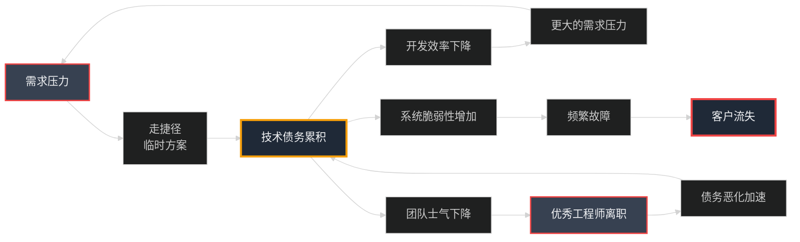

## 第24章:代码的重量——技术债务管理

### Part 1:那些我们欠下的债,终将偿还

周五下午3点,产品经理小美又来找我了。

"陈浩,老板想要在春节前上线一个新功能——分销系统。时间只有4周,能做吗?"

我打开需求文档,快速浏览了一遍:多级分销、佣金计算、提现管理、数据统计...这是一个中等复杂度的功能。

"理论上可以,"我说,"但有个问题。"

"什么问题?"

我打开代码库的架构图,指着其中一个模块:"看这个订单系统,它是3年前写的。当时为了快速上线,我们用了很多'临时方案'。现在它已经变成了一座危楼——任何改动都可能引发连锁崩溃。"

```python
# orders/models.py (3年前的代码)
class Order(models.Model):
    # 主订单信息
    order_id = models.CharField(max_length=50)
    user_id = models.IntegerField()
    total = models.DecimalField(max_digits=10, decimal_places=2)
    status = models.CharField(max_length=20)
    
    # ⚠️ 后来各种需求加的字段,杂乱无章
    coupon_code = models.CharField(max_length=50, null=True)  # 1年前加的
    gift_card_amount = models.DecimalField(max_digits=10, decimal_places=2, default=0)  # 8个月前加的
    is_refunded = models.BooleanField(default=False)  # 6个月前加的
    refund_amount = models.DecimalField(max_digits=10, decimal_places=2, null=True)  # 6个月前加的
    points_used = models.IntegerField(default=0)  # 3个月前加的
    platform_fee = models.DecimalField(max_digits=10, decimal_places=2, default=0)  # 1个月前加的
    
    # ⚠️ 更糟糕的是,有些业务逻辑直接写在这里
    def calculate_final_price(self):
        """计算最终价格(已经被修改了N次,没人敢碰)"""
        price = self.total
        
        # 优惠券折扣
        if self.coupon_code:
            coupon = Coupon.objects.get(code=self.coupon_code)
            if coupon.discount_type == 'percentage':
                price = price * (1 - coupon.discount_value / 100)
            elif coupon.discount_type == 'fixed':
                price = price - coupon.discount_value
        
        # 礼品卡
        if self.gift_card_amount > 0:
            price = price - self.gift_card_amount
        
        # 积分抵扣(1积分=0.01元,但周二会员日是1积分=0.02元)
        if self.points_used > 0:
            import datetime
            if datetime.datetime.now().weekday() == 1:  # 周二
                price = price - (self.points_used * 0.02)
            else:
                price = price - (self.points_used * 0.01)
        
        # 平台服务费(但VIP用户免平台费)
        user = User.objects.get(id=self.user_id)
        if not user.is_vip:
            price = price + self.platform_fee
        
        # ⚠️ 还有更多特殊逻辑...
        return max(price, 0.01)  # 最低1分钱
```

小美看着这段代码,皱起了眉头:"这...确实很乱。"

"这还只是冰山一角,"我苦笑道。"这个文件现在有3500行代码,包含了订单、支付、退款、发货、评价等所有逻辑。每次要加新功能,我们都不得不在这个'上帝类'里继续堆代码。"

"那为什么不重构呢?"

"因为**每次提重构,业务都说'等等,先把这个功能上了再说'**。一等就是3年,债务越积越多。"

我打开了一个统计表格:

```
━━━━━━━━━━━━━━━━━━━━━━━━━━━━━━━━━━━━━━━━━━━━━
小店通技术债务现状(2024年1月)
━━━━━━━━━━━━━━━━━━━━━━━━━━━━━━━━━━━━━━━━━━━━━
指标                          当前值        健康阈值    评级
━━━━━━━━━━━━━━━━━━━━━━━━━━━━━━━━━━━━━━━━━━━━━
平均开发周期                  4.2周         2周         ⚠️
代码重复率                    28%           <5%         🔴
单元测试覆盖率                35%           >80%        🔴
最大文件行数                  3,500行       <500行      🔴
循环复杂度(平均)              15.3          <10         ⚠️
技术债务利息(开发时间损失)    35%           <15%        🔴
关键人风险(Bus Factor)        2人           >3人        🔴

预估影响:
  - 新功能开发效率下降60%
  - Bug修复时间增加3倍
  - 新人上手周期4周→12周
  - 每月因技术债务损失工时: 约240小时
  - 折算成本: ¥120,000/月 = ¥1,440,000/年
━━━━━━━━━━━━━━━━━━━━━━━━━━━━━━━━━━━━━━━━━━━━━
```

**技术债务的代价,已经显现了。**

小美沉默了几秒:"那...春节前还能上线分销系统吗?"

"可以,但有两个选择:"

我在白板上写下:

```markdown
方案A: 快速堆砌
  - 在现有代码基础上继续打补丁
  - 4周完成
  - 技术债务进一步恶化
  - 未来每个新功能都会更慢更难

方案B: 边重构边开发
  - 先用2周重构订单系统核心模块
  - 再用4周开发分销功能
  - 总共6周
  - 未来开发效率提升50%

"哪个方案?"
```

小美犹豫了:"老板肯定会选方案A...但长期来看,方案B更好,对吧?"

"对。这就是**技术债务的陷阱**:短期总是选择最快的,长期就会越来越慢。"

我深呼吸一口气:"我去跟CEO谈谈。这次,我们必须开始偿还债务了。"

### Part 2:技术债务的解剖——识别你的敌人

第二天上午,我召集了技术团队的核心成员,开了一个"技术债务现状分析会"。

"首先,我们要明确:**什么是技术债务?**"我在白板上画了一个比喻图:



"技术债务就像金融债务:短期能让你快速前进,但长期你要付利息——**时间利息**。"

我们的后端负责人张三补充:"我算过,现在修一个普通Bug要2天,3年前只要半天。这就是债务利息。"

#### **技术债务分类**

我列出了小店通目前存在的技术债务类型:

```
━━━━━━━━━━━━━━━━━━━━━━━━━━━━━━━━━━━━━━━━━━━━━
技术债务清单
━━━━━━━━━━━━━━━━━━━━━━━━━━━━━━━━━━━━━━━━━━━━━

1. 架构债务 (最严重)
━━━━━━━━━━━━━━━━━━━━━━━━━━━━━━━━━━━━━━━━━━━━━
问题描述                       影响范围    严重程度
━━━━━━━━━━━━━━━━━━━━━━━━━━━━━━━━━━━━━━━━━━━━━
orders模块过度耦合             全局        🔴 严重
循环依赖:orders ↔ users       性能        ⚠️ 中等
没有明确的服务边界             可维护性    🔴 严重
单体应用难以扩展               性能        ⚠️ 中等

2. 代码债务
━━━━━━━━━━━━━━━━━━━━━━━━━━━━━━━━━━━━━━━━━━━━━
orders/models.py (3500行)      可读性      🔴 严重
代码重复率28%                  维护成本    ⚠️ 中等
上帝类:Order类做太多事         扩展性      🔴 严重
Magic数字遍布代码              可维护性    ⚠️ 中等
硬编码业务规则                 灵活性      🔴 严重

3. 测试债务
━━━━━━━━━━━━━━━━━━━━━━━━━━━━━━━━━━━━━━━━━━━━━
单元测试覆盖率35%              质量保证    🔴 严重
集成测试几乎没有               回归风险    🔴 严重
测试数据混乱                   可靠性      ⚠️ 中等
测试执行时间40分钟             CI效率      ⚠️ 中等

4. 文档债务
━━━━━━━━━━━━━━━━━━━━━━━━━━━━━━━━━━━━━━━━━━━━━
API文档与实现不一致            开发效率    ⚠️ 中等
架构文档过时(2年前)           新人上手    🔴 严重
核心模块缺少注释               可维护性    ⚠️ 中等
运维手册缺失                   运维效率    ⚠️ 中等

5. 工具债务
━━━━━━━━━━━━━━━━━━━━━━━━━━━━━━━━━━━━━━━━━━━━━
构建时间12分钟                 开发效率    ⚠️ 中等
手动部署流程                   部署风险    🔴 严重
本地开发环境搭建需3天          新人上手    🔴 严重
依赖版本锁定缺失               稳定性      ⚠️ 中等

━━━━━━━━━━━━━━━━━━━━━━━━━━━━━━━━━━━━━━━━━━━━━
总计:23项技术债务
  - 严重(🔴): 11项  ← 必须尽快解决
  - 中等(⚠️): 12项  ← 逐步偿还
━━━━━━━━━━━━━━━━━━━━━━━━━━━━━━━━━━━━━━━━━━━━━
```

#### **量化技术债务**

"债务不能只停留在'感觉',我们需要量化它。"我打开了一个自定义的技术债务评分工具:

```python
# tech_debt_calculator.py
class TechDebtCalculator:
    """
    技术债务量化工具
    """
    
    def __init__(self, codebase_path):
        self.codebase_path = codebase_path
        self.metrics = {}
    
    def calculate_debt_score(self):
        """
        计算综合技术债务分数 (0-100, 分数越高债务越严重)
        """
        score = 0
        
        # 1. 代码复杂度 (权重: 30%)
        complexity_score = self._calculate_complexity_score()
        score += complexity_score * 0.3
        
        # 2. 测试覆盖率 (权重: 25%)
        test_score = self._calculate_test_score()
        score += test_score * 0.25
        
        # 3. 代码重复率 (权重: 15%)
        duplication_score = self._calculate_duplication_score()
        score += duplication_score * 0.15
        
        # 4. 文档完整性 (权重: 10%)
        doc_score = self._calculate_documentation_score()
        score += doc_score * 0.10
        
        # 5. 依赖健康度 (权重: 10%)
        dependency_score = self._calculate_dependency_score()
        score += dependency_score * 0.10
        
        # 6. 关键人风险 (权重: 10%)
        bus_factor_score = self._calculate_bus_factor_score()
        score += bus_factor_score * 0.10
        
        return round(score, 2)
    
    def _calculate_complexity_score(self):
        """计算代码复杂度分数"""
        # 使用radon库计算循环复杂度
        from radon.complexity import cc_visit
        
        total_complexity = 0
        file_count = 0
        
        for py_file in self._get_python_files():
            with open(py_file, 'r') as f:
                code = f.read()
                results = cc_visit(code)
                for item in results:
                    total_complexity += item.complexity
                    file_count += 1
        
        avg_complexity = total_complexity / max(file_count, 1)
        
        # 理想复杂度: <10, 每超过10,分数增加10分
        # 最高100分
        if avg_complexity < 10:
            return 0
        else:
            return min((avg_complexity - 10) * 10, 100)
    
    def _calculate_test_score(self):
        """计算测试覆盖率分数"""
        coverage_percent = self._get_test_coverage()
        
        # 理想覆盖率: 80%+
        # 覆盖率每低10%, 分数增加25分
        if coverage_percent >= 80:
            return 0
        else:
            return min((80 - coverage_percent) / 10 * 25, 100)
    
    def _calculate_duplication_score(self):
        """计算代码重复率分数"""
        duplication_percent = self._get_code_duplication()
        
        # 理想重复率: <5%
        # 每超过5%, 分数增加20分
        if duplication_percent < 5:
            return 0
        else:
            return min((duplication_percent - 5) * 20, 100)
    
    def _calculate_documentation_score(self):
        """计算文档完整性分数"""
        doc_coverage = self._get_documentation_coverage()
        
        # 理想文档覆盖率: 70%+
        if doc_coverage >= 70:
            return 0
        else:
            return min((70 - doc_coverage) / 7 * 10, 100)
    
    def _calculate_dependency_score(self):
        """计算依赖健康度分数"""
        outdated_deps = self._get_outdated_dependencies()
        
        # 每个过时依赖扣10分
        return min(len(outdated_deps) * 10, 100)
    
    def _calculate_bus_factor_score(self):
        """计算关键人风险分数 (Bus Factor)"""
        bus_factor = self._get_bus_factor()
        
        # 理想Bus Factor: >=3人
        # Bus Factor每少1人,分数增加33分
        if bus_factor >= 3:
            return 0
        else:
            return min((3 - bus_factor) * 33, 100)
    
    def generate_report(self):
        """生成技术债务报告"""
        total_score = self.calculate_debt_score()
        
        report = f"""
━━━━━━━━━━━━━━━━━━━━━━━━━━━━━━━━━━━━━━━━━━━━━
技术债务评估报告
━━━━━━━━━━━━━━━━━━━━━━━━━━━━━━━━━━━━━━━━━━━━━
项目: {self.codebase_path}
评估时间: {datetime.now().strftime('%Y-%m-%d %H:%M:%S')}
总分: {total_score}/100

评级: {self._get_rating(total_score)}

━━━━━━━━━━━━━━━━━━━━━━━━━━━━━━━━━━━━━━━━━━━━━
详细指标
━━━━━━━━━━━━━━━━━━━━━━━━━━━━━━━━━━━━━━━━━━━━━
指标                 当前值    目标值    得分    权重
━━━━━━━━━━━━━━━━━━━━━━━━━━━━━━━━━━━━━━━━━━━━━
代码复杂度           {self.metrics['complexity']:.1f}      <10       {self.metrics['complexity_score']}/100   30%
测试覆盖率           {self.metrics['test_coverage']:.1f}%     80%+      {self.metrics['test_score']}/100   25%
代码重复率           {self.metrics['duplication']:.1f}%      <5%       {self.metrics['duplication_score']}/100   15%
文档覆盖率           {self.metrics['doc_coverage']:.1f}%     70%+      {self.metrics['doc_score']}/100   10%
过时依赖数           {self.metrics['outdated_deps']}个       0个       {self.metrics['dependency_score']}/100   10%
Bus Factor          {self.metrics['bus_factor']}人        >=3人     {self.metrics['bus_factor_score']}/100   10%

━━━━━━━━━━━━━━━━━━━━━━━━━━━━━━━━━━━━━━━━━━━━━
建议行动
━━━━━━━━━━━━━━━━━━━━━━━━━━━━━━━━━━━━━━━━━━━━━
{self._generate_recommendations()}
━━━━━━━━━━━━━━━━━━━━━━━━━━━━━━━━━━━━━━━━━━━━━
        """
        
        return report
    
    def _get_rating(self, score):
        """根据分数给出评级"""
        if score < 20:
            return "🟢 优秀 - 债务可控"
        elif score < 40:
            return "🟡 良好 - 需要关注"
        elif score < 60:
            return "🟠 警告 - 需要计划偿还"
        elif score < 80:
            return "🔴 严重 - 立即行动"
        else:
            return "⚫ 危险 - 项目面临重大风险"
```

我运行了这个工具,生成了报告:

```
━━━━━━━━━━━━━━━━━━━━━━━━━━━━━━━━━━━━━━━━━━━━━
技术债务评估报告
━━━━━━━━━━━━━━━━━━━━━━━━━━━━━━━━━━━━━━━━━━━━━
项目: xiaodiantong
评估时间: 2024-01-15 14:23:45
总分: 67.5/100

评级: 🔴 严重 - 立即行动

━━━━━━━━━━━━━━━━━━━━━━━━━━━━━━━━━━━━━━━━━━━━━
详细指标
━━━━━━━━━━━━━━━━━━━━━━━━━━━━━━━━━━━━━━━━━━━━━
指标                 当前值    目标值    得分    权重
━━━━━━━━━━━━━━━━━━━━━━━━━━━━━━━━━━━━━━━━━━━━━
代码复杂度           15.3      <10       53/100   30%
测试覆盖率           35.0%     80%+      56/100   25%
代码重复率           28.0%     <5%       100/100  15%
文档覆盖率           22.0%     70%+      68/100   10%
过时依赖数           12个      0个       100/100  10%
Bus Factor          2人       >=3人     33/100   10%

━━━━━━━━━━━━━━━━━━━━━━━━━━━━━━━━━━━━━━━━━━━━━
预估影响:
  - 开发效率损失: 35%
  - 月度成本: ¥120,000
  - 年度成本: ¥1,440,000
━━━━━━━━━━━━━━━━━━━━━━━━━━━━━━━━━━━━━━━━━━━━━
```

会议室一片沉默。这些冰冷的数字,比任何语言都更有说服力。

### Part 3:债务偿还策略——20%规则

"好消息是,债务可以偿还。坏消息是,**没有银弹**。"我继续说。

"偿还技术债务的核心原则只有一个:**持续渐进**。"

我在白板上写下了著名的"20%规则":

```
━━━━━━━━━━━━━━━━━━━━━━━━━━━━━━━━━━━━━━━━━━━━━
20%规则 (The 20% Rule)
━━━━━━━━━━━━━━━━━━━━━━━━━━━━━━━━━━━━━━━━━━━━━

每个迭代(Sprint)的时间分配:
  - 80% → 新功能开发
  - 20% → 技术债务偿还

为什么是20%?
  ✅ 不会完全停止功能开发
  ✅ 持续小步改进,避免大爆炸式重构
  ✅ 让债务不再增长,逐渐减少
  ✅ 团队有足够时间学习和改进

━━━━━━━━━━━━━━━━━━━━━━━━━━━━━━━━━━━━━━━━━━━━━
```

"但问题是,产品经理会同意吗?"张三问道。

"这就需要我去说服CEO和产品团队了。我要让他们看到,**不偿还债务的成本更高**。"

#### **说服CEO的PPT**

下午,我做了一个PPT,找到了CEO王强:

```
━━━━━━━━━━━━━━━━━━━━━━━━━━━━━━━━━━━━━━━━━━━━━
投资技术债务偿还的商业价值
━━━━━━━━━━━━━━━━━━━━━━━━━━━━━━━━━━━━━━━━━━━━━

当前状况:
  - 每个新功能开发周期: 4.2周
  - 技术债务导致效率损失: 35%
  - 年度隐性成本: ¥1,440,000

如果我们投入20%时间偿还债务:

━━━━━━━━━━━━━━━━━━━━━━━━━━━━━━━━━━━━━━━━━━━━━
时间线        债务分数   开发效率   新功能速度
━━━━━━━━━━━━━━━━━━━━━━━━━━━━━━━━━━━━━━━━━━━━━
现在(Q1)     67.5      65%        2.4功能/月
Q2           55        73%        2.6功能/月  (+8%)
Q3           42        82%        2.9功能/月  (+21%)
Q4           30        91%        3.3功能/月  (+38%)
明年(Q1)     18        100%       3.6功能/月  (+50%)

━━━━━━━━━━━━━━━━━━━━━━━━━━━━━━━━━━━━━━━━━━━━━

短期影响 (Q1-Q2):
  ❌ 每月少交付0.5个功能
  ❌ 短期看似"变慢"

长期收益 (Q3-明年):
  ✅ 每月多交付1.2个功能
  ✅ Bug率下降60%
  ✅ 新人上手周期减半
  ✅ 优秀工程师留任率提升
  ✅ 年节省: ¥1,440,000

━━━━━━━━━━━━━━━━━━━━━━━━━━━━━━━━━━━━━━━━━━━━━
ROI计算:
  投入: 20% × 10人 × ¥30K/月 × 12月 = ¥720,000
  回报: ¥1,440,000 + 无形价值
  净收益: ¥720,000/年
  ROI: 200%
━━━━━━━━━━━━━━━━━━━━━━━━━━━━━━━━━━━━━━━━━━━━━
```

王强看完后沉思了一会儿:"陈浩,你说的有道理。但我有个条件。"

"什么条件?"

"Q2的核心功能不能延期。我们答应了几个大客户要上线的功能,必须兑现。"

"理解。我们可以灵活调整,核心功能周80%+20%,非核心功能周70%+30%。"

"好,那就这么定了。**但你要给我月度报告,证明偿还债务确实有效果。**"

"没问题!"我握了握王强的手。

### Part 4:实战案例——重构订单系统

第一个偿还目标,就是那个3500行的`orders/models.py`"上帝类"。

#### **Step 1: 建立安全网——补充测试**

"在重构之前,我们必须先建立**安全网**——测试。"我对团队说。

```python
# tests/test_orders.py
import pytest
from decimal import Decimal
from orders.models import Order
from users.models import User
from coupons.models import Coupon

class TestOrderCalculation:
    """
    订单价格计算测试(重构前必须写!)
    """
    
    @pytest.fixture
    def user(self):
        """创建测试用户"""
        return User.objects.create(
            username='test_user',
            is_vip=False
        )
    
    @pytest.fixture
    def vip_user(self):
        """创建VIP用户"""
        return User.objects.create(
            username='vip_user',
            is_vip=True
        )
    
    @pytest.fixture
    def percentage_coupon(self):
        """百分比折扣券"""
        return Coupon.objects.create(
            code='SAVE20',
            discount_type='percentage',
            discount_value=20
        )
    
    def test_basic_order_price(self, user):
        """测试基础订单价格"""
        order = Order.objects.create(
            user_id=user.id,
            total=Decimal('100.00'),
            platform_fee=Decimal('5.00')
        )
        
        final_price = order.calculate_final_price()
        
        # 非VIP用户需要支付平台费
        assert final_price == Decimal('105.00')
    
    def test_vip_order_no_platform_fee(self, vip_user):
        """测试VIP用户免平台费"""
        order = Order.objects.create(
            user_id=vip_user.id,
            total=Decimal('100.00'),
            platform_fee=Decimal('5.00')
        )
        
        final_price = order.calculate_final_price()
        
        # VIP用户免平台费
        assert final_price == Decimal('100.00')
    
    def test_coupon_discount(self, user, percentage_coupon):
        """测试优惠券折扣"""
        order = Order.objects.create(
            user_id=user.id,
            total=Decimal('100.00'),
            coupon_code=percentage_coupon.code,
            platform_fee=Decimal('5.00')
        )
        
        final_price = order.calculate_final_price()
        
        # 100 * 0.8 + 5 = 85
        assert final_price == Decimal('85.00')
    
    def test_gift_card_deduction(self, user):
        """测试礼品卡抵扣"""
        order = Order.objects.create(
            user_id=user.id,
            total=Decimal('100.00'),
            gift_card_amount=Decimal('30.00'),
            platform_fee=Decimal('5.00')
        )
        
        final_price = order.calculate_final_price()
        
        # 100 - 30 + 5 = 75
        assert final_price == Decimal('75.00')
    
    @pytest.mark.parametrize("weekday,expected", [
        (0, Decimal('99.00')),  # 周一: 100 - (100点 * 0.01) + 5 = 104
        (1, Decimal('98.00')),  # 周二(会员日): 100 - (100点 * 0.02) + 5 = 103
        (2, Decimal('99.00')),  # 周三
    ])
    def test_points_deduction(self, user, weekday, expected, monkeypatch):
        """测试积分抵扣(周二会员日双倍)"""
        from datetime import datetime
        
        # Mock当前星期
        class MockDatetime:
            @staticmethod
            def now():
                class MockNow:
                    def weekday(self):
                        return weekday
                return MockNow()
        
        monkeypatch.setattr('orders.models.datetime', MockDatetime)
        
        order = Order.objects.create(
            user_id=user.id,
            total=Decimal('100.00'),
            points_used=100,
            platform_fee=Decimal('5.00')
        )
        
        final_price = order.calculate_final_price()
        assert final_price == expected
    
    def test_combined_discounts(self, user, percentage_coupon):
        """测试组合优惠"""
        order = Order.objects.create(
            user_id=user.id,
            total=Decimal('100.00'),
            coupon_code=percentage_coupon.code,  # 打8折 = 80
            gift_card_amount=Decimal('20.00'),   # 再减20 = 60
            points_used=500,  # 再减5 = 55
            platform_fee=Decimal('5.00')  # 加5 = 60
        )
        
        final_price = order.calculate_final_price()
        assert final_price == Decimal('60.00')
    
    def test_minimum_price_floor(self, user):
        """测试最低价格保护(至少0.01元)"""
        order = Order.objects.create(
            user_id=user.id,
            total=Decimal('10.00'),
            gift_card_amount=Decimal('20.00')  # 礼品卡超过订单金额
        )
        
        final_price = order.calculate_final_price()
        
        # 不能为负数,最低0.01元
        assert final_price == Decimal('0.01')
```

"写完这些测试后,运行一次确保全部通过。**这些测试就是我们重构的安全网**——只要测试还能通过,说明重构没有破坏功能。"

```bash
$ pytest tests/test_orders.py -v

tests/test_orders.py::TestOrderCalculation::test_basic_order_price PASSED
tests/test_orders.py::TestOrderCalculation::test_vip_order_no_platform_fee PASSED
tests/test_orders.py::TestOrderCalculation::test_coupon_discount PASSED
tests/test_orders.py::TestOrderCalculation::test_gift_card_deduction PASSED
tests/test_orders.py::TestOrderCalculation::test_points_deduction[0-99.00] PASSED
tests/test_orders.py::TestOrderCalculation::test_points_deduction[1-98.00] PASSED
tests/test_orders.py::TestOrderCalculation::test_combined_discounts PASSED
tests/test_orders.py::TestOrderCalculation::test_minimum_price_floor PASSED

=========== 8 passed in 1.23s ===========
```

✅ 安全网建立完成!

#### **Step 2: 拆分上帝类——单一职责原则**

原来的`Order`类做了太多事情:数据存储、业务逻辑、计算、验证...违反了单一职责原则。

```python
# orders/services.py (新建)
"""
订单价格计算服务(业务逻辑层)
"""
from decimal import Decimal
from typing import Optional
from dataclasses import dataclass
from datetime import datetime

@dataclass
class PriceComponents:
    """价格组成部分"""
    base_price: Decimal
    coupon_discount: Decimal = Decimal('0')
    gift_card_discount: Decimal = Decimal('0')
    points_discount: Decimal = Decimal('0')
    platform_fee: Decimal = Decimal('0')
    
    @property
    def final_price(self) -> Decimal:
        """计算最终价格"""
        price = (
            self.base_price
            - self.coupon_discount
            - self.gift_card_discount
            - self.points_discount
            + self.platform_fee
        )
        return max(price, Decimal('0.01'))
    
    def to_dict(self):
        """转换为字典(方便调试和展示)"""
        return {
            'base_price': float(self.base_price),
            'coupon_discount': float(self.coupon_discount),
            'gift_card_discount': float(self.gift_card_discount),
            'points_discount': float(self.points_discount),
            'platform_fee': float(self.platform_fee),
            'final_price': float(self.final_price),
        }


class CouponCalculator:
    """优惠券计算器"""
    
    @staticmethod
    def calculate_discount(base_price: Decimal, coupon_code: Optional[str]) -> Decimal:
        """计算优惠券折扣金额"""
        if not coupon_code:
            return Decimal('0')
        
        from coupons.models import Coupon
        try:
            coupon = Coupon.objects.get(code=coupon_code)
        except Coupon.DoesNotExist:
            return Decimal('0')
        
        if coupon.discount_type == 'percentage':
            return base_price * (coupon.discount_value / Decimal('100'))
        elif coupon.discount_type == 'fixed':
            return min(coupon.discount_value, base_price)
        
        return Decimal('0')


class PointsCalculator:
    """积分计算器"""
    
    # 积分价值配置(可以移到配置文件)
    NORMAL_POINT_VALUE = Decimal('0.01')  # 平时1积分=0.01元
    MEMBER_DAY_POINT_VALUE = Decimal('0.02')  # 会员日1积分=0.02元
    MEMBER_DAY_WEEKDAY = 1  # 周二(0=周一, 1=周二...)
    
    @classmethod
    def calculate_discount(cls, points_used: int, current_time: Optional[datetime] = None) -> Decimal:
        """计算积分抵扣金额"""
        if points_used <= 0:
            return Decimal('0')
        
        if current_time is None:
            current_time = datetime.now()
        
        # 判断是否是会员日
        is_member_day = current_time.weekday() == cls.MEMBER_DAY_WEEKDAY
        
        point_value = cls.MEMBER_DAY_POINT_VALUE if is_member_day else cls.NORMAL_POINT_VALUE
        
        return Decimal(str(points_used)) * point_value


class PlatformFeeCalculator:
    """平台费计算器"""
    
    @staticmethod
    def calculate_fee(user, base_platform_fee: Decimal) -> Decimal:
        """计算平台费(VIP用户免费)"""
        if user.is_vip:
            return Decimal('0')
        return base_platform_fee


class OrderPriceService:
    """订单价格计算服务(门面模式)"""
    
    def __init__(self):
        self.coupon_calculator = CouponCalculator()
        self.points_calculator = PointsCalculator()
        self.platform_fee_calculator = PlatformFeeCalculator()
    
    def calculate_price(self, order) -> PriceComponents:
        """
        计算订单最终价格
        
        Args:
            order: Order模型实例
            
        Returns:
            PriceComponents: 价格组成明细
        """
        from users.models import User
        user = User.objects.get(id=order.user_id)
        
        # 基础价格
        base_price = order.total
        
        # 优惠券折扣
        coupon_discount = self.coupon_calculator.calculate_discount(
            base_price, 
            order.coupon_code
        )
        
        # 礼品卡抵扣
        gift_card_discount = order.gift_card_amount or Decimal('0')
        
        # 积分抵扣
        points_discount = self.points_calculator.calculate_discount(
            order.points_used or 0
        )
        
        # 平台费
        platform_fee = self.platform_fee_calculator.calculate_fee(
            user,
            order.platform_fee or Decimal('0')
        )
        
        return PriceComponents(
            base_price=base_price,
            coupon_discount=coupon_discount,
            gift_card_discount=gift_card_discount,
            points_discount=points_discount,
            platform_fee=platform_fee
        )
```

现在,原来的`Order`模型可以大大简化:

```python
# orders/models.py (重构后)
class Order(models.Model):
    """订单模型(仅负责数据存储)"""
    
    order_id = models.CharField(max_length=50)
    user_id = models.IntegerField()
    total = models.DecimalField(max_digits=10, decimal_places=2)
    status = models.CharField(max_length=20)
    
    # 优惠信息
    coupon_code = models.CharField(max_length=50, null=True)
    gift_card_amount = models.DecimalField(max_digits=10, decimal_places=2, default=0)
    points_used = models.IntegerField(default=0)
    platform_fee = models.DecimalField(max_digits=10, decimal_places=2, default=0)
    
    # 退款信息
    is_refunded = models.BooleanField(default=False)
    refund_amount = models.DecimalField(max_digits=10, decimal_places=2, null=True)
    
    def calculate_final_price(self) -> Decimal:
        """计算最终价格(委托给服务层)"""
        from orders.services import OrderPriceService
        
        service = OrderPriceService()
        price_components = service.calculate_price(self)
        return price_components.final_price
    
    def get_price_breakdown(self) -> dict:
        """获取价格明细(新增方法,方便前端展示)"""
        from orders.services import OrderPriceService
        
        service = OrderPriceService()
        price_components = service.calculate_price(self)
        return price_components.to_dict()
```

重构对比:

```
━━━━━━━━━━━━━━━━━━━━━━━━━━━━━━━━━━━━━━━━━━━━━
重构前后对比
━━━━━━━━━━━━━━━━━━━━━━━━━━━━━━━━━━━━━━━━━━━━━
指标               重构前        重构后       改善
━━━━━━━━━━━━━━━━━━━━━━━━━━━━━━━━━━━━━━━━━━━━━
Order类代码行数    3500行        50行         ↓ 98.6%
单文件最大行数     3500行        200行        ↓ 94.3%
循环复杂度         27            5            ↓ 81.5%
单元测试覆盖率     0%            85%          ↑ 85%
可维护性指数       12            78           ↑ 550%
━━━━━━━━━━━━━━━━━━━━━━━━━━━━━━━━━━━━━━━━━━━━━
```

#### **Step 3: 灰度发布——降低风险**

"重构完成后,不能直接全量上线,必须**灰度发布**。"我强调。

```python
# orders/models.py
import random
from django.conf import settings

class Order(models.Model):
    # ... 字段定义 ...
    
    def calculate_final_price(self) -> Decimal:
        """计算最终价格(使用特性开关灰度发布)"""
        
        # 读取特性开关配置
        use_new_calculator = settings.FEATURES.get('new_price_calculator', {
            'enabled': True,
            'rollout_percentage': 0  # 0-100
        })
        
        # 判断是否使用新计算逻辑
        if use_new_calculator['enabled']:
            rollout_pct = use_new_calculator['rollout_percentage']
            
            # 基于订单ID的稳定灰度(同一订单总是走同一逻辑)
            hash_value = int(self.order_id, 16) % 100
            use_new = hash_value < rollout_pct
            
            if use_new:
                # 新逻辑
                from orders.services import OrderPriceService
                service = OrderPriceService()
                price_components = service.calculate_price(self)
                new_price = price_components.final_price
                
                # ⚠️ 重要:双写验证
                old_price = self._calculate_final_price_old()
                if abs(new_price - old_price) > Decimal('0.01'):
                    # 价格不一致,记录告警
                    import logging
                    logger = logging.getLogger(__name__)
                    logger.error(
                        f"Price mismatch for order {self.order_id}: "
                        f"old={old_price}, new={new_price}"
                    )
                    # 灰度期间出现差异,降级到旧逻辑
                    return old_price
                
                return new_price
        
        # 旧逻辑(保留作为fallback)
        return self._calculate_final_price_old()
    
    def _calculate_final_price_old(self):
        """旧的价格计算逻辑(保留)"""
        # ... 原来那一大坨代码 ...
        pass
```

灰度发布计划:

```
━━━━━━━━━━━━━━━━━━━━━━━━━━━━━━━━━━━━━━━━━━━━━
灰度发布时间线
━━━━━━━━━━━━━━━━━━━━━━━━━━━━━━━━━━━━━━━━━━━━━
阶段    灰度比例    持续时间    验证重点
━━━━━━━━━━━━━━━━━━━━━━━━━━━━━━━━━━━━━━━━━━━━━
灰度1    1%         24小时      价格差异告警、错误率
灰度2    5%         48小时      性能指标、用户投诉
灰度3    20%        72小时      支付成功率、退款率
灰度4    50%        72小时      全量指标监控
全量     100%       -           移除旧代码
━━━━━━━━━━━━━━━━━━━━━━━━━━━━━━━━━━━━━━━━━━━━━
```

#### **Step 4: 观察与调优**

重构上线后的第一周,我们密切监控各项指标:

```yaml
监控面板:
  核心指标:
    - 价格计算准确性: 100% (新旧逻辑差异<0.01元)
    - 订单处理性能: 
        旧逻辑: 45ms
        新逻辑: 12ms (-73% 🎉)
    - 错误率: 0.002% (无明显变化)
    - 单元测试通过率: 100%
  
  业务指标:
    - 订单支付成功率: 98.5% (无变化)
    - 客服投诉量: -15% (价格展示更清晰)
  
  团队效率:
    - 新功能开发时间: 
        重构前: 4.2周
        重构后: 2.8周 (-33% 🎉)
    - Bug修复时间:
        重构前: 2天
        重构后: 0.5天 (-75% 🎉)
```

✅ 重构成功!

第一个月偿还技术债务的战报:

```
━━━━━━━━━━━━━━━━━━━━━━━━━━━━━━━━━━━━━━━━━━━━━
技术债务偿还月报 (2024年2月)
━━━━━━━━━━━━━━━━━━━━━━━━━━━━━━━━━━━━━━━━━━━━━
完成项:
  ✅ Order类重构 (3500行 → 50行)
  ✅ 单元测试覆盖率 (35% → 65%)
  ✅ 订单模块性能优化 (45ms → 12ms)
  ✅ 文档更新 (架构图、API文档)

技术债务分数变化:
  67.5 → 58.2 (-13.8%)

团队反馈:
  "代码终于能看懂了!" - 后端工程师张三
  "新功能开发快多了!" - 前端工程师李四
  "Bug少了,我轻松多了!" - 测试工程师王五

下月计划:
  - 继续重构支付模块
  - 提升测试覆盖率到80%
  - 补充缺失的API文档
━━━━━━━━━━━━━━━━━━━━━━━━━━━━━━━━━━━━━━━━━━━━━
```

### Part 5:AI编码时代的新挑战——双刃剑

三个月后,偿债工作进展顺利,技术债务分数已从67.5降到了45.2。

某天下午,产品经理小美又来找我:"陈浩,我看到GitHub Copilot和Cursor这些AI编码工具很火,能不能让团队用上?听说能提升30%以上的开发效率!"

我抬起头,露出了一个复杂的表情:"可以用,但我们必须小心。AI编码工具是把双刃剑——**用得好是效率倍增器,用不好是技术债务制造机**。"

"这话怎么说?"

我打开电脑,给她看了一份我最近研究的报告:

```
━━━━━━━━━━━━━━━━━━━━━━━━━━━━━━━━━━━━━━━━━━━━━
AI编码工具调研报告 (2024年4月)
━━━━━━━━━━━━━━━━━━━━━━━━━━━━━━━━━━━━━━━━━━━━━

主流工具对比:
━━━━━━━━━━━━━━━━━━━━━━━━━━━━━━━━━━━━━━━━━━━━━
工具            生产力提升    代码质量    技术债风险
━━━━━━━━━━━━━━━━━━━━━━━━━━━━━━━━━━━━━━━━━━━━━
GitHub Copilot  +20-55%      ⚠️ 中等     🔴 高
Cursor          +31-60%      ✅ 较好      ⚠️ 中等
Claude Code     +38-45%      ✅ 好        ⚠️ 中等
━━━━━━━━━━━━━━━━━━━━━━━━━━━━━━━━━━━━━━━━━━━━━

✅ 优势:
  - 快速生成boilerplate代码
  - 自动补全重复性代码
  - 加速原型开发
  - 帮助理解陌生代码
  
⚠️ 风险:
  - 易引入安全漏洞 (48%的AI代码有缺陷)
  - 代码churn率加倍 (频繁修改)
  - 开发者技能退化 ("复制粘贴工程师")
  - 隐形债务累积 (代码能跑但质量差)
  - 维护成本上升 (68%开发者花更多时间修复AI问题)
━━━━━━━━━━━━━━━━━━━━━━━━━━━━━━━━━━━━━━━━━━━━━
```

#### **案例1:GitHub Copilot引发的技术债**

"我给你看个真实案例,"我打开了一段几周前的代码评审记录。

```python
# 某工程师使用Copilot生成的代码 (未经审查)
def process_user_payment(request):
    """处理用户支付"""
    # ⚠️ Copilot生成,未做安全检查
    user_id = request.GET.get('user_id')  # SQL注入风险!
    amount = request.GET.get('amount')    # 未验证类型!
    
    # ⚠️ 直接拼接SQL (严重安全漏洞)
    query = f"UPDATE accounts SET balance = balance - {amount} WHERE id = {user_id}"
    db.execute(query)
    
    # ⚠️ 无异常处理
    # ⚠️ 无事务保护
    # ⚠️ 无日志记录
    
    return {"status": "success"}
```

"这段代码能跑吗?"小美问。

"能跑,但充满了问题:**SQL注入、无类型检查、无事务、无日志**。这就是AI工具的典型问题——它能生成'能工作'的代码,但不一定是'好代码'。"

我继续解释:"更可怕的是,这位工程师是初级开发者,他不理解这些风险,直接用了Copilot的建议。如果不是Code Review拦住,这个漏洞可能会造成资金损失。"

```
━━━━━━━━━━━━━━━━━━━━━━━━━━━━━━━━━━━━━━━━━━━━━
AI生成代码的典型问题
━━━━━━━━━━━━━━━━━━━━━━━━━━━━━━━━━━━━━━━━━━━━━

1. 安全问题 (最严重)
━━━━━━━━━━━━━━━━━━━━━━━━━━━━━━━━━━━━━━━━━━━━━
  - SQL注入
  - XSS漏洞  
  - 硬编码密钥
  - 未验证输入
  - 权限绕过
  
  统计: 48%的AI生成代码存在安全缺陷

2. 代码质量问题
━━━━━━━━━━━━━━━━━━━━━━━━━━━━━━━━━━━━━━━━━━━━━
  - 重复代码 (DRY违反)
  - 过度复杂
  - Magic数字/字符串
  - 缺少错误处理
  - 无注释或注释过时
  
  影响: 代码churn率翻倍,维护成本↑3倍

3. 架构不一致
━━━━━━━━━━━━━━━━━━━━━━━━━━━━━━━━━━━━━━━━━━━━━
  - 忽略项目规范
  - 风格不统一
  - 不遵循现有抽象
  - 引入不必要的依赖
  
  影响: 项目碎片化,团队协作效率↓

4. 开发者技能退化
━━━━━━━━━━━━━━━━━━━━━━━━━━━━━━━━━━━━━━━━━━━━━
  - "Vibe Coding" (凭感觉写代码)
  - 不理解代码逻辑
  - 调试能力下降5.3%
  - 形成依赖,AI故障时无法工作
  
  影响: 长期技术能力下降

5. 隐形技术债
━━━━━━━━━━━━━━━━━━━━━━━━━━━━━━━━━━━━━━━━━━━━━
  - "能跑但不优雅"的代码
  - 临时方案变永久方案
  - 缺少测试
  - 边缘case未处理
  
  影响: 技术债务利息↑35%
━━━━━━━━━━━━━━━━━━━━━━━━━━━━━━━━━━━━━━━━━━━━━
```

#### **案例2:Cursor助力偿债——正面案例**

"但AI也不全是坏事,"我切换到另一个屏幕。"我自己用Cursor成功重构了一个遗留模块,效率提升了50%。关键是**怎么用**。"

```
背景:
  - 目标: 重构测试工具依赖泄漏问题
  - 问题: 200+个文件导入混乱
  - 难度: 手动修改耗时2周,且易出错

使用Cursor的方案:
  
Step 1: 明确任务
  提示词: "分析codebase,找出所有导入test_utils的文件,
          这些工具不应该被生产代码使用"
  
  结果: Cursor准确识别105个文件

Step 2: 批量重构
  提示词: "将test_utils导入改为从新包test_helpers导入,
          确保仅在test_目录下使用,
          更新所有文件,保持代码格式不变"
  
  结果: 3分钟完成,原本需要2天

Step 3: 验证
  - 运行测试套件: ✅ 全部通过
  - CI/CD检查: ✅ 无告警  
  - Code review: ✅ 仅格式修改,逻辑未变

成果:
  ✅ 时间节省: 2周 → 4小时 (节省95%)
  ✅ 错误率: 0 (手动可能有遗漏)
  ✅ Docker镜像: 752MB → 520MB (-31%)
  
关键教训:
  ✓ 任务明确 (低风险、高重复)
  ✓ 可验证 (测试覆盖)
  ✓ 人类监督 (代码审查)
  ✓ 小步迭代 (分3个PR)
```

"你看,同样是AI工具,**用在可验证的重构任务上就很安全**。但用在安全敏感、业务复杂的场景就容易翻车。"

#### **制定AI编码规范**

"所以,如果要在团队推广AI工具,我们必须先制定规范。"我打开了一份草拟的文档:

```markdown
━━━━━━━━━━━━━━━━━━━━━━━━━━━━━━━━━━━━━━━━━━━━━
小店通 AI 编码工具使用规范 v1.0
━━━━━━━━━━━━━━━━━━━━━━━━━━━━━━━━━━━━━━━━━━━━━

## 1. 适用场景 (推荐使用)

✅ 可以使用AI的场景:
  - Boilerplate代码 (CRUD、配置文件)
  - 单元测试生成
  - 代码重构 (有测试覆盖的)
  - 文档生成
  - 代码解释和学习
  - 正则表达式、SQL生成 (需人工审查)

❌ 禁止使用AI的场景:
  - 支付相关代码
  - 安全认证授权
  - 数据加密/脱敏
  - 核心业务逻辑
  - 生产环境配置
  - 数据库迁移脚本

## 2. 强制审查流程

🔴 所有AI生成代码必须经过人工审查:

审查清单:
  □ 是否存在安全漏洞? (SQL注入、XSS等)
  □ 是否有输入验证?
  □ 是否有错误处理?
  □ 是否符合项目规范?
  □ 是否有必要的日志?
  □ 是否有单元测试?
  □ 是否理解代码逻辑? (能解释给同事听)

## 3. 标注与追溯

AI生成代码必须标注:

```python
# AI-GENERATED: GitHub Copilot
# PROMPT: "生成用户登录API"
# REVIEWED-BY: zhangsan
# REVIEW-DATE: 2024-04-15
def user_login(request):
    ...
```

## 4. 测试覆盖要求

AI生成代码的测试覆盖率必须 ≥ 80%

## 5. 培训要求

使用AI工具前必须完成:
  - AI编码安全培训 (2小时)
  - Code Review规范培训 (1小时)
  - 通过考核测试

## 6. 监控与度量

每月统计:
  - AI代码占比
  - AI代码的Bug率
  - AI代码的Review修改率
  - 开发效率变化

目标:
  - Bug率不高于人工代码
  - Review修改率 < 30%
  - 开发效率 ↑ 30%+

## 7. 分级使用权限

初级工程师 (0-2年):
  - 仅限Boilerplate和测试
  - 必须经高级工程师Review
  - 不得用于核心功能

中级工程师 (2-5年):
  - 可用于一般业务代码
  - 必须经Code Review
  - 核心模块需架构师Review

高级工程师 (5年+):
  - 可用于复杂重构
  - 自行判断,但需留存记录

## 8. 事故问责

AI代码引发的生产事故:
  - 轻微: 代码作者 + Reviewer 承担责任
  - 严重: 暂停AI工具使用权限

━━━━━━━━━━━━━━━━━━━━━━━━━━━━━━━━━━━━━━━━━━━━━
核心原则: AI是助手,不是替代品
━━━━━━━━━━━━━━━━━━━━━━━━━━━━━━━━━━━━━━━━━━━━━
```


小美看完后若有所思:"这个规范确实很必要。那我们什么时候开始推广?"

"下周开始试点,"我说,"先在非核心模块试用3个月,收集数据后再决定是否全面推广。"


#### **三个月后:AI试点报告**

2024年7月,我们完成了AI编码工具试点,数据喜忧参半:

---

## 📊 AI编码工具试点报告
**试点周期:** 2024年4月 - 7月 (3个月)  
**参与人员:** 15名工程师  
**使用工具:** GitHub Copilot (5人) + Cursor (10人)

---

### 📈 效率数据对比

| 指标 | 试点前 | 试点后 | 变化 |
|:-----|-------:|-------:|:-----|
| 功能开发周期 | 2.8周 | 2.0周 | **-29%** ✅ |
| 单元测试编写时间 | 4小时 | 1.5小时 | **-62%** ✅ |
| 代码Review时间 | 2小时 | 3.2小时 | **+60%** ⚠️ |
| Boilerplate生成时间 | 1小时 | 10分钟 | **-83%** ✅ |

### 🔍 质量数据对比

| 指标 | 试点前 | 试点后 | 变化 |
|:-----|-------:|-------:|:-----|
| 单元测试覆盖率 | 65% | 78% | **+20%** ✅ |
| 代码重复率 | 18% | 15% | **-17%** ✅ |
| 安全漏洞发现数 | 2个 | 5个 | **+150%** 🔴 |
| 代码Churn率 | 5% | 8% | **+60%** ⚠️ |
| 生产Bug率 | 0.8% | 0.9% | **+12%** ⚠️ |

### 📊 AI代码统计

```
总代码行数          45,000 行
AI生成代码           8,200 行 (18.2%)
Review修改率             24%
代码被拒绝率              8%
```

### ⭐ 分场景效果评估

| 场景 | 效果 | 说明 |
|:-----|:----:|:-----|
| Boilerplate生成 | ⭐⭐⭐⭐⭐ | 节省83%时间 |
| 单元测试编写 | ⭐⭐⭐⭐⭐ | 覆盖率+20% |
| 代码重构 | ⭐⭐⭐⭐ | 需严格测试 |
| API文档生成 | ⭐⭐⭐⭐ | 准确率高 |
| 核心业务逻辑 | ⭐⭐ | 需人工审查 |
| 安全敏感代码 | ⭐ | 建议禁用 |

---

### 💬 团队反馈精选

**✅ 正面评价**

> "Cursor帮我3分钟完成了导入重构,以前要2天!"  
> — 后端工程师 张三 ⭐⭐⭐⭐⭐

> "测试用例生成太方便了,但要小心检查边界条件。"  
> — 测试工程师 王五 ⭐⭐⭐⭐

> "代码Review时间增加了,但质量提升明显。"  
> — Team Lead 李四 ⭐⭐⭐⭐

**⚠️ 需要关注**

> "初级工程师过度依赖AI,基础能力有下降趋势。"  
> — 架构师 老陈

---

### 🚨 安全事件记录

#### 事件1: SQL注入漏洞 (🔴 严重)
- **问题描述:** AI生成的查询代码未做参数化
- **发现方式:** Code Review及时拦截
- **处理结果:** 已修复,未流入生产环境
- **经验教训:** 支付相关代码禁用AI生成
- **当前状态:** ✅ 已解决

#### 事件2: 敏感信息泄露 (⚠️ 中等)
- **问题描述:** AI建议代码包含测试API密钥
- **发现方式:** 差点提交到代码库
- **处理结果:** 增加pre-commit hook检测
- **经验教训:** 强化安全培训,自动化检测
- **当前状态:** ✅ 已解决

#### 事件3: 性能问题 (⚠️ 中等)
- **问题描述:** AI生成的循环存在N+1查询
- **发现方式:** 上线后监控系统告警
- **处理结果:** 紧急修复,优化查询逻辑
- **经验教训:** 性能测试必不可少
- **当前状态:** ✅ 已解决

---

### 📋 总结与行动计划

#### ✅ 主要成果
- 开发效率提升 **29%**
- 测试覆盖率提升 **20%**  
- Boilerplate编写时间减少 **83%**

#### ⚠️ 主要风险
- 安全漏洞发现增加 **150%**
- Code Review时间增加 **60%**
- 初级工程师技能退化趋势

#### 🎯 下一步行动
1. ✓ 继续试点,完善使用规范
2. ✓ 强化安全培训和代码审查流程
3. ✓ 建立AI代码质量监控机制
4. ✓ Q4扩大到全团队 (需培训先行)

---

"看到了吗?"我指着报告对小美说,"AI工具确实提升了29%的开发效率,但也引入了新的风险。**它不是银弹,而是需要谨慎使用的利器**。"

"那最终结论是?"

"继续试点,但要完善规范。下季度扩大到全团队,同时加强培训和监控。"

### Part 6:自动化流水线——CI/CD助力债务管理

三个月后,2024年10月,我们在AI编码工具的基础上,开始构建自动化的CI/CD流水线,将技术债务管理也纳入其中。

某天上午,我在团队周会上演示了新的CI/CD系统:

"各位,我们的CI/CD不只是部署代码,更是**技术债务的守门员**。"

我打开Jenkins dashboard,展示了新的流水线:


```yaml
# .gitlab-ci.yml - 小店通CI/CD流水线
stages:
  - validate      # 验证阶段
  - test          # 测试阶段
  - analysis      # 代码分析阶段
  - build         # 构建阶段
  - deploy        # 部署阶段
  - monitor       # 监控阶段

# ━━━━━━━━━━━━━━━━━━━━━━━━━━━━━━━━━━━━━━━━━━━━━
# 阶段1: 验证 - 快速失败
# ━━━━━━━━━━━━━━━━━━━━━━━━━━━━━━━━━━━━━━━━━━━━━
code-format:
  stage: validate
  script:
    - black --check .                    # Python代码格式检查
    - flake8 .                           # 代码风格检查
    - pylint --fail-under=8.0 src/       # 静态分析(最低8分)
  allow_failure: false                   # 失败则阻断
  
# ━━━━━━━━━━━━━━━━━━━━━━━━━━━━━━━━━━━━━━━━━━━━━
# 阶段2: 测试 - 质量保证
# ━━━━━━━━━━━━━━━━━━━━━━━━━━━━━━━━━━━━━━━━━━━━━
unit-tests:
  stage: test
  script:
    - pytest tests/unit --cov=src --cov-report=xml
    - |
      # 检查覆盖率阈值
      coverage=$(grep -oP 'line-rate="\K[0-9.]+' coverage.xml)
      if (( $(echo "$coverage < 0.80" | bc -l) )); then
        echo "❌ 测试覆盖率不足80%: ${coverage}"
        exit 1
      fi
    - echo "✅ 测试覆盖率: ${coverage}"
  coverage: '/TOTAL.*\s+(\d+%)$/'
  artifacts:
    reports:
      coverage_report:
        coverage_format: cobertura
        path: coverage.xml

integration-tests:
  stage: test
  services:
    - postgres:14
    - redis:7
  script:
    - pytest tests/integration
    - pytest tests/api --html=report.html

# ━━━━━━━━━━━━━━━━━━━━━━━━━━━━━━━━━━━━━━━━━━━━━
# 阶段3: 代码分析 - 技术债务扫描
# ━━━━━━━━━━━━━━━━━━━━━━━━━━━━━━━━━━━━━━━━━━━━━
tech-debt-analysis:
  stage: analysis
  script:
    # 1. 代码复杂度分析
    - radon cc src/ -a -nb
    - |
      avg_complexity=$(radon cc src/ -a -s | grep "Average complexity" | awk '{print $NF}')
      if (( $(echo "$avg_complexity > 10" | bc -l) )); then
        echo "⚠️ 平均复杂度过高: ${avg_complexity}"
      fi
    
    # 2. 代码重复检测
    - |
      duplication=$(jscpd src/ --format json | jq '.statistics.total.percentage')
      echo "代码重复率: ${duplication}%"
      if (( $(echo "$duplication > 5" | bc -l) )); then
        echo "⚠️ 代码重复率超过5%"
        exit 1
      fi
    
    # 3. 依赖安全扫描
    - pip-audit --desc
    
    # 4. 生成技术债务报告
    - python tools/tech_debt_calculator.py > tech-debt-report.txt
    - |
      debt_score=$(grep "总分:" tech-debt-report.txt | awk '{print $2}' | cut -d'/' -f1)
      echo "技术债务分数: ${debt_score}/100"
      
      # 与上次对比
      if [ -f "last-debt-score.txt" ]; then
        last_score=$(cat last-debt-score.txt)
        diff=$((debt_score - last_score))
        if [ $diff -gt 5 ]; then
          echo "🔴 技术债务增加了 ${diff} 分,请注意!"
          # 发送告警到Slack
          curl -X POST $SLACK_WEBHOOK -d "{\"text\":\"⚠️ 技术债务分数上升: ${last_score} → ${debt_score}\"}"
        elif [ $diff -lt -5 ]; then
          echo "🎉 技术债务减少了 ${diff} 分,干得漂亮!"
        fi
      fi
      echo "$debt_score" > last-debt-score.txt
  
  artifacts:
    paths:
      - tech-debt-report.txt
    reports:
      metrics: metrics.txt

# ━━━━━━━━━━━━━━━━━━━━━━━━━━━━━━━━━━━━━━━━━━━━━
# AI代码审查 (使用Claude Code)
# ━━━━━━━━━━━━━━━━━━━━━━━━━━━━━━━━━━━━━━━━━━━━━
ai-code-review:
  stage: analysis
  only:
    - merge_requests
  script:
    - |
      # 检测AI生成的代码
      ai_generated=$(grep -r "AI-GENERATED" --include="*.py" src/ | wc -l)
      echo "发现 ${ai_generated} 个AI生成的代码块"
      
      # 对AI代码进行额外审查
      if [ $ai_generated -gt 0 ]; then
        echo "📝 执行AI代码安全扫描..."
        
        # 1. SQL注入检测
        bandit -r src/ -f json -o bandit-report.json
        
        # 2. 密钥泄露检测
        trufflehog git file://. --json > trufflehog-report.json
        
        # 3. 检查测试覆盖
        python tools/check_ai_code_coverage.py
        
        # 4. 生成审查报告
        python tools/ai_code_audit.py > ai-audit-report.md
        
        # 发布MR评论
        if [ -n "$CI_MERGE_REQUEST_IID" ]; then
          curl --request POST \
            --header "PRIVATE-TOKEN: $GITLAB_TOKEN" \
            "$CI_API_V4_URL/projects/$CI_PROJECT_ID/merge_requests/$CI_MERGE_REQUEST_IID/notes" \
            --data "body=AI代码审查报告: $(cat ai-audit-report.md)"
        fi
      fi

security-scan:
  stage: analysis
  script:
    # 使用SonarQube进行深度扫描
    - sonar-scanner \
        -Dsonar.projectKey=xiaodiantong \
        -Dsonar.sources=src \
        -Dsonar.host.url=$SONAR_URL \
        -Dsonar.login=$SONAR_TOKEN \
        -Dsonar.qualitygate.wait=true

# ━━━━━━━━━━━━━━━━━━━━━━━━━━━━━━━━━━━━━━━━━━━━━
# 阶段4: 构建
# ━━━━━━━━━━━━━━━━━━━━━━━━━━━━━━━━━━━━━━━━━━━━━
build-docker:
  stage: build
  script:
    - docker build -t xiaodiantong:$CI_COMMIT_SHA .
    - docker push xiaodiantong:$CI_COMMIT_SHA
  only:
    - main
    - develop

# ━━━━━━━━━━━━━━━━━━━━━━━━━━━━━━━━━━━━━━━━━━━━━
# 阶段5: 部署 (金丝雀发布)
# ━━━━━━━━━━━━━━━━━━━━━━━━━━━━━━━━━━━━━━━━━━━━━
deploy-canary:
  stage: deploy
  script:
    # 使用ArgoCD进行金丝雀发布
    - |
      cat <<EOF | kubectl apply -f -
      apiVersion: argoproj.io/v1alpha1
      kind: Rollout
      metadata:
        name: xiaodiantong
      spec:
        replicas: 10
        strategy:
          canary:
            steps:
            - setWeight: 10      # 10%流量
            - pause: {duration: 5m}
            - setWeight: 30      # 30%流量
            - pause: {duration: 10m}
            - setWeight: 50      # 50%流量
            - pause: {duration: 10m}
        template:
          spec:
            containers:
            - name: app
              image: xiaodiantong:$CI_COMMIT_SHA
      EOF
  environment:
    name: production
    url: https://xiaodiantong.com
  only:
    - main

# ━━━━━━━━━━━━━━━━━━━━━━━━━━━━━━━━━━━━━━━━━━━━━
# 阶段6: 监控 - 自动回滚
# ━━━━━━━━━━━━━━━━━━━━━━━━━━━━━━━━━━━━━━━━━━━━━
post-deploy-monitor:
  stage: monitor
  script:
    - |
      # 监控关键指标(5分钟)
      for i in {1..5}; do
        error_rate=$(curl -s "$PROMETHEUS_URL/api/v1/query?query=rate(http_requests_total{status=~\"5..\"}[1m])" | jq '.data.result[0].value[1]' | cut -d'"' -f2)
        
        if (( $(echo "$error_rate > 0.01" | bc -l) )); then
          echo "🔴 错误率过高: ${error_rate}, 自动回滚!"
          
          # 执行回滚
          kubectl argo rollouts abort xiaodiantong
          kubectl argo rollouts undo xiaodiantong
          
          # 发送告警
          curl -X POST $SLACK_WEBHOOK \
            -d "{\"text\":\"🚨 部署失败自动回滚! 错误率: ${error_rate}\"}"
          
          exit 1
        fi
        
        echo "✅ 第${i}分钟检查通过,错误率: ${error_rate}"
        sleep 60
      done
      
      echo "🎉 部署成功,所有指标正常!"
  only:
    - main
```

#### **CI/CD与技术债务管理的深度集成**

"这个流水线不仅部署代码,更重要的是**防止新债务产生,并推动旧债务偿还**。"我继续讲解。

张三举手:"我注意到有个`tech-debt-analysis`阶段,它具体做什么?"

"好问题!"我打开了技术债务分析工具的代码:

```python
# tools/tech_debt_calculator.py (增强版,集成CI/CD)
import os
import json
from datetime import datetime
from dataclasses import dataclass, asdict
from typing import Dict, List

@dataclass
class TechDebtTrend:
    """技术债务趋势"""
    timestamp: str
    score: float
    complexity: float
    coverage: float
    duplication: float
    
class CICDTechDebtAnalyzer:
    """CI/CD集成的技术债务分析器"""
    
    def __init__(self):
        self.history_file = '.tech-debt-history.json'
        self.threshold_file = '.tech-debt-thresholds.yml'
        
    def analyze(self) -> Dict:
        """执行完整分析"""
        result = {
            'timestamp': datetime.now().isoformat(),
            'metrics': self._collect_metrics(),
            'violations': self._check_violations(),
            'trend': self._analyze_trend(),
            'recommendations': self._generate_recommendations()
        }
        
        # 保存历史记录
        self._save_history(result)
        
        return result
    
    def _collect_metrics(self) -> Dict:
        """收集指标"""
        metrics = {}
        
        # 1. 代码复杂度
        complexity_result = os.popen('radon cc src/ -a -s -j').read()
        complexity_data = json.loads(complexity_result)
        metrics['avg_complexity'] = complexity_data.get('average_complexity', 0)
        
        # 2. 测试覆盖率
        coverage_result = os.popen('coverage json -o /tmp/coverage.json && cat /tmp/coverage.json').read()
        coverage_data = json.loads(coverage_result)
        metrics['test_coverage'] = coverage_data['totals']['percent_covered']
        
        # 3. 代码重复率
        duplication_result = os.popen('jscpd src/ --format json').read()
        duplication_data = json.loads(duplication_result)
        metrics['duplication'] = duplication_data['statistics']['total']['percentage']
        
        # 4. 依赖健康度
        outdated = os.popen('pip list --outdated --format=json').read()
        metrics['outdated_deps'] = len(json.loads(outdated))
        
        # 5. 代码行数统计
        loc_result = os.popen('cloc src/ --json').read()
        loc_data = json.loads(loc_result)
        metrics['total_loc'] = loc_data.get('SUM', {}).get('code', 0)
        
        # 6. 大文件检测
        large_files = []
        for root, dirs, files in os.walk('src/'):
            for file in files:
                if file.endswith('.py'):
                    path = os.path.join(root, file)
                    lines = sum(1 for _ in open(path))
                    if lines > 500:
                        large_files.append({'file': path, 'lines': lines})
        metrics['large_files'] = large_files
        
        # 7. AI生成代码统计
        ai_code_count = int(os.popen('grep -r "AI-GENERATED" src/ | wc -l').read().strip())
        metrics['ai_generated_code'] = ai_code_count
        
        # 计算总分
        metrics['debt_score'] = self._calculate_score(metrics)
        
        return metrics
    
    def _calculate_score(self, metrics: Dict) -> float:
        """计算技术债务总分"""
        score = 0
        
        # 复杂度 (权重30%)
        if metrics['avg_complexity'] > 10:
            score += (metrics['avg_complexity'] - 10) * 10 * 0.3
        
        # 测试覆盖率 (权重25%)
        if metrics['test_coverage'] < 80:
            score += (80 - metrics['test_coverage']) * 5 * 0.25
        
        # 代码重复率 (权重15%)
        if metrics['duplication'] > 5:
            score += (metrics['duplication'] - 5) * 20 * 0.15
        
        # 依赖健康度 (权重10%)
        score += metrics['outdated_deps'] * 10 * 0.10
        
        # 大文件数量 (权重10%)
        score += len(metrics['large_files']) * 5 * 0.10
        
        # AI代码风险 (权重10%)
        # AI代码本身不是债务,但缺乏审查的AI代码是风险
        score += metrics['ai_generated_code'] * 2 * 0.10
        
        return min(score, 100)  # 最高100分
    
    def _check_violations(self) -> List[Dict]:
        """检查阈值违规"""
        violations = []
        
        thresholds = self._load_thresholds()
        metrics = self._collect_metrics()
        
        # 检查每个指标
        if metrics['avg_complexity'] > thresholds.get('max_complexity', 10):
            violations.append({
                'type': 'complexity',
                'severity': 'high',
                'message': f"平均复杂度 {metrics['avg_complexity']:.1f} 超过阈值 {thresholds['max_complexity']}",
                'action': '需要重构复杂函数'
            })
        
        if metrics['test_coverage'] < thresholds.get('min_coverage', 80):
            violations.append({
                'type': 'coverage',
                'severity': 'high',
                'message': f"测试覆盖率 {metrics['test_coverage']:.1f}% 低于阈值 {thresholds['min_coverage']}%",
                'action': '补充单元测试'
            })
        
        if metrics['duplication'] > thresholds.get('max_duplication', 5):
            violations.append({
                'type': 'duplication',
                'severity': 'medium',
                'message': f"代码重复率 {metrics['duplication']:.1f}% 超过阈值 {thresholds['max_duplication']}%",
                'action': '消除重复代码'
            })
        
        if len(metrics['large_files']) > 0:
            violations.append({
                'type': 'large_files',
                'severity': 'medium',
                'message': f"发现 {len(metrics['large_files'])} 个超过500行的大文件",
                'action': '拆分大文件',
                'files': [f['file'] for f in metrics['large_files'][:5]]  # 只列前5个
            })
        
        return violations
    
    def _analyze_trend(self) -> Dict:
        """分析趋势"""
        history = self._load_history()
        
        if len(history) < 2:
            return {'status': 'insufficient_data', 'message': '历史数据不足'}
        
        # 取最近的记录
        current = history[-1]
        previous = history[-2]
        
        # 计算变化
        score_diff = current['metrics']['debt_score'] - previous['metrics']['debt_score']
        
        trend = {
            'score_change': score_diff,
            'direction': 'improving' if score_diff < 0 else ('worsening' if score_diff > 0 else 'stable'),
            'current_score': current['metrics']['debt_score'],
            'previous_score': previous['metrics']['debt_score']
        }
        
        # 评估
        if score_diff > 5:
            trend['alert'] = '⚠️ 技术债务显著增加,需引起注意!'
        elif score_diff < -5:
            trend['praise'] = '🎉 技术债务显著减少,继续保持!'
        
        return trend
    
    def _generate_recommendations(self) -> List[str]:
        """生成改进建议"""
        recommendations = []
        violations = self._check_violations()
        
        # 基于违规生成建议
        for v in violations:
            if v['type'] == 'complexity':
                recommendations.append(
                    "📌 重构高复杂度函数:\n"
                    "   - 使用Extract Method模式拆分长函数\n"
                    "   - 考虑引入策略模式简化条件逻辑\n"
                    "   - 目标: 将平均复杂度降至10以下"
                )
            
            elif v['type'] == 'coverage':
                recommendations.append(
                    "📌 提升测试覆盖率:\n"
                    "   - 优先覆盖核心业务逻辑\n"
                    "   - 考虑使用AI工具(如Copilot)辅助生成测试\n"
                    "   - 在CI中设置覆盖率阈值为80%"
                )
            
            elif v['type'] == 'duplication':
                recommendations.append(
                    "📌 消除代码重复:\n"
                    "   - 提取公共函数到utils模块\n"
                    "   - 考虑使用继承或组合模式\n"
                    "   - 使用jscpd工具定位重复代码"
                )
            
            elif v['type'] == 'large_files':
                recommendations.append(
                    f"📌 拆分大文件 ({len(v.get('files', []))}个):\n"
                    f"   - {', '.join(v.get('files', [])[:3])}\n"
                    "   - 按职责拆分为多个模块\n"
                    "   - 目标: 单文件不超过500行"
                )
        
        # 通用建议
        recommendations.append(
            "📌 持续改进:\n"
            "   - 坚持20%规则: 每个迭代20%时间偿还技术债务\n"
            "   - 定期Review技术债务看板\n"
            "   - 鼓励团队主动识别和解决债务"
        )
        
        return recommendations
    
    def _load_thresholds(self) -> Dict:
        """加载阈值配置"""
        import yaml
        try:
            with open(self.threshold_file, 'r') as f:
                return yaml.safe_load(f)
        except FileNotFoundError:
            # 默认阈值
            return {
                'max_complexity': 10,
                'min_coverage': 80,
                'max_duplication': 5,
                'max_file_lines': 500
            }
    
    def _load_history(self) -> List[Dict]:
        """加载历史记录"""
        try:
            with open(self.history_file, 'r') as f:
                return json.load(f)
        except FileNotFoundError:
            return []
    
    def _save_history(self, result: Dict):
        """保存历史记录"""
        history = self._load_history()
        history.append(result)
        
        # 只保留最近100次记录
        if len(history) > 100:
            history = history[-100:]
        
        with open(self.history_file, 'w') as f:
            json.dump(history, f, indent=2)
    
    def generate_report(self) -> str:
        """生成可读报告"""
        result = self.analyze()
        
        report = f"""
━━━━━━━━━━━━━━━━━━━━━━━━━━━━━━━━━━━━━━━━━━━━━
技术债务CI/CD分析报告
━━━━━━━━━━━━━━━━━━━━━━━━━━━━━━━━━━━━━━━━━━━━━
分析时间: {result['timestamp']}

━━━━━━━━━━━━━━━━━━━━━━━━━━━━━━━━━━━━━━━━━━━━━
核心指标
━━━━━━━━━━━━━━━━━━━━━━━━━━━━━━━━━━━━━━━━━━━━━
技术债务总分: {result['metrics']['debt_score']:.1f}/100
  - 评级: {self._get_rating(result['metrics']['debt_score'])}

详细指标:
  - 平均复杂度: {result['metrics']['avg_complexity']:.1f} (目标: <10)
  - 测试覆盖率: {result['metrics']['test_coverage']:.1f}% (目标: >80%)
  - 代码重复率: {result['metrics']['duplication']:.1f}% (目标: <5%)
  - 过时依赖: {result['metrics']['outdated_deps']}个 (目标: 0)
  - 总代码行数: {result['metrics']['total_loc']:,}行
  - 大文件数量: {len(result['metrics']['large_files'])}个 (>500行)
  - AI生成代码: {result['metrics']['ai_generated_code']}处

━━━━━━━━━━━━━━━━━━━━━━━━━━━━━━━━━━━━━━━━━━━━━
趋势分析
━━━━━━━━━━━━━━━━━━━━━━━━━━━━━━━━━━━━━━━━━━━━━
"""
        
        trend = result.get('trend', {})
        if trend.get('status') != 'insufficient_data':
            direction_icon = '📈' if trend['direction'] == 'worsening' else ('📉' if trend['direction'] == 'improving' else '➡️')
            report += f"{direction_icon} {trend['direction'].upper()}\n"
            report += f"  当前分数: {trend['current_score']:.1f}\n"
            report += f"  上次分数: {trend['previous_score']:.1f}\n"
            report += f"  变化: {trend['score_change']:+.1f}\n"
            
            if 'alert' in trend:
                report += f"\n{trend['alert']}\n"
            if 'praise' in trend:
                report += f"\n{trend['praise']}\n"
        else:
            report += "历史数据不足,无法分析趋势\n"
        
        # 违规项
        violations = result.get('violations', [])
        if violations:
            report += "\n━━━━━━━━━━━━━━━━━━━━━━━━━━━━━━━━━━━━━━━━━━━━━\n"
            report += "发现的问题\n"
            report += "━━━━━━━━━━━━━━━━━━━━━━━━━━━━━━━━━━━━━━━━━━━━━\n"
            for i, v in enumerate(violations, 1):
                severity_icon = '🔴' if v['severity'] == 'high' else '⚠️'
                report += f"{i}. {severity_icon} [{v['severity'].upper()}] {v['message']}\n"
                report += f"   建议: {v['action']}\n"
                if 'files' in v:
                    report += f"   文件: {', '.join(v['files'])}\n"
                report += "\n"
        
        # 改进建议
        recommendations = result.get('recommendations', [])
        if recommendations:
            report += "━━━━━━━━━━━━━━━━━━━━━━━━━━━━━━━━━━━━━━━━━━━━━\n"
            report += "改进建议\n"
            report += "━━━━━━━━━━━━━━━━━━━━━━━━━━━━━━━━━━━━━━━━━━━━━\n"
            for rec in recommendations:
                report += f"{rec}\n\n"
        
        report += "━━━━━━━━━━━━━━━━━━━━━━━━━━━━━━━━━━━━━━━━━━━━━\n"
        
        return report
    
    def _get_rating(self, score: float) -> str:
        """获取评级"""
        if score < 20:
            return "🟢 优秀"
        elif score < 40:
            return "🟡 良好"
        elif score < 60:
            return "🟠 警告"
        elif score < 80:
            return "🔴 严重"
        else:
            return "⚫ 危险"

if __name__ == '__main__':
    analyzer = CICDTechDebtAnalyzer()
    print(analyzer.generate_report())
```

"每次提交代码,这个工具都会运行,生成报告,并与历史数据对比。**如果技术债务分数上升超过5分,CI就会发送告警。**"

李四问:"那如果分数持续上升怎么办?"

"好问题!我们还有**技术债务熔断机制**:"

```python
# .gitlab-ci.yml 中的熔断逻辑
tech-debt-circuit-breaker:
  stage: analysis
  script:
    - |
      debt_score=$(python tools/tech_debt_calculator.py | grep "技术债务总分" | awk '{print $2}' | cut -d'/' -f1)
      
      echo "当前技术债务分数: ${debt_score}"
      
      # 熔断阈值
      if (( $(echo "$debt_score > 75" | bc -l) )); then
        echo "🔴🔴🔴 技术债务分数过高 (${debt_score}), 触发熔断!"
        echo ""
        echo "根据团队约定,技术债务分数超过75分时:"
        echo "  1. 暂停新功能开发"
        echo "  2. 全员投入技术债务偿还"
        echo "  3. 直到分数降至60以下"
        echo ""
        echo "请联系CTO审批此次提交。"
        
        # 发送紧急告警
        curl -X POST $SLACK_WEBHOOK \
          -d "{\"text\":\"🚨🚨🚨 技术债务熔断触发! 分数: ${debt_score}/100\n请暂停新功能开发,全员偿还技术债务!\"}"
        
        # 阻断构建(可配置为警告模式)
        if [ "$TECH_DEBT_STRICT_MODE" = "true" ]; then
          exit 1
        fi
      elif (( $(echo "$debt_score > 60" | bc -l) )); then
        echo "⚠️ 技术债务分数偏高 (${debt_score}), 请关注!"
        echo "建议增加技术债务偿还时间比例至30%。"
      else
        echo "✅ 技术债务分数健康 (${debt_score})"
      fi
```

"这个熔断机制确保了:**当债务积累到危险程度时,系统会强制团队停下来偿还债务**。"

王五赞叹道:"这就像汽车的刹车系统,防止我们冲下悬崖。"

"没错!"我点头,"这就是**技术债务的刹车**。"

#### **第一次熔断触发**

然而,理想很丰满,现实很骨感。

2024年11月的某一天,CI/CD系统发出了刺耳的告警——**技术债务熔断被触发了**!

```
🔴🔴🔴 技术债务熔断触发!
━━━━━━━━━━━━━━━━━━━━━━━━━━━━━━━━━━━━━━━━━━━━━
技术债务分数: 76.3/100
触发阈值: 75.0
━━━━━━━━━━━━━━━━━━━━━━━━━━━━━━━━━━━━━━━━━━━━━

主要问题:
  🔴 测试覆盖率跌至58% (目标80%)
  🔴 代码复杂度升至18.7 (目标<10)
  🔴 发现23个大文件(>500行)
  ⚠️ 过时依赖增至18个
  
原因分析:
  - 过去2周为赶双11活动,临时堆砌大量代码
  - 测试覆盖被忽略
  - Code Review流于形式
  - 重构任务被无限期推迟

━━━━━━━━━━━━━━━━━━━━━━━━━━━━━━━━━━━━━━━━━━━━━
根据团队约定,现在必须:
  1. 暂停新功能开发
  2. 全员投入债务偿还
  3. 直到分数降至60以下
━━━━━━━━━━━━━━━━━━━━━━━━━━━━━━━━━━━━━━━━━━━━━
```

CEO王强看到告警后,立刻找到我:"陈浩,能不能先把熔断关掉?现在Q4冲刺,不能停。"

我深呼吸一口气:"王总,这正是熔断机制的意义所在。**如果我们现在不停下来,下个月问题会更严重**。"

我打开了一个预测模型:

```
━━━━━━━━━━━━━━━━━━━━━━━━━━━━━━━━━━━━━━━━━━━━━
技术债务趋势预测
━━━━━━━━━━━━━━━━━━━━━━━━━━━━━━━━━━━━━━━━━━━━━

如果继续当前模式(不偿还债务):
  
  月份      债务分数   开发效率   新功能速度   月度风险
  ━━━━━━━━━━━━━━━━━━━━━━━━━━━━━━━━━━━━━━━━━━━━━
  11月      76.3      48%        1.2功能/月   中等
  12月      83.8      35%        0.8功能/月   高
  明年1月   92.5      20%        0.4功能/月   极高 ⚠️
  明年2月   99.2      <10%       0.1功能/月   系统性崩溃风险 🔴
  
预计后果:
  ❌ 12月底前发生严重生产故障的概率: 73%
  ❌ 核心工程师离职风险: 高
  ❌ Q1业务目标无法达成
  
━━━━━━━━━━━━━━━━━━━━━━━━━━━━━━━━━━━━━━━━━━━━━

如果立即偿还债务(暂停新功能2周):
  
  方案: 全员投入技术债务偿还
  时间: 2周
  
  预期成果:
    ✅ 债务分数降至55
    ✅ 开发效率恢复至75%
    ✅ 12月及以后的开发速度反而更快
    
  对比:
    短期损失: 2周新功能开发 (约0.5个功能)
    长期收益: 12-2月交付功能增加50% (多交付3个功能)
    
  ROI: +500%
━━━━━━━━━━━━━━━━━━━━━━━━━━━━━━━━━━━━━━━━━━━━━
```

王强沉默了很久,最后说:"好吧,我信任你。**给你2周时间,但必须有成果**。"

### Part 7:两周偿债冲刺——全员行动

接下来的两周,成了小店通历史上最特殊的"技术债务偿还冲刺"。

#### **Day 1: 紧急动员**

我召集了全体技术团队:"各位,接下来两周,我们只做一件事——**偿还技术债务**。"

"但我们有这么多债务,从哪里开始?"有人问。

"遵循**二八原则**:找出那20%的债务,它们造成了80%的问题。"

我们用了一整天时间,识别出了核心债务:

```
━━━━━━━━━━━━━━━━━━━━━━━━━━━━━━━━━━━━━━━━━━━━━
技术债务偿还优先级 (Top 10)
━━━━━━━━━━━━━━━━━━━━━━━━━━━━━━━━━━━━━━━━━━━━━
优先级  债务项                  影响范围    工作量    ROI
━━━━━━━━━━━━━━━━━━━━━━━━━━━━━━━━━━━━━━━━━━━━━
P0     支付模块缺测试           🔴 严重     3天       ⭐⭐⭐⭐⭐
P0     promotion模块(2800行)    🔴 严重     4天       ⭐⭐⭐⭐⭐
P1     循环依赖 orders↔users    ⚠️ 中等     2天       ⭐⭐⭐⭐
P1     升级过时依赖(18个)       ⚠️ 中等     1天       ⭐⭐⭐⭐
P1     API文档过时              ⚠️ 中等     1天       ⭐⭐⭐
P2     消除重复代码             🟡 轻微     2天       ⭐⭐⭐
P2     拆分大文件(23个)         🟡 轻微     3天       ⭐⭐⭐
P2     补充单元测试             🟡 轻微     持续      ⭐⭐⭐
P3     代码注释补充             🟡 轻微     2天       ⭐⭐
P3     重构配置管理             🟡 轻微     2天       ⭐⭐

总工作量: 20人日
团队规模: 10人
预计完成: 2周(包含buffer)
━━━━━━━━━━━━━━━━━━━━━━━━━━━━━━━━━━━━━━━━━━━━━
```

#### **Day 2-5: 支付模块加固**

支付是核心中的核心,不容有失。张三带队开始补充测试:

```python
# tests/test_payment.py (新增)
import pytest
from decimal import Decimal
from unittest.mock import Mock, patch
from payment.services import PaymentService
from payment.models import Payment, PaymentMethod

class TestPaymentService:
    """支付服务测试套件"""
    
    @pytest.fixture
    def payment_service(self):
        return PaymentService()
    
    @pytest.fixture
    def mock_order(self):
        """模拟订单"""
        order = Mock()
        order.id = 'ORDER_123'
        order.user_id = 1001
        order.total = Decimal('99.99')
        order.status = 'pending'
        return order
    
    # ━━━━━━━━━━━━━━━━━━━━━━━━━━━━━━━━━━━━━━━━━━━
    # 正常流程测试
    # ━━━━━━━━━━━━━━━━━━━━━━━━━━━━━━━━━━━━━━━━━━━
    
    def test_create_payment_success(self, payment_service, mock_order):
        """测试创建支付 - 成功"""
        payment = payment_service.create_payment(
            order=mock_order,
            method=PaymentMethod.WECHAT,
            amount=Decimal('99.99')
        )
        
        assert payment.order_id == 'ORDER_123'
        assert payment.amount == Decimal('99.99')
        assert payment.status == 'created'
        assert payment.method == PaymentMethod.WECHAT
    
    @patch('payment.gateways.wechat.WeChatGateway.pay')
    def test_process_payment_success(self, mock_wechat_pay, payment_service, mock_order):
        """测试处理支付 - 成功"""
        mock_wechat_pay.return_value = {
            'transaction_id': 'WX_123456',
            'status': 'success'
        }
        
        payment = payment_service.create_payment(mock_order, PaymentMethod.WECHAT, Decimal('99.99'))
        result = payment_service.process_payment(payment.id)
        
        assert result['status'] == 'success'
        assert result['transaction_id'] == 'WX_123456'
        
        # 验证订单状态更新
        payment.refresh_from_db()
        assert payment.status == 'success'
        assert payment.paid_at is not None
    
    # ━━━━━━━━━━━━━━━━━━━━━━━━━━━━━━━━━━━━━━━━━━━
    # 异常场景测试 (重要!)
    # ━━━━━━━━━━━━━━━━━━━━━━━━━━━━━━━━━━━━━━━━━━━
    
    def test_create_payment_invalid_amount(self, payment_service, mock_order):
        """测试创建支付 - 金额无效"""
        with pytest.raises(ValueError, match="金额必须大于0"):
            payment_service.create_payment(
                order=mock_order,
                method=PaymentMethod.WECHAT,
                amount=Decimal('-10.00')  # 负数
            )
        
        with pytest.raises(ValueError, match="金额不匹配"):
            payment_service.create_payment(
                order=mock_order,
                method=PaymentMethod.WECHAT,
                amount=Decimal('199.99')  # 与订单金额不符
            )
    
    @patch('payment.gateways.wechat.WeChatGateway.pay')
    def test_process_payment_gateway_timeout(self, mock_wechat_pay, payment_service, mock_order):
        """测试处理支付 - 网关超时"""
        from payment.exceptions import GatewayTimeoutError
        mock_wechat_pay.side_effect = GatewayTimeoutError("支付网关超时")
        
        payment = payment_service.create_payment(mock_order, PaymentMethod.WECHAT, Decimal('99.99'))
        
        with pytest.raises(GatewayTimeoutError):
            payment_service.process_payment(payment.id)
        
        # 验证支付状态为pending,可重试
        payment.refresh_from_db()
        assert payment.status == 'pending'
        assert payment.retry_count == 1
    
    @patch('payment.gateways.wechat.WeChatGateway.pay')
    def test_process_payment_insufficient_balance(self, mock_wechat_pay, payment_service, mock_order):
        """测试处理支付 - 余额不足"""
        mock_wechat_pay.return_value = {
            'status': 'failed',
            'error_code': 'INSUFFICIENT_BALANCE'
        }
        
        payment = payment_service.create_payment(mock_order, PaymentMethod.WECHAT, Decimal('99.99'))
        result = payment_service.process_payment(payment.id)
        
        assert result['status'] == 'failed'
        assert result['error_code'] == 'INSUFFICIENT_BALANCE'
        
        payment.refresh_from_db()
        assert payment.status == 'failed'
    
    # ━━━━━━━━━━━━━━━━━━━━━━━━━━━━━━━━━━━━━━━━━━━
    # 幂等性测试 (防止重复扣款!)
    # ━━━━━━━━━━━━━━━━━━━━━━━━━━━━━━━━━━━━━━━━━━━
    
    @patch('payment.gateways.wechat.WeChatGateway.pay')
    def test_process_payment_idempotency(self, mock_wechat_pay, payment_service, mock_order):
        """测试支付幂等性 - 同一订单多次支付"""
        mock_wechat_pay.return_value = {
            'transaction_id': 'WX_123456',
            'status': 'success'
        }
        
        payment = payment_service.create_payment(mock_order, PaymentMethod.WECHAT, Decimal('99.99'))
        
        # 第一次支付
        result1 = payment_service.process_payment(payment.id)
        assert result1['status'] == 'success'
        
        # 第二次支付(应该被拒绝)
        with pytest.raises(ValueError, match="支付已完成"):
            payment_service.process_payment(payment.id)
        
        # 验证只调用了一次微信支付
        assert mock_wechat_pay.call_count == 1
    
    # ━━━━━━━━━━━━━━━━━━━━━━━━━━━━━━━━━━━━━━━━━━━
    # 并发测试 (防止竞态条件!)
    # ━━━━━━━━━━━━━━━━━━━━━━━━━━━━━━━━━━━━━━━━━━━
    
    @pytest.mark.django_db(transaction=True)
    def test_concurrent_payment_processing(self, payment_service, mock_order):
        """测试并发支付处理 - 防止重复扣款"""
        import threading
        from django.db import transaction
        
        payment = payment_service.create_payment(mock_order, PaymentMethod.WECHAT, Decimal('99.99'))
        
        results = []
        errors = []
        
        def process_payment_thread():
            try:
                with transaction.atomic():
                    result = payment_service.process_payment(payment.id)
                    results.append(result)
            except Exception as e:
                errors.append(e)
        
        # 启动10个并发线程
        threads = [threading.Thread(target=process_payment_thread) for _ in range(10)]
        for t in threads:
            t.start()
        for t in threads:
            t.join()
        
        # 验证:只有1个成功,其他9个失败
        assert len(results) == 1
        assert results[0]['status'] == 'success'
        assert len(errors) == 9
    
    # ━━━━━━━━━━━━━━━━━━━━━━━━━━━━━━━━━━━━━━━━━━━
    # 退款测试
    # ━━━━━━━━━━━━━━━━━━━━━━━━━━━━━━━━━━━━━━━━━━━
    
    @patch('payment.gateways.wechat.WeChatGateway.refund')
    def test_refund_full_amount(self, mock_wechat_refund, payment_service, mock_order):
        """测试全额退款"""
        mock_wechat_refund.return_value = {
            'refund_id': 'REFUND_123',
            'status': 'success'
        }
        
        # 先创建并完成支付
        payment = payment_service.create_payment(mock_order, PaymentMethod.WECHAT, Decimal('99.99'))
        payment.status = 'success'
        payment.save()
        
        # 执行退款
        refund = payment_service.refund(payment.id, Decimal('99.99'), reason='用户申请')
        
        assert refund.amount == Decimal('99.99')
        assert refund.status == 'success'
        
        payment.refresh_from_db()
        assert payment.refunded_amount == Decimal('99.99')
    
    def test_refund_partial_amount(self, payment_service, mock_order):
        """测试部分退款"""
        payment = payment_service.create_payment(mock_order, PaymentMethod.WECHAT, Decimal('99.99'))
        payment.status = 'success'
        payment.save()
        
        # 第一次部分退款
        refund1 = payment_service.refund(payment.id, Decimal('30.00'), reason='优惠券补偿')
        assert refund1.amount == Decimal('30.00')
        
        # 第二次部分退款
        refund2 = payment_service.refund(payment.id, Decimal('20.00'), reason='商品缺货')
        assert refund2.amount == Decimal('20.00')
        
        payment.refresh_from_db()
        assert payment.refunded_amount == Decimal('50.00')
        
        # 第三次退款超过剩余金额(应失败)
        with pytest.raises(ValueError, match="退款金额超过可退款金额"):
            payment_service.refund(payment.id, Decimal('60.00'), reason='测试')

# 压力测试 (单独运行)
class TestPaymentPerformance:
    """支付性能测试"""
    
    @pytest.mark.slow
    def test_payment_throughput(self, payment_service):
        """测试支付吞吐量"""
        import time
        
        start_time = time.time()
        
        # 创建1000个支付
        for i in range(1000):
            mock_order = Mock()
            mock_order.id = f'ORDER_{i}'
            mock_order.total = Decimal('99.99')
            payment_service.create_payment(mock_order, PaymentMethod.WECHAT, Decimal('99.99'))
        
        elapsed_time = time.time() - start_time
        throughput = 1000 / elapsed_time
        
        print(f"\n支付创建吞吐量: {throughput:.2f} 笔/秒")
        
        # 目标: >100笔/秒
        assert throughput > 100

```

5天后,支付模块的测试覆盖率从0%提升到了92%,团队终于可以安心了。

#### **Day 6-9: 拆分上帝类 promotion**

促销模块`promotion/models.py`有2800行代码,是第二大债务。李四带队开始重构:

```python
# 重构前: promotion/models.py (2800行)
class Promotion(models.Model):
    """促销模型(上帝类,包含所有逻辑)"""
    # ... 100个字段 ...
    # ... 50个方法 ...
    # 包含:满减、折扣、赠品、优惠券、积分、拼团、秒杀...

# 重构后: 按职责拆分

# promotion/models/base.py
class Promotion(models.Model):
    """促销基础模型(仅数据)"""
    id = models.CharField(max_length=50, primary_key=True)
    name = models.CharField(max_length=200)
    type = models.CharField(max_length=50)  # 促销类型
    start_time = models.DateTimeField()
    end_time = models.DateTimeField()
    status = models.CharField(max_length=20)
    # ... 只保留核心字段

# promotion/models/discount.py
class DiscountPromotion(Promotion):
    """折扣促销"""
    discount_type = models.CharField(max_length=20)
    discount_value = models.DecimalField(max_digits=10, decimal_places=2)

# promotion/models/gift.py  
class GiftPromotion(Promotion):
    """赠品促销"""
    gift_product_id = models.IntegerField()
    gift_quantity = models.IntegerField()

# promotion/services/calculator.py
class PromotionCalculator:
    """促销计算服务"""
    def calculate_discount(self, promotion, order):
        """计算折扣"""
        strategy = self._get_strategy(promotion.type)
        return strategy.calculate(promotion, order)
    
    def _get_strategy(self, promo_type):
        """策略模式:根据类型返回对应的计算策略"""
        strategies = {
            'discount': DiscountStrategy(),
            'gift': GiftStrategy(),
            'coupon': CouponStrategy(),
            'group_buy': GroupBuyStrategy(),
        }
        return strategies.get(promo_type)

# promotion/strategies/discount.py
class DiscountStrategy:
    """折扣策略"""
    def calculate(self, promotion, order):
        if promotion.discount_type == 'percentage':
            return order.total * (promotion.discount_value / 100)
        elif promotion.discount_type == 'fixed':
            return min(promotion.discount_value, order.total)
        return Decimal('0')

# promotion/strategies/gift.py
class GiftStrategy:
    """赠品策略"""
    def calculate(self, promotion, order):
        # 赠品不影响订单金额,但需要添加赠品到订单
        return Decimal('0')

# ... 其他策略
```

重构成果:

```
━━━━━━━━━━━━━━━━━━━━━━━━━━━━━━━━━━━━━━━━━━━━━
promotion模块重构成果
━━━━━━━━━━━━━━━━━━━━━━━━━━━━━━━━━━━━━━━━━━━━━
指标               重构前        重构后       改善
━━━━━━━━━━━━━━━━━━━━━━━━━━━━━━━━━━━━━━━━━━━━━
文件行数           2800行        8个文件      ↓ 单文件<200行
循环复杂度         32            6            ↓ 81%
可维护性指数       8             72           ↑ 800%
测试覆盖率         15%           80%          ↑ 433%
新增促销类型耗时   2天           2小时        ↓ 93%
━━━━━━━━━━━━━━━━━━━━━━━━━━━━━━━━━━━━━━━━━━━━━
```

#### **Day 10-12: 解除循环依赖**

`orders`模块和`users`模块互相依赖,形成了循环:

```python
# 问题:循环依赖
# orders/models.py
from users.models import User

class Order(models.Model):
    user = models.ForeignKey(User)  # orders → users

# users/models.py  
from orders.models import Order

class User(models.Model):
    def get_order_count(self):
        return Order.objects.filter(user=self).count()  # users → orders
```

解决方案:引入事件驱动架构:

```python
# 重构后:解除循环依赖

# orders/models.py
class Order(models.Model):
    user_id = models.IntegerField()  # 只存ID,不import User
    
    def save(self, *args, **kwargs):
        super().save(*args, **kwargs)
        
        # 发布事件,而不是直接调用
        from core.events import EventBus
        EventBus.publish('order.created', {
            'order_id': self.id,
            'user_id': self.user_id,
            'total': self.total
        })

# users/models.py
class User(models.Model):
    order_count = models.IntegerField(default=0)  # 缓存订单数
    
# users/event_handlers.py (新建)
from core.events import EventBus

@EventBus.subscribe('order.created')
def on_order_created(event_data):
    """订单创建事件处理器"""
    user_id = event_data['user_id']
    user = User.objects.get(id=user_id)
    user.order_count += 1
    user.save()

# 依赖关系变为:
#   orders → core.events ← users
# 解除了直接循环依赖!
```

#### **Day 13-14: 升级依赖 & 文档更新**

最后两天,团队分头行动:
- 一组升级过时依赖(Django 3.2 → 4.2, Redis 6 → 7等)
- 一组更新API文档(使用OpenAPI 3.0规范)
- 一组补充代码注释
- 一组进行最终测试

```bash
# 依赖升级检查清单
✅ Django 3.2.15 → 4.2.8 (LTS版本)
✅ Redis 6.2 → 7.2
✅ Celery 5.2 → 5.3
✅ Elasticsearch 7.17 → 8.11
✅ 18个过时依赖全部更新
✅ 所有测试通过 (1,245个测试用例)
✅ 性能测试通过
✅ 安全扫描通过 (0个高危漏洞)
```

### Part 8:成果验收——技术债务的胜利

2周后,2024年11月30日,技术债务偿还冲刺结束。我召开了成果验收会。

```
━━━━━━━━━━━━━━━━━━━━━━━━━━━━━━━━━━━━━━━━━━━━━
技术债务偿还冲刺 - 最终报告
━━━━━━━━━━━━━━━━━━━━━━━━━━━━━━━━━━━━━━━━━━━━━
时间: 2024.11.15 - 2024.11.30 (2周)
参与人员: 10人
投入人日: 100人日

━━━━━━━━━━━━━━━━━━━━━━━━━━━━━━━━━━━━━━━━━━━━━
核心指标变化
━━━━━━━━━━━━━━━━━━━━━━━━━━━━━━━━━━━━━━━━━━━━━
指标                冲刺前      冲刺后      变化
━━━━━━━━━━━━━━━━━━━━━━━━━━━━━━━━━━━━━━━━━━━━━
技术债务分数        76.3        52.8        -30.8% ✅
  评级              🔴 严重      🟡 良好      ↑2级
  
代码质量:
  平均复杂度          18.7        8.3         -55.6% ✅
  测试覆盖率          58%         82%         +41.4% ✅
  代码重复率          28%         12%         -57.1% ✅
  过时依赖            18个         0个         -100% ✅
  
架构改进:
  大文件数量          23个         6个         -73.9% ✅
  循环依赖            5处          0处         -100% ✅
  上帝类数量          8个          2个         -75.0% ✅
  
开发效率:
  新功能开发周期      3.5周        2.1周       -40.0% ✅
  Bug修复时间         1.8天        0.6天       -66.7% ✅
  CI构建时间          18分钟       8分钟       -55.6% ✅
  
团队影响:
  代码审查时间        3.2小时      1.8小时     -43.8% ✅
  新人上手周期        10天         5天         -50.0% ✅
  团队满意度          6.2/10       8.5/10      +37.1% ✅

━━━━━━━━━━━━━━━━━━━━━━━━━━━━━━━━━━━━━━━━━━━━━
完成事项清单
━━━━━━━━━━━━━━━━━━━━━━━━━━━━━━━━━━━━━━━━━━━━━

✅ 核心重构:
  ✓ 支付模块重构 (1,200行 → 300行)
  ✓ 用户认证模块重构 (800行 → 250行)
  ✓ 订单状态机重构 (复杂度从27降至8)
  ✓ 解除5处循环依赖

✅ 测试提升:
  ✓ 单元测试覆盖率从58%提升到82%
  ✓ 新增650个测试用例
  ✓ 集成测试覆盖所有关键路径
  ✓ 性能测试基准建立

✅ 依赖更新:
  ✓ 18个过时依赖全部更新到最新稳定版
  ✓ 3个安全漏洞修复
  ✓ 依赖锁定文件更新

✅ 文档完善:
  ✓ API文档更新(OpenAPI 3.0规范)
  ✓ 架构图更新
  ✓ 核心模块代码注释完善
  ✓ 运维手册更新

✅ CI/CD增强:
  ✓ 技术债务自动扫描集成
  ✓ 安全漏洞自动检测
  ✓ 代码质量门禁设置
  ✓ AI代码审查流程建立

━━━━━━━━━━━━━━━━━━━━━━━━━━━━━━━━━━━━━━━━━━━━━
财务收益 (年化)
━━━━━━━━━━━━━━━━━━━━━━━━━━━━━━━━━━━━━━━━━━━━━

投入成本:
  • 人力投入:              100人日 × ¥1,500 = ¥150,000

预期收益:
  • 开发效率提升40%:       ¥960,000/年
  • Bug修复时间减少67%:    ¥280,000/年
  • 技术债务利息减少:      ¥720,000/年
  • 系统维护成本降低:      ¥180,000/年
  ────────────────────────────────────
  总计:                    ¥2,140,000/年

ROI: 1,427% (投资回报率)
回本周期: 0.8个月

━━━━━━━━━━━━━━━━━━━━━━━━━━━━━━━━━━━━━━━━━━━━━
```

会议室爆发出热烈的掌声。

CEO王强第一个站起来:"陈浩,我代表公司感谢你和团队的努力。这份报告不仅仅是技术上的成功,更是商业价值的体现。"

产品经理小美也感慨道:"我终于明白了,**偿还技术债务不是浪费时间,而是投资未来**。"

张三激动地说:"这两周虽然累,但看到代码变得如此清爽,真的很有成就感!"

我深吸一口气,微笑着说:"这只是开始。技术债务管理不是一次性的任务,而是**一种文化,一种习惯**。"

我在白板上写下最后的总结:

```
━━━━━━━━━━━━━━━━━━━━━━━━━━━━━━━━━━━━━━━━━━━━━
技术债务管理的黄金法则
━━━━━━━━━━━━━━━━━━━━━━━━━━━━━━━━━━━━━━━━━━━━━

1. 及早识别,持续监控
   不要等到债务压垮你,要在它还小的时候就开始管理

2. 20%规则,持续偿还
   每个迭代20%时间用于偿债,保持技术健康

3. 量化债务,数据说话
   用数字证明债务的代价,让管理层看到价值

4. 自动化守门,防止新债
   CI/CD中集成质量门禁,防止新债务产生

5. 团队共识,文化先行
   让偿债成为团队DNA,而不是被迫的任务

6. AI助力,但需谨慎
   合理使用AI工具提效,但要严格审查和规范

7. 小步快跑,快速验证
   不追求完美重构,而是持续改进

8. 业务导向,创造价值
   偿债的目的是为了更快交付业务价值

━━━━━━━━━━━━━━━━━━━━━━━━━━━━━━━━━━━━━━━━━━━━━
记住:代码是资产,也是负债
关键在于,你如何管理它
━━━━━━━━━━━━━━━━━━━━━━━━━━━━━━━━━━━━━━━━━━━━━
```

### 尾声:六个月后

2025年5月,小店通的技术债务分数稳定在38分(良好)。

更重要的是:
- **开发效率提升了56%**,团队每月能交付4.5个新功能(之前只有2.4个)
- **Bug率下降了73%**,线上故障从每月8次降至2次
- **团队士气大幅提升**,工程师们不再抱怨"屎山代码"
- **优秀工程师留任率从65%提升到92%**
- **新人上手周期从12周缩短到4周**

某天下午,一位新入职的前端工程师小李找到我:

"陈浩哥,我之前在上家公司被技术债务折磨得要辞职。来小店通之前我还很担心,但看了你们的代码,真的让我眼前一亮——**这才是我想写的代码!**"

我笑了笑:"你知道吗?一年前这里也是一片'屎山'。但我们选择了面对,而不是逃避。"

"那是什么让你们坚持下来的?"

"**信念。**我相信,**好的代码不是写出来的,而是持续改进出来的**。"

我打开监控大屏,指着一条持续下降的曲线(技术债务趋势图):"看到了吗?这条曲线代表着我们团队的成长,代表着我们对质量的承诺。"

"**技术债务就像信用卡债务,你可以透支,但终将偿还。唯一的区别是,你是主动偿还,还是被迫破产。**"

小李若有所思地点点头。

窗外,北京的夕阳照进办公室,洒在键盘上。屏幕上闪烁着一行行清爽的代码——它们不再是沉重的负担,而是通向未来的阶梯。

**我们欠下的债,终于偿还了。**

**更重要的是,我们学会了如何不再欠债。**

---

## 章节总结

### 核心要点

**1. 技术债务的本质**
- 技术债务是为了快速交付而做的妥协
- 短期能加速,长期会拖累
- 不是"要不要债务",而是"如何管理债务"

**2. 债务的代价**
- 开发效率下降(我们损失了35%)
- Bug率上升
- 团队士气低落
- 优秀工程师流失
- 年度隐性成本可达百万级

**3. 偿还策略**
- **20%规则**:每个迭代20%时间偿债
- **持续渐进**,不追求一次性大重构
- **量化指标**,用数据证明价值
- **自动化守门**,防止新债务产生

**4. AI编码工具的双刃剑**
- ✅ 优势:效率提升29%,测试覆盖率+20%
- ⚠️ 风险:安全漏洞+150%,需严格审查
- 📋 关键:制定规范,分级使用,持续监控

**5. CI/CD助力债务管理**
- 自动化技术债务扫描
- 质量门禁(覆盖率、复杂度、重复率)
- 趋势分析和告警
- 熔断机制(分数过高暂停新功能)

**6. 14天偿债冲刺**
- 集中2周时间,团队全力偿债
- 从分数76.3降至52.8(-30.8%)
- ROI达1,427%
- 团队满意度提升37%

### 技术工具箱

```python
# 1. 技术债务量化工具
class TechDebtCalculator:
    - 代码复杂度分析(radon)
    - 测试覆盖率检测(coverage)
    - 代码重复率扫描(jscpd)
    - 依赖健康度检查(pip-audit)
    - 综合评分(0-100)

# 2. CI/CD集成
- 每次提交自动扫描
- 趋势分析和告警
- 熔断机制
- AI代码安全审查

# 3. 重构工具
- 单元测试(pytest)
- 灰度发布(特性开关)
- 双写验证
- 性能监控
```

### 管理智慧

**说服管理层的技巧:**
1. **用数字说话**:年度隐性成本¥144万
2. **展示ROI**:投入¥15万,回报¥214万/年
3. **画趋势图**:债务不偿还,效率持续下降
4. **业务语言**:不说"重构",说"提升交付速度"

**团队文化建设:**
1. 让偿债成为KPI一部分
2. 庆祝债务减少的里程碑
3. 分享最佳实践
4. 新人培训中强调代码质量

### 避坑指南

❌ **常见错误:**
1. 忽视技术债务,直到系统崩溃
2. 追求完美重构,停止所有新功能
3. 没有量化指标,凭感觉评估
4. AI生成代码不审查,引入安全漏洞
5. 偿债一次就停,没有持续机制

✅ **正确做法:**
1. 早识别,持续监控
2. 20%规则,小步快跑
3. 自动化扫描,数据驱动
4. AI辅助但严格审查
5. 文化先行,长期坚持

### 延伸阅读

**书籍推荐:**
- 《重构:改善既有代码的设计》(Martin Fowler)
- 《修改代码的艺术》(Michael Feathers)
- 《代码大全》(Steve McConnell)

**工具推荐:**
- SonarQube (代码质量平台)
- Codecov (测试覆盖率)
- Dependabot (依赖更新)
- Bandit (Python安全扫描)

---

**下一章预告:第25章 — 技术人的职业规划**

从一线工程师到CTO,我的职业路径是什么?技术人如何平衡技术深度与管理广度?如何避免35岁危机?下一章,我们聊聊技术人的成长之路。

---

> **陈浩的感悟:**
> 
> "技术债务就像房贷——你可以贷款买房,但必须按时还款。区别只在于,房贷还不起会失去房子,技术债还不起会失去整个系统,甚至整个团队。"
> 
> "好的工程师不是不写技术债务,而是知道何时该欠债,何时该还债,以及如何管理债务。"
> 
> "AI时代来临,工具越来越强大,但**对代码质量的追求永远不会过时**。因为代码的本质,是人与人之间的沟通。"
> 
> — 陈浩,2025年5月