## 第25章：技术人的职业规划——野路子的螺旋上升之路

### 引言：AI时代的野路子与螺旋上升

2025年11月,北京初冬的傍晚,我坐在小店通的办公室里,看着窗外渐沉的夕阳。手机上弹出一条消息,是刚入职的00后工程师小张发来的:

"陈浩哥,我很迷茫。看到AI编程工具如Cursor、Copilot X越来越强大,感觉自己学的那点东西很快就要被淘汰了。像我这样非科班出身的人,还有未来吗?"

我看着这条消息,突然想起了十几年前,那个在天通苑地铁上发誓要改变命运的自己。那时的我,也是个"野路子"——商科背景,自学编程,没有名校学位,没有人脉背景。

但今天,我成了一家科技公司的CTO。

**这不是偶然,这是一条可以复制的路径。**

我回复他:"来我办公室,我们聊聊。"

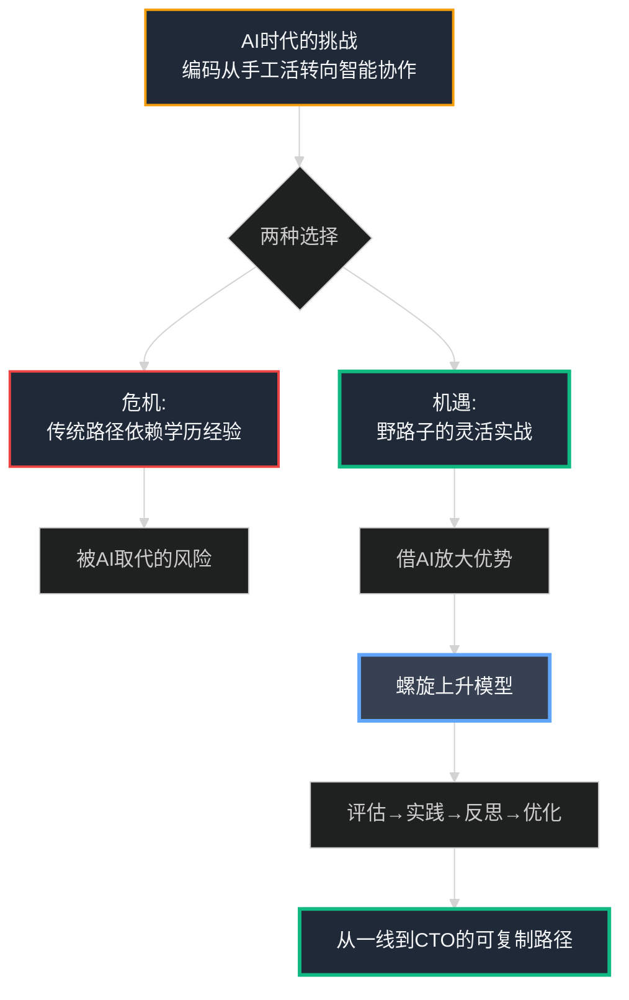

半小时后,小张坐在我对面,眼中满是困惑和不安。

"小张,你知道吗?AI时代,恰恰是我们这些'野路子'技术人最好的机会。"我说。

"为什么?"

"因为传统路径看重的是学历、资历、年限——这些都是**固化的标准**。而AI时代看重的是**学习能力、适应能力、实战能力**——这恰恰是野路子的强项。"

我打开电脑,给他看了一张我最近整理的图:

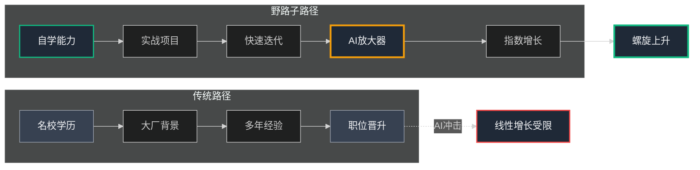

"传统路径是线性的,野路子路径是螺旋的——每一次迭代都比上一次更强。AI不是你的敌人,而是你的**放大器**。"

小张若有所思地点点头。

"但是,野路子也需要规划。"我继续说,"今天,我想和你分享我这些年的经验——一个从商科学生到CTO的完整路径。这不是理论,而是我真实走过的路。"

我在白板上写下了今天要聊的内容:

```
━━━━━━━━━━━━━━━━━━━━━━━━━━━━━━━━━━━━━━━━━━━━━
技术人的职业规划——螺旋上升模型
━━━━━━━━━━━━━━━━━━━━━━━━━━━━━━━━━━━━━━━━━━━━━

第一节: 自我评估——盘点你的"野路子"资产
第二节: 从一线到CTO——AI时代的路径拆解
第三节: 核心技能提升——AI放大你的"T型"
第四节: 避免35岁危机——可持续迭代与第二曲线

核心理念:
  成长不是线性的,而是螺旋上升的
  规划是起点,执行与迭代才是真正的成长

━━━━━━━━━━━━━━━━━━━━━━━━━━━━━━━━━━━━━━━━━━━━━
```

"走,我们一节一节地聊。"

---

### Part 1: 自我评估——盘点你的"野路子"资产

"规划的第一步,不是看别人有什么,而是**看你自己有什么**。"我说。

小张皱眉:"但我什么都没有啊——没学历,没背景,技术也不算强..."

"停!"我打断他,"这就是传统思维的陷阱。你在用传统标准评判自己,所以看不到自己的资产。"

我在白板上画了一个表格:

```
━━━━━━━━━━━━━━━━━━━━━━━━━━━━━━━━━━━━━━━━━━━━━
野路子技术人的隐藏资产
━━━━━━━━━━━━━━━━━━━━━━━━━━━━━━━━━━━━━━━━━━━━━

传统标准看到的        野路子的真实资产
━━━━━━━━━━━━━━━━━━━━━━━━━━━━━━━━━━━━━━━━━━━━━
❌ 非科班出身         ✅ 跨界视角(如销售→编程)
❌ 没有系统学习       ✅ 自学能力超强
❌ 经验碎片化         ✅ 实战经验丰富
❌ 基础不扎实         ✅ 问题导向,快速学习
❌ 没有大厂背景       ✅ 灵活,适应力强

AI时代的优势:
  跨界背景 → 理解用户需求(AI生成不了的)
  自学能力 → 快速掌握新工具(如Cursor)
  实战导向 → 直接解决问题(不纠结完美)
  灵活适应 → 拥抱变化(不固守旧模式)

━━━━━━━━━━━━━━━━━━━━━━━━━━━━━━━━━━━━━━━━━━━━━
```

"你看,当我们换一个角度看,你的'劣势'其实都是**独特的资产**。"

小张眼睛亮了:"但怎么把这些资产变成优势?"

"这就需要做一个**系统的自我评估**。"我打开电脑,给他看了我多年前给自己做的评估表:

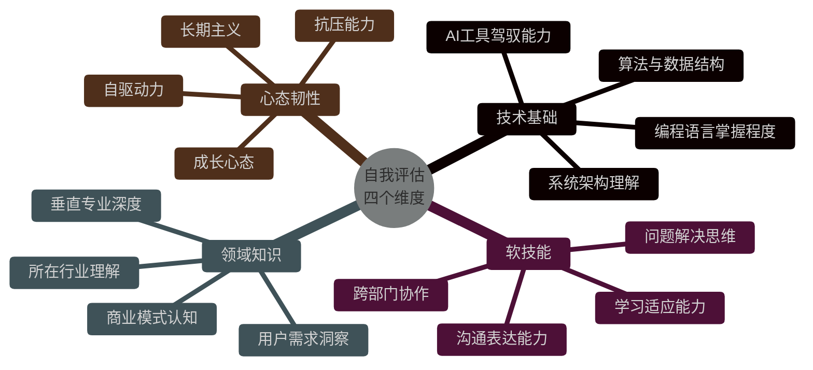

"每个维度都要诚实评估,找到你的**亮点**和**短板**。然后制定行动计划。"

我给他看了一个实际的评估案例:

```
━━━━━━━━━━━━━━━━━━━━━━━━━━━━━━━━━━━━━━━━━━━━━
小张的自我评估表(2025年11月)
━━━━━━━━━━━━━━━━━━━━━━━━━━━━━━━━━━━━━━━━━━━━━

维度            当前资产(野路子亮点)              短板与AI机会               1年目标
━━━━━━━━━━━━━━━━━━━━━━━━━━━━━━━━━━━━━━━━━━━━━━━━━━━━━━━━━━━━━━━
技术基础        自学Python 2年                   架构理解薄弱              驾驭AI+RAG
                建过5个实际项目                  缺乏大型系统经验          构建完整系统
                熟悉前端React                    → AI辅助系统设计          

软技能          曾做过销售,懂用户               技术文档能力弱            领导小项目
                沟通能力强                       → AI生成+人工审核         主动反馈迭代
                跨界背景丰富                     

领域知识        电商背景(曾在淘宝店工作)        知识浅层                  "AI+电商"专家
                了解中小商家痛点                 → 深挖垂直领域            建立个人品牌
                
心态韧性        转行成功(销售→技术)            对AI有焦虑               驾驭AI工具
                抗挫能力强                       → 视作放大器             建立信心
                自学习惯好                       

━━━━━━━━━━━━━━━━━━━━━━━━━━━━━━━━━━━━━━━━━━━━━━━━━━━━━━━━━━━━━━━

资产总结:
  ✅ 跨界优势: 销售背景→理解用户需求→产品sense强
  ✅ 实战能力: 5个项目→解决问题能力→不怕动手
  ✅ 学习韧性: 转行成功→证明学习能力→可持续成长
  
短板与机会:
  ⚠️ 技术深度不足 → 用AI辅助学习,边做边学
  ⚠️ 架构思维欠缺 → 读经典书籍,参与大项目
  ⚠️ 文档化能力弱 → 用AI工具生成,培养习惯

行动计划(Q1季度):
  Week 1-2:  读《设计数据密集型应用》前3章
  Week 3-4:  用Cursor重构一个旧项目,学习架构
  Week 5-8:  建立"AI+电商"个人博客,每周1篇
  Week 9-12: 在公司内部分享1次技术talk,锻炼表达

━━━━━━━━━━━━━━━━━━━━━━━━━━━━━━━━━━━━━━━━━━━━━
```

小张认真地看着这张表,若有所思。

"评估不是为了打击自己,而是为了**找到AI时代的杠杆点**。"我强调,"你看,你的销售背景在AI时代反而是优势——因为AI可以生成代码,但无法生成对用户的深刻理解。"

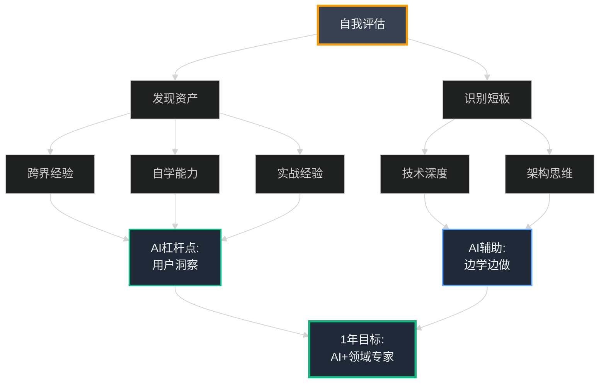

"记住,**每季度复盘一次评估**。你的资产会随时间增长,短板也会逐渐补足。这是一个螺旋上升的过程。"

我给他留了一个作业:

> **📋 作业:完成你的自我评估表**
> 
> 1. 诚实评估四个维度(技术、软技能、领域、心态)
> 2. 列出3个最大的资产(野路子亮点)
> 3. 列出3个最需要补足的短板
> 4. 制定下个季度的具体行动计划(不超过3件事)
> 5. 每周五复盘,每月调整

"完成这个表,你就迈出了规划的第一步。"

---

### Part 2: 从一线工程师到CTO——AI时代的路径拆解

"评估完自己,下一步就是看清**路径**。"我站起身,在白板上画了一个图。

"传统的职业路径是这样的——你从初级工程师做起,慢慢熬年头,等待晋升。但AI时代,路径变了。"

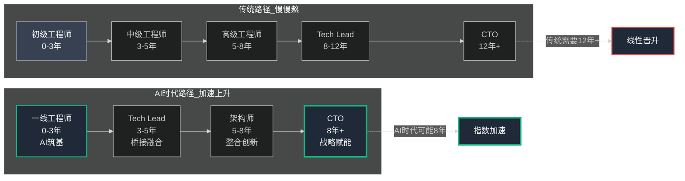

"AI时代,路径更扁平了——因为AI承担了大量日常工作,让你可以更快进入高价值角色。但每个阶段需要的能力不同。"

我详细展开每个阶段:

#### **阶段1: 一线工程师(0-5年)——借AI筑基,专注交付**

"这是打基础的阶段,也是最容易迷茫的阶段。"我说。

```
━━━━━━━━━━━━━━━━━━━━━━━━━━━━━━━━━━━━━━━━━━━━━
一线工程师阶段(0-5年)
━━━━━━━━━━━━━━━━━━━━━━━━━━━━━━━━━━━━━━━━━━━━━

核心职责:
  - 编码、调试、优化
  - 完成feature开发
  - 修复bug,保证质量
  
目标:
  成为"可靠执行者"——按时交付,质量稳定

AI时代的杠杆点:
  ✅ 用Copilot/Cursor加速编码(效率+30%)
  ✅ 用AI学习设计模式(如GoF 23种)
  ✅ 用AI生成单元测试(覆盖率+40%)
  ⚠️ 但必须手动审阅,避免"债务积累"

野路子的特殊技巧:
  🎯 用跨界背景建"AI+创意"工具
  🎯 在GitHub建立作品集(展示实力)
  🎯 写技术博客(沉淀+个人品牌)
  🎯 参与开源项目(学习+网络)

常见陷阱:
  ❌ 过度依赖AI,不理解原理
  ❌ 只做执行,不思考架构
  ❌ 闭门造车,不与人交流
  ❌ 只学工具,不学思维

━━━━━━━━━━━━━━━━━━━━━━━━━━━━━━━━━━━━━━━━━━━━━
```

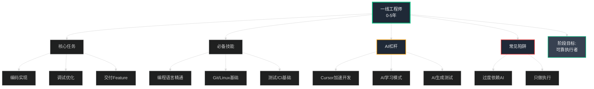

"我当年就在这个阶段,每天深夜自学,在天通苑地铁上看技术文档。那时没有AI,但现在你们有了——这既是巨大的优势,也可能是陷阱。"

#### **阶段2: 资深工程师/Tech Lead(5-10年)——桥接融合,扩展视野**

"当你成为可靠执行者后,下一步是**从'做'转向'教'和'设计'**。"

```
━━━━━━━━━━━━━━━━━━━━━━━━━━━━━━━━━━━━━━━━━━━━━
Tech Lead阶段(5-10年)
━━━━━━━━━━━━━━━━━━━━━━━━━━━━━━━━━━━━━━━━━━━━━

核心职责:
  - 架构设计(小到中型系统)
  - 导师指导(培养初级工程师)
  - RAG和AI Agent应用
  - Code Review,把控质量
  
目标:
  从"做"转向"教"和"设计"
  影响范围从个人扩展到小团队(5人)

AI时代的杠杆点:
  ✅ 用AI辅助架构决策(快速验证方案)
  ✅ 用AI生成技术文档(节省80%时间)
  ✅ 深挖AI Agent(每周20%时间)
  ✅ 参与产品会议(拓展业务视野)

关键转变:
  📊 深度 vs 广度的平衡
     - 20%时间:深挖技术(如AI Agent)
     - 80%时间:广度学习(产品、业务、管理)
  
  🎯 个人贡献 vs 团队贡献
     - 从"我做得最好"转向"我们做得最好"
     - 学会放手,培养他人

常见陷阱:
  ❌ 拒绝管理——"我只想写代码"
      (数据:30% Tech Lead卡在这里)
  ❌ 全是深度,没有广度
      (成为技术专家,但升不上去)
  ❌ 全是广度,没有深度
      (成为"PPT架构师",不受尊重)

━━━━━━━━━━━━━━━━━━━━━━━━━━━━━━━━━━━━━━━━━━━━━
```

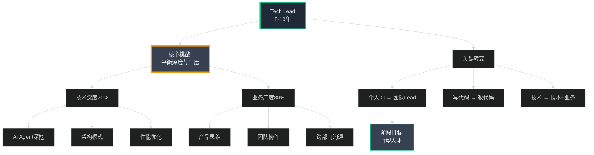

"这是最关键的转折点。"我强调,"很多技术人在这里卡住了,因为他们不愿意放下'写代码'的舒适区。"

小张问:"那怎么平衡呢?我也担心自己会变成'不写代码的架构师'。"

"好问题!我的经验是:**保持手艺人本色**。"我说,"每个月给自己留'黑客时间',纯粹写代码。但大部分时间,要逼自己走出舒适区。"

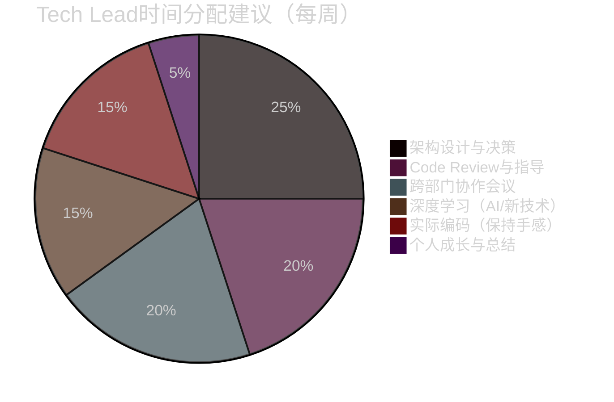

#### **阶段3: 架构师/工程总监(10-15年)——整合创新,驱动转型**

"到这个阶段,你已经不是单纯的技术人了,而是**技术与业务的桥梁**。"

```
━━━━━━━━━━━━━━━━━━━━━━━━━━━━━━━━━━━━━━━━━━━━━
架构师/工程总监阶段(10-15年)
━━━━━━━━━━━━━━━━━━━━━━━━━━━━━━━━━━━━━━━━━━━━━

核心职责:
  - 系统重构与技术债务管理
  - 风险把控与技术决策
  - AI系统设计(如RAG、Agent架构)
  - 影响公司技术路线
  
目标:
  从"解决问题"到"定义问题"
  影响范围从团队扩展到部门/公司级

AI时代的杠杆点:
  ✅ 跨界学习(如MBA微课、AI伦理)
  ✅ 用AI模拟架构演进(快速验证)
  ✅ 用OKR框架对齐团队目标
  ✅ 建立技术债务管理体系(第24章)

关键能力:
  🎯 战略思维
     - 技术选型不只看技术,看业务ROI
     - 理解CEO/CFO的语言(财务、增长)
  
  🎯 风险管理
     - 预见技术债务(第24章的经验)
     - 平衡创新与稳定
  
  🎯 人才培养
     - 从"做事"到"成事"
     - 建立技术文化

常见陷阱:
  ❌ 象牙塔架构师——不接地气
  ❌ 技术完美主义——忽视业务优先级
  ❌ 只管技术,不管人——团队士气低落

━━━━━━━━━━━━━━━━━━━━━━━━━━━━━━━━━━━━━━━━━━━━━
```

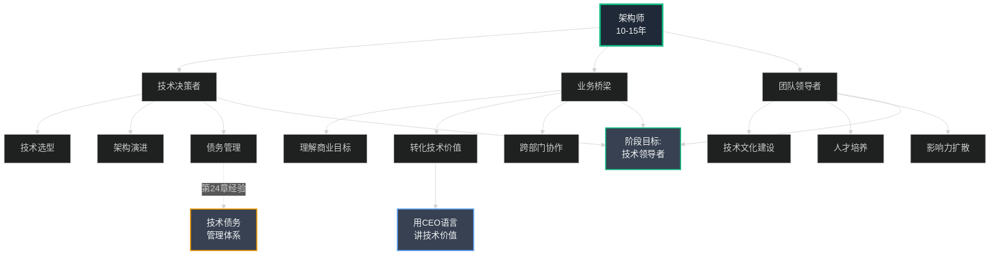

"我在这个阶段学到最重要的一课,是**技术债务管理**。"我指向第24章的笔记,"你记得我们花了两周偿债吗?那次经验让我明白,架构师不只是设计系统,更要管理系统的健康度。"

#### **阶段4: CTO/技术VP(15年以上)——战略赋能,构建生态**

"最后一个阶段,是很多人的终极目标——CTO。"我说,"但很多人对CTO有误解。"

```
━━━━━━━━━━━━━━━━━━━━━━━━━━━━━━━━━━━━━━━━━━━━━
CTO/技术VP阶段(15年以上)
━━━━━━━━━━━━━━━━━━━━━━━━━━━━━━━━━━━━━━━━━━━━━

核心职责:
  - 技术愿景与战略规划
  - 人才引进与组织建设
  - 赋能业务增长
  - 对外技术品牌(行业影响力)
  
目标:
  技术成为业务引擎,而非成本中心
  影响范围:全公司/生态

AI时代的杠杆点:
  ✅ 孵化AI产品线(新增长点)
  ✅ 领导企业AI转型
  ✅ 建立技术品牌(招聘/融资)
  ✅ 构建技术生态(开源/社区)

关键转变:
  📊 从"做技术"到"用技术赋能业务"
     - 不再亲自写代码(偶尔可以)
     - 关注业务指标(GMV、留存、增长)
     - 技术决策=商业决策
  
  🎯 从"管团队"到"建组织"
     - 建立可持续的技术文化
     - 培养下一代技术领导者
     - 打造学习型组织

CTO不是什么:
  ❌ 不是"最强的程序员"
  ❌ 不是"只懂技术的人"
  ❌ 不是"闭门造车的技术专家"

CTO是什么:
  ✅ 技术与业务的翻译器
  ✅ 组织能力的构建者
  ✅ 技术价值的放大器

━━━━━━━━━━━━━━━━━━━━━━━━━━━━━━━━━━━━━━━━━━━━━
```

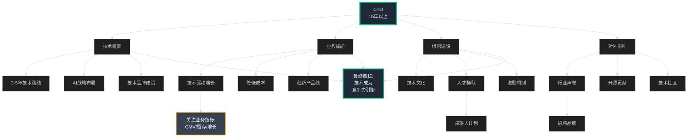

"我现在的角色,70%的时间在做**非技术的事**——跟CEO讨论战略,跟CFO谈预算,跟产品定义需求,跟HR招人。"我坦诚地说,"但这些都是在**用技术思维解决业务问题**。"

小张若有所思:"所以CTO不是技术最强的人?"

"对!CTO是**最懂如何用技术创造价值的人**。"我强调,"技术只是工具,价值才是目的。"

---

"现在,你看清整个路径了吗?"我把白板上的内容整理成一张完整的图:

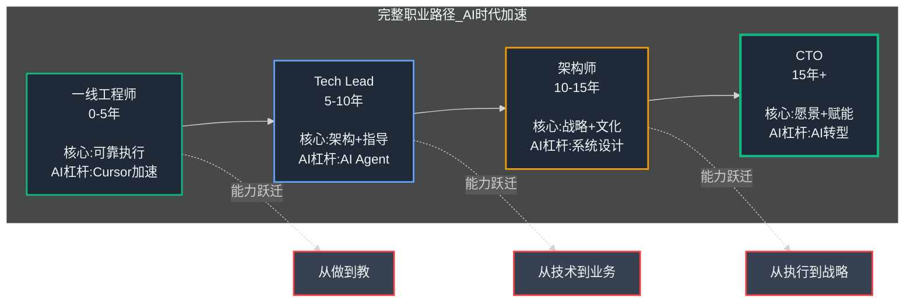

"记住,这个路径不是固定的时间线。**有人可能8年就到CTO,有人可能20年还在Tech Lead。**关键在于每个阶段的**能力跃迁**是否完成。"

我给小张看了一个对比表:

```
━━━━━━━━━━━━━━━━━━━━━━━━━━━━━━━━━━━━━━━━━━━━━━━━━━━━━━━━━
四个阶段的能力对比矩阵
━━━━━━━━━━━━━━━━━━━━━━━━━━━━━━━━━━━━━━━━━━━━━━━━━━━━━━━━━

阶段        技术能力    软技能    业务理解    影响范围    AI杠杆应用
━━━━━━━━━━━━━━━━━━━━━━━━━━━━━━━━━━━━━━━━━━━━━━━━━━━━━━━━━
一线工程师  ⭐⭐⭐⭐    ⭐⭐      ⭐          个人        Cursor加速编码
                                                      AI学习模式

Tech Lead   ⭐⭐⭐⭐    ⭐⭐⭐    ⭐⭐        5人团队     AI辅助架构
                                                      AI生成文档
                                                      
架构师      ⭐⭐⭐      ⭐⭐⭐⭐  ⭐⭐⭐      部门级      AI系统设计
                                                      债务管理

CTO         ⭐⭐        ⭐⭐⭐⭐  ⭐⭐⭐⭐    全公司      AI战略转型
                                                      生态构建

━━━━━━━━━━━━━━━━━━━━━━━━━━━━━━━━━━━━━━━━━━━━━━━━━━━━━━━━━
关键洞察:
  - 技术能力在Tech Lead阶段达到顶峰,之后维持即可
  - 软技能和业务理解持续增长,成为核心竞争力
  - AI杠杆的应用层次递进,从工具到战略
━━━━━━━━━━━━━━━━━━━━━━━━━━━━━━━━━━━━━━━━━━━━━━━━━━━━━━━━━
```

"看到了吗?**技术能力不是越往上越重要**,反而是软技能和业务理解越来越关键。"我说,"这就是为什么很多技术大牛升不上去——他们还在用技术能力竞争高层职位。"

小张恍然大悟:"所以我现在的跨界背景,反而是长期优势?"

"没错!"我拍了拍他的肩膀,"你的销售经验、用户洞察,这些在你到达Tech Lead和架构师阶段时,会成为核心竞争力。"

---

### Part 3: 核心技能提升——AI放大你的"T型"

"路径看清了,下一步是**具体怎么提升技能**。"我翻开笔记本。

"AI时代,技能模型变了。以前我们强调'全栈工程师',现在我们强调'**T型+AI**'——既有深度,又有广度,还懂得用AI放大。"

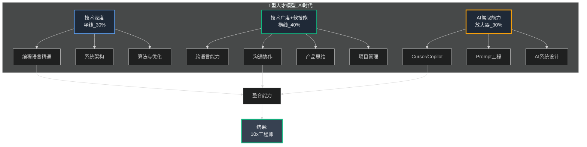

"注意这个比例:**技术深度30%,广度+软技能40%,AI驾驭30%**。很多人搞反了,把80%时间花在技术深度上。"

#### **1. 技术深度(竖线)——保持"手艺人"本色**

"虽然比例不高,但技术深度是你的**立身之本**,绝不能丢。"

```
━━━━━━━━━━━━━━━━━━━━━━━━━━━━━━━━━━━━━━━━━━━━━
技术深度提升路径
━━━━━━━━━━━━━━━━━━━━━━━━━━━━━━━━━━━━━━━━━━━━━

基础层(0-2年):
  🎯 精通1-2门编程语言(Python/JS推荐)
  🎯 理解数据结构与算法(LeetCode中等题)
  🎯 掌握Git/Linux/Docker基础
  
  AI辅助:
    ✅ 用Cursor学习语言特性
    ✅ 用AI解释算法原理
    ⚠️ 但必须手动实现,理解原理

进阶层(2-5年):
  🎯 系统设计能力(读《Designing Data-Intensive Applications》)
  🎯 设计模式(GoF 23种,重点理解6种常用)
  🎯 性能优化(profiling、并发、缓存)
  
  AI辅助:
    ✅ 用AI模拟高并发场景
    ✅ 用AI生成性能测试
    ⚠️ 但要手动分析结果

专家层(5年以上):
  🎯 垂直领域深挖(如AI、分布式、安全)
  🎯 开源贡献(建立技术声誉)
  🎯 技术写作(沉淀知识)
  
  AI辅助:
    ✅ 用AI辅助研究前沿技术
    ✅ 用AI生成技术文档
    ⚠️ 但核心洞察必须是自己的

保持手艺人本色的技巧:
  ✅ 每月设定"黑客时间"(2-4天纯编码)
  ✅ 参与code review(保持代码感)
  ✅ 亲手搭建小系统(如个人博客、工具)
  ⚠️ 避免成为"PPT架构师"

━━━━━━━━━━━━━━━━━━━━━━━━━━━━━━━━━━━━━━━━━━━━━
```

"AI让你跳过了'搬砖'阶段,但这不意味着你可以跳过基础。"我强调,"你更需要手动审阅AI代码、亲手搭建小系统,锻炼'改造力'和'鉴赏力'。"

**AI工具的理性认知——它比看起来要"笨"**

我停顿了一下,补充道:"但在深入AI工作流之前,我们需要对AI有正确的认知。"

"记住Seth Godin说的一句话:**AI比看起来要笨**。"我在白板上写下几个关键点:

```
━━━━━━━━━━━━━━━━━━━━━━━━━━━━━━━━━━━━━━━━━━━━━
AI的本质——理性认知
━━━━━━━━━━━━━━━━━━━━━━━━━━━━━━━━━━━━━━━━━━━━━

AI不是什么:
  ❌ 不是"智能"——它不真正理解任何东西
  ❌ 不是"知识库"——它只是在计算概率
  ❌ 不是"决策者"——每个字都是统计猜测
  ❌ 不是"值得信任的专家"——它会自信地犯错

AI是什么:
  ✅ 是工具——像螺丝刀、电锯一样的工具
  ✅ 是放大器——放大你的能力,不替代判断
  ✅ 是助手——辅助思考,不代替思考
  ✅ 是猜测器——基于概率的模式匹配

正确使用AI的原则:

1. 提清晰有界的问题
   ✅ "这段代码如何优化?"
   ❌ "帮我设计整个系统"

2. 容易检查结果的场景
   ✅ 生成单元测试(可以跑测试验证)
   ✅ 重构代码(可以对比diff)
   ❌ 复杂的业务逻辑(难以验证正确性)

3. 不让AI做决策,而是扩展选项
   ✅ "给我3种实现方案及利弊"
   ❌ "告诉我应该用哪种方案"

4. 利用AI的"无感情"获得反馈
   ✅ "这个设计有什么问题?"(AI会诚实指出)
   ✅ "帮我Review这段代码"
   ❌ 把AI当朋友倾诉(它不懂情感)

关键洞察:
  如果猜测足够好,你就赢了
  如果猜测不够好,你要有Plan B
  
  AI是"愚蠢但有用"的工具
  就像电锯——很强大,但用不好会砍到自己

━━━━━━━━━━━━━━━━━━━━━━━━━━━━━━━━━━━━━━━━━━━━━
```

"我个人更喜欢Claude,因为它**更谦逊,更少自大**。"我说,"但无论用哪个,记住:AI在猜,你要审。"

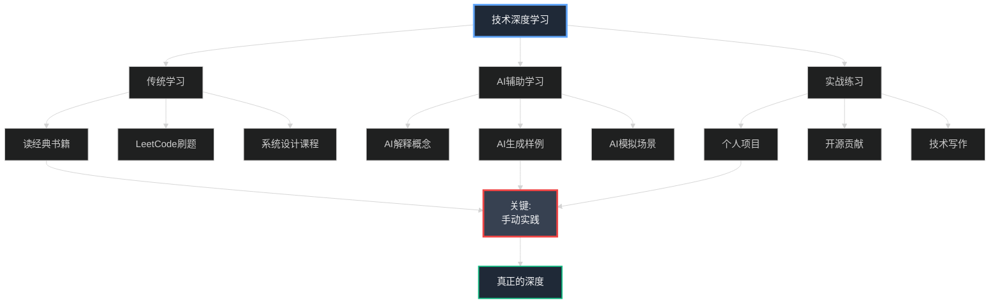

#### **2. 架构与工程思维——野路子的独特优势**

"野路子技术人有个特点——实战导向。这在架构思维培养上,反而是优势。"

```
━━━━━━━━━━━━━━━━━━━━━━━━━━━━━━━━━━━━━━━━━━━━━
架构与工程思维培养
━━━━━━━━━━━━━━━━━━━━━━━━━━━━━━━━━━━━━━━━━━━━━

什么是架构思维?
  不是画漂亮的架构图,而是:
  ✅ 权衡取舍(Trade-off思维)
  ✅ 面向演化(可扩展性)
  ✅ 管理复杂度(简单优于复杂)
  ✅ 商业价值导向(不过度设计)

野路子的架构悖论:
  ❓ AI跳过了"搬砖"阶段
  ❓ 是否可以跳过基础,直接做架构?
  
  ❌ 答案:不能!
  
  为什么?
    - AI生成的代码需要你判断好坏(需要"鉴赏力")
    - AI提供的方案需要你权衡利弊(需要"判断力")
    - 这些能力只能通过实战获得

培养架构思维的实战路径:
  
  Step 1: 阅读经典(理论基础)
    📚 《Designing Data-Intensive Applications》
    📚 《系统设计面试》
    📚 《凤凰项目》(DevOps思维)
    
  Step 2: 拆解优秀系统(逆向学习)
    🔍 研究开源项目架构(如Django、Flask)
    🔍 阅读技术博客(如Netflix、Uber技术团队)
    🔍 用AI辅助理解复杂系统
    
  Step 3: 亲手重构小系统(实战练习)
    💻 每季度选1个旧项目重构
    💻 写重构日志(记录决策过程)
    💻 用AI辅助但自己做决策
    
  Step 4: 参与大项目(真实场景)
    🎯 主动请缨参与核心项目
    🎯 观察资深架构师的决策过程
    🎯 在code review中学习

野路子的独特杠杆:
  ✅ 用跨界知识建垂直AI应用
     例:电商背景→建"AI+电商推荐"系统
     例:销售背景→建"AI+CRM"工具
  
  ✅ 实战优先,快速迭代
     不追求完美设计,先快速验证MVP
     在真实反馈中调整架构

━━━━━━━━━━━━━━━━━━━━━━━━━━━━━━━━━━━━━━━━━━━━━
```

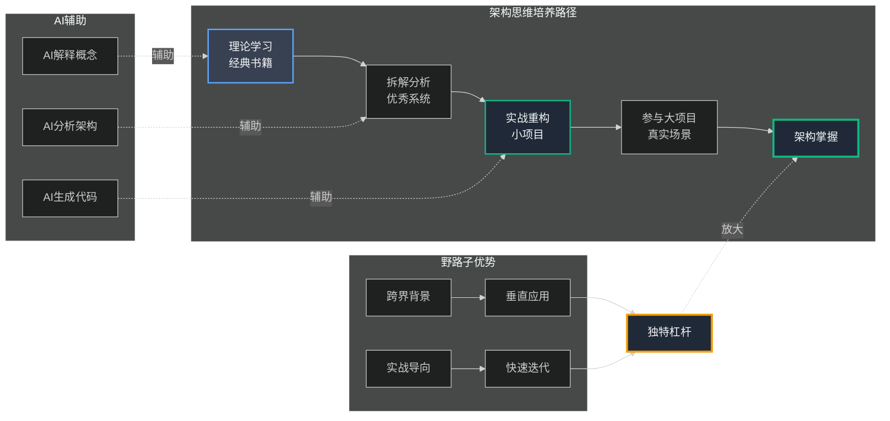

"记住,架构不是一次性设计出来的,而是**演化**出来的。"我说,"这也是为什么我们在第24章花了两周偿还技术债务——好的架构需要持续维护。"

#### **3. 广度与软技能(横线)——AI取代不了的能力**

"现在我们来聊最重要的部分——**软技能**。"我在白板上重重画了一个圈。

"在AI时代,编码能力被大幅压缩,但软技能的价值反而被放大了。"

```
━━━━━━━━━━━━━━━━━━━━━━━━━━━━━━━━━━━━━━━━━━━━━
软技能——AI取代不了的核心竞争力
━━━━━━━━━━━━━━━━━━━━━━━━━━━━━━━━━━━━━━━━━━━━━

为什么软技能越来越重要?
  
  AI可以做:
    ✅ 生成代码
    ✅ 写技术文档
    ✅ 调试bug
  
  AI做不了:
    ❌ 理解用户真实需求(需要共情)
    ❌ 协调跨部门利益冲突(需要沟通)
    ❌ 激励团队士气(需要领导力)
    ❌ 做复杂权衡决策(需要判断力)
    ❌ 建立信任关系(需要人际能力)

核心软技能清单:

1. 沟通表达(最重要!)
   
   技术沟通:
     ✅ 能用简单语言解释复杂技术
     ✅ 写清晰的技术文档(AI辅助生成,人工审核)
     ✅ 做有说服力的技术演讲
   
   跨部门沟通:
     ✅ 理解产品、运营、销售的语言
     ✅ 翻译技术问题为业务影响
     ✅ 建立跨部门信任
   
   向上沟通:
     ✅ 用CEO的语言讲技术价值
     ✅ 用CFO的语言讲ROI
     ✅ 用数据说话,不用技术术语
   
   野路子优势:
     💡 你的跨界背景(如销售)是天然优势
     💡 你更懂"人话",不是"技术黑话"

2. 问题解决能力
   
   AI时代的问题解决:
     ✅ 定义问题(比解决问题更重要)
     ✅ 拆解复杂问题为小问题
     ✅ 用AI辅助但自己做决策
   
   框架化思维:
     ✅ 5Why分析法(找根因)
     ✅ 第一性原理(回到本质)
     ✅ 80/20法则(抓重点)

3. 学习能力(野路子核心优势!)
   
   AI时代学习加速:
     ✅ 用AI快速了解新领域
     ✅ 用AI生成学习路径
     ✅ 但核心是"学会学习"的元能力
   
   野路子的学习优势:
     💡 自学能力强(已被证明)
     💡 实战导向,不纠结完美
     💡 跨界迁移能力

4. 协作与领导力
   
   人机协作:
     ✅ Prompt就是新的"对话"
     ✅ AI文档化能力弱,你要补足
     ✅ Code Review变得更重要(审AI代码)
   
   团队协作:
     ✅ 管理如"分布式系统"
     ✅ 分权、监控、容错
     ✅ 激励>命令

5. 商业意识(升CTO必备)
   
   理解商业模式:
     ✅ 你的技术如何创造价值?
     ✅ ROI怎么算?
     ✅ 技术债务的商业成本?(第24章)
   
   野路子优势:
     💡 你可能有业务背景(如电商、销售)
     💡 这是科班生缺乏的

━━━━━━━━━━━━━━━━━━━━━━━━━━━━━━━━━━━━━━━━━━━━━
```

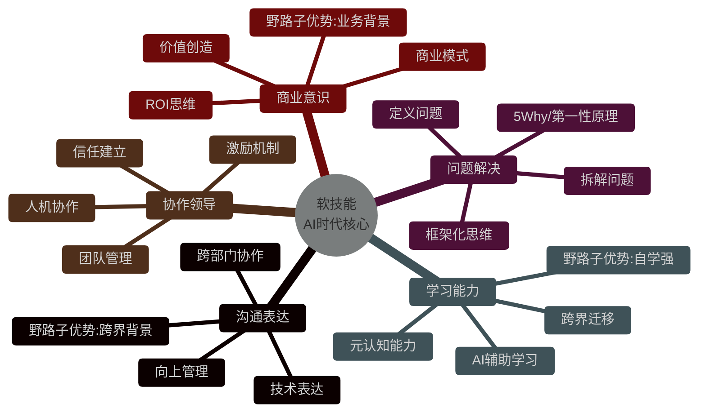

"看到了吗?**软技能才是你的护城河**。"我强调,"AI可以写代码,但AI建立不了信任,激励不了团队,理解不了用户。"

小张若有所思:"所以我的销售背景,反而是长期优势?"

"对!等你到Tech Lead、架构师阶段,你会发现**理解人、沟通协作,比写代码重要得多**。"

#### **实战练习:每周行动计划**

"理论说完了,最重要的是**行动**。"我给小张列了一个每周计划模板:

```
━━━━━━━━━━━━━━━━━━━━━━━━━━━━━━━━━━━━━━━━━━━━━
每周行动计划模板(40小时工作制)
━━━━━━━━━━━━━━━━━━━━━━━━━━━━━━━━━━━━━━━━━━━━━

周一-周二(16小时):AI coding实践
  🎯 用Cursor完成实际项目任务
  🎯 LeetCode AI版练习(用AI辅助,自己实现)
  🎯 参与code review(学习+贡献)
  
  重点:
    ✅ 手动审阅AI代码
    ✅ 理解每一行逻辑
    ⚠️ 避免"复制粘贴工程师"

周三-周四(16小时):架构与系统思维
  🎯 维护/重构一个小系统
  🎯 阅读技术文章/书籍(每天30分钟)
  🎯 分析优秀开源项目架构
  
  重点:
    ✅ 记录架构决策(为什么这样设计?)
    ✅ 用AI辅助但自己做决策
    ✅ 写重构日志

周五(8小时):软技能+复盘
  🎯 参与跨部门会议(产品/运营)
  🎯 写周报/技术分享(锻炼表达)
  🎯 每周复盘(What/So What/Now What)
  
  重点:
    ✅ 主动沟通,建立联系
    ✅ 用简单语言讲技术
    ✅ 总结本周成长

周末(弹性):领域深挖+个人品牌
  🎯 深挖垂直领域(如AI+电商)
  🎯 写技术博客(每月2篇)
  🎯 参与技术社区(GitHub/掘金)
  
  重点:
    ✅ 建立个人品牌
    ✅ 沉淀知识体系
    ✅ 扩展人脉网络

时间分配建议:
  30% - 深度技术(编码+架构)
  40% - 广度技能(沟通+协作+业务)
  30% - AI驾驭(Cursor+Prompt+系统设计)

━━━━━━━━━━━━━━━━━━━━━━━━━━━━━━━━━━━━━━━━━━━━━
```

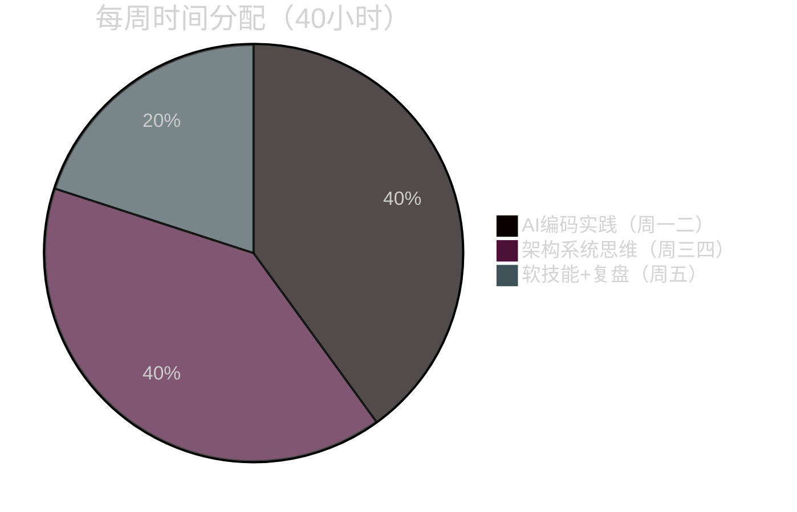

"关键在于**持续迭代**。"我说,"每周五复盘,每月调整,每季度评估。这就是螺旋上升。"

---

### Part 4: 避免35岁危机——可持续迭代与第二曲线

谈话进行到这里,小张突然问了一个让我沉默的问题:

"陈浩哥,我今年24岁。我看网上都说技术人35岁就没人要了。这条路,真的走得通吗?"

窗外的夕阳更低了,橙红色的光洒进办公室。我沉思了一会儿,缓缓开口:

"35岁危机,是真实存在的。但它不是宿命。"

我在白板上画了一个曲线图:

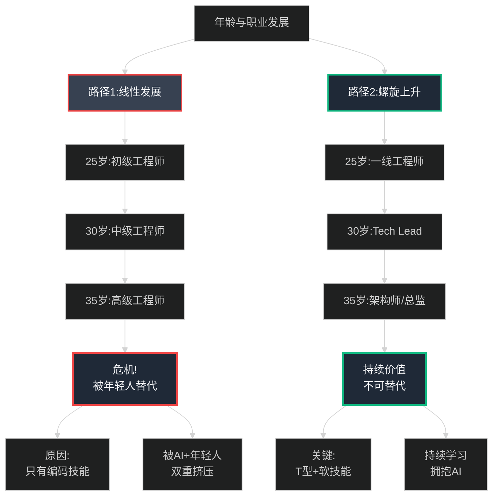

#### **35岁危机的真相**

"首先,我们要理解**35岁危机为什么存在**。"

```
━━━━━━━━━━━━━━━━━━━━━━━━━━━━━━━━━━━━━━━━━━━━━
35岁危机的成因分析
━━━━━━━━━━━━━━━━━━━━━━━━━━━━━━━━━━━━━━━━━━━━━

现象:
  📊 2025年数据:40%的35岁+技术人面临职业困境
  📊 跳槽成功率:35岁以下80%,35岁以上35%
  📊 薪资plateau:很多人30-40岁薪资不增反降

三大成因:

1. 体力与精力衰退
   ❌ 无法像年轻人那样连续加班
   ❌ 学习新技术的速度下降
   ❌ Burnout风险增加
   
   但:
     ✅ 经验带来的效率可以弥补
     ✅ AI工具降低了体力要求
     ✅ 智慧>体力(做正确的事>做更多的事)

2. 技能过时与AI冲击
   ❌ 只会写CRUD代码
   ❌ 技术栈老化(还在用jQuery)
   ❌ AI取代routine工作
   
   但:
     ✅ 如果你持续学习(拥抱AI)
     ✅ 如果你有软技能+业务理解
     ✅ 你反而更有竞争力

3. 家庭与生活压力
   ❌ 房贷、育儿、父母养老
   ❌ 不能像年轻人那样灵活
   ❌ 薪资期望高但增长停滞
   
   但:
     ✅ 如果你建立了"第二曲线"
     ✅ 如果你有被动收入
     ✅ 压力反而成为动力

━━━━━━━━━━━━━━━━━━━━━━━━━━━━━━━━━━━━━━━━━━━━━
核心洞察:
  35岁危机不是年龄问题,是价值问题
  如果你35岁还只能做25岁的事,当然会被淘汰
  如果你35岁能做25岁做不了的事,你就是稀缺资源
━━━━━━━━━━━━━━━━━━━━━━━━━━━━━━━━━━━━━━━━━━━━━
```

"我今年也快35了。"我坦诚地说,"但我不焦虑。为什么?因为我做的事,25岁的年轻人做不了——我有经验、有人脉、有业务理解、有团队管理能力。"

#### **应对策略:可持续发展的三个支柱**

"避免35岁危机,需要**提前10年布局**。"我在白板上写下三个关键词:

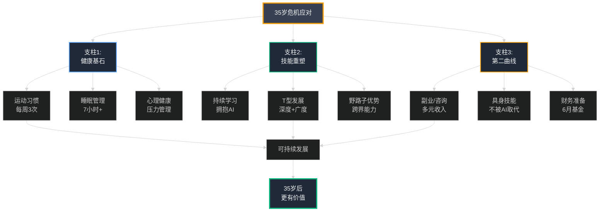

**支柱1:健康基石——长期主义的前提**

```
━━━━━━━━━━━━━━━━━━━━━━━━━━━━━━━━━━━━━━━━━━━━━
健康管理——职业生涯的基础设施
━━━━━━━━━━━━━━━━━━━━━━━━━━━━━━━━━━━━━━━━━━━━━

残酷现实:
  很多技术人30岁就:
  ❌ 颈椎病、腰椎病
  ❌ 脱发、肥胖
  ❌ 失眠、焦虑
  ❌ 慢性疲劳

健康投资(ROI最高的投资):
  
  1. 运动习惯(每周3次,每次30-60分钟)
     ✅ 不要求高强度,关键是坚持
     ✅ 推荐:游泳、慢跑、力量训练
     ✅ 利用通勤时间(提前一站下车走路)
  
  2. 睡眠管理(7-8小时)
     ✅ 固定作息,不熬夜
     ✅ 睡前1小时不看手机
     ✅ 周末补觉不超过1小时
  
  3. 饮食调整
     ✅ 减少外卖,自己做饭
     ✅ 多吃蔬菜水果
     ✅ 控制糖分和油脂
  
  4. 心理健康
     ✅ 定期与家人朋友聊天
     ✅ 培养爱好(音乐、阅读、旅行)
     ✅ 必要时寻求心理咨询

我的个人经验:
  从2020年开始,我每周游泳2次,每次1小时
  睡眠从每天5小时调整到7小时
  结果:
    ✅ 精力明显改善
    ✅ 工作效率提升30%
    ✅ 很少生病
    ✅ 心态更平和

投入:每周3小时运动 + 每天2小时额外睡眠
产出:工作效率提升30% + 医疗支出降低 + 生活质量提升
ROI:无法估量,但绝对值得

━━━━━━━━━━━━━━━━━━━━━━━━━━━━━━━━━━━━━━━━━━━━━
```

"健康是1,其他都是0。"我认真地说,"我见过太多技术人,30多岁就身体垮了,再多的钱都买不回健康。"

**支柱2:技能重塑——转向"AI+X"**

"技能会过时,但学习能力不会。"我继续说。

```
━━━━━━━━━━━━━━━━━━━━━━━━━━━━━━━━━━━━━━━━━━━━━
技能重塑——从"技术人"到"AI+X专家"
━━━━━━━━━━━━━━━━━━━━━━━━━━━━━━━━━━━━━━━━━━━━━

35岁后,不要只学AI技术,要成为"AI+X"专家:

方向1: AI + 垂直行业
  🎯 AI + 医疗(医疗AI系统)
  🎯 AI + 金融(风控、量化)
  🎯 AI + 教育(个性化学习)
  🎯 AI + 制造(工业AI)
  
  优势:
    ✅ 行业know-how不会过时
    ✅ AI是工具,领域是护城河
    ✅ 野路子的跨界背景成为优势

方向2: AI + 软技能
  🎯 AI + 咨询(帮企业做AI转型)
  🎯 AI + 培训(AI技能培训师)
  🎯 AI + 产品(AI产品经理)
  🎯 AI + 管理(AI团队管理)
  
  优势:
    ✅ 软技能AI生成不了
    ✅ 35岁后软技能更成熟
    ✅ 市场需求大,竞争小

方向3: AI + 创业/副业
  🎯 AI工具开发(如AI插件)
  🎯 AI咨询服务(Upwork/Fiverr)
  🎯 AI内容创作(博客、课程)
  🎯 AI应用定制(中小企业)
  
  优势:
    ✅ 时间自由
    ✅ 收入可扩展
    ✅ 不受35岁限制

具体行动计划(35岁前5年开始布局):
  
  Year 1-2: 选定"X"(垂直领域)
    - 研究3个行业,选1个深挖
    - 建立个人博客,沉淀知识
    - 参加行业会议,建立人脉
  
  Year 3-4: 建立专业度
    - 成为"AI+X"领域的KOL
    - 发表文章、做分享
    - 接咨询项目,验证价值
  
  Year 5: 开辟第二曲线
    - 副业收入达到主业30%+
    - 建立个人品牌
    - 财务更自由

━━━━━━━━━━━━━━━━━━━━━━━━━━━━━━━━━━━━━━━━━━━━━
```

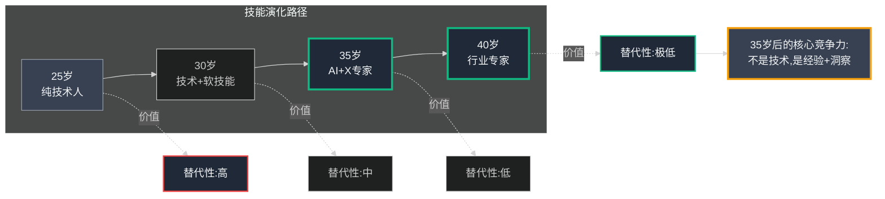

**支柱3:第二曲线——不把鸡蛋放在一个篮子**

"最后,也是最重要的——**建立第二曲线**。"我说。

```
━━━━━━━━━━━━━━━━━━━━━━━━━━━━━━━━━━━━━━━━━━━━━
第二曲线——财务安全网与职业保险
━━━━━━━━━━━━━━━━━━━━━━━━━━━━━━━━━━━━━━━━━━━━━

为什么需要第二曲线?
  
  ❌ 主业收入有天花板
  ❌ 裁员风险无法预测
  ❌ 35岁后跳槽困难
  ❌ 全职工作=单点故障
  
  ✅ 第二曲线=抗风险能力
  ✅ 多元收入=财务安全
  ✅ 副业=新的可能性
  ✅ 被动收入=真正自由

第二曲线的类型:

1. 基于技能的副业(推荐指数:⭐⭐⭐⭐⭐)
   
   选项A: 技术咨询
     - 在Upwork/Fiverr接项目
     - 帮中小企业做AI转型
     - 时薪¥500-2000
     - 每周投入5-10小时
     - 月收入:¥1-3万
   
   选项B: 技术培训/写作
     - 在知识星球/小册子平台
     - 录制视频课程
     - 写技术专栏
     - 被动收入,可持续
     - 月收入:¥5千-2万(稳定后)
   
   选项C: 开源项目商业化
     - 开发AI工具/插件
     - GitHub赞助/付费版本
     - 建立SaaS小产品
     - 月收入:不稳定,但潜力大

2. 跨界的"具身技能"(推荐指数:⭐⭐⭐⭐)
   
   什么是具身技能?
     ✅ 需要人类在场的技能
     ✅ AI难以取代
     ✅ 通常与"手艺"相关
   
   案例:
     - 咖啡师(我认识的工程师副业)
     - 木工(周末做家具)
     - 摄影师(婚礼摄影)
     - 健身教练(晚上带课)
   
   优势:
     ✅ 完全不同的技能树
     ✅ AI取代不了
     ✅ 有社交属性
     ✅ 心理上的调剂

3. 投资与理财(推荐指数:⭐⭐⭐)
   
   被动收入策略:
     🎯 指数基金定投(长期)
     🎯 REITs/债券(稳定)
     🎯 出租房产(如果有)
   
   ⚠️ 不推荐:
     ❌ 炒股(时间成本高)
     ❌ 加密货币(风险太高)
     ❌ P2P/高风险产品

4. 财务准备:6个月基金
   
   应急基金计算:
     (月支出 × 6个月) + 缓冲
     
   例如:
     月支出:¥2万(房贷¥1万 + 生活¥1万)
     应急基金:¥12万 + ¥3万缓冲 = ¥15万
   
   这笔钱的作用:
     ✅ 裁员时不慌
     ✅ 可以从容找工作
     ✅ 有勇气说"不"
     ✅ 心理安全感

我的第二曲线经验:
  
  2013年:联盟营销博客(月入¥4-5万)
  2014年:与王峰合作数字营销机构
  2020年:创立小店通
  
  现在:
    - 小店通(主业)
    - 技术咨询(每月2-3个小时,月入¥1-2万)
    - 技术写作(被动收入,月入¥5千)
    - 投资理财(被动收入)
  
  结果:
    ✅ 财务安全感极强
    ✅ 不怕任何职业风险
    ✅ 可以自由选择
    ✅ 35岁后更自信

━━━━━━━━━━━━━━━━━━━━━━━━━━━━━━━━━━━━━━━━━━━━━
```

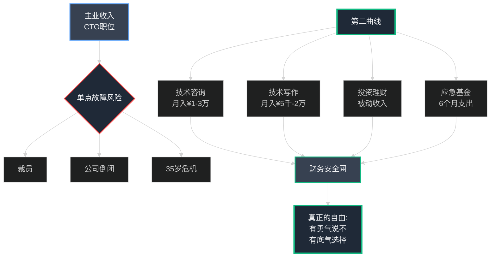

"记住,**第二曲线不是为了赚更多钱,而是为了给自己更多选择**。"我说,"当你有第二曲线时,就不会被任何单一收入来源绑架。"

---

#### **真实案例:两个35岁的故事**

"最后,我给你讲两个真实的故事,都是我身边的人。"我翻开笔记本。

**案例1:小李——从销售到AI营销工程师**

```
━━━━━━━━━━━━━━━━━━━━━━━━━━━━━━━━━━━━━━━━━━━━━
小李的故事:野路子的逆袭
━━━━━━━━━━━━━━━━━━━━━━━━━━━━━━━━━━━━━━━━━━━━━

背景(2020年,30岁):
  ❌ 大专学历,销售出身
  ❌ 做了5年ToB销售,感觉遇到瓶颈
  ❌ 收入¥1.5万/月,增长停滞
  ❌ 担心35岁被淘汰

转折点(2020-2021):
  ✅ 疫情期间自学Python(每天2小时)
  ✅ 用销售经验理解客户需求
  ✅ 开始用AI工具(GPT-3)生成营销内容
  ✅ 发现了"AI + 营销"的价值

行动(2021-2023):
  Year 1:
    - 转岗到公司的增长团队
    - 用AI优化营销流程
    - 效果显著,获得认可
  
  Year 2:
    - 深挖"AI营销"
    - 建立个人博客,分享经验
    - 接咨询项目(周末)
  
  Year 3:
    - 成为"AI营销"领域小KOL
    - 创业做AI营销工具
    - 获得天使投资

结果(2024年,34岁):
  ✅ 月收入:¥5-8万(创业公司CEO)
  ✅ 薪资翻了4倍
  ✅ 完全不担心35岁危机
  ✅ 销售背景成为核心优势

关键洞察:
  "我的销售经验,让我比纯技术人更懂客户需求。
   AI工具,让我能快速实现想法。
   这两者结合,就是我的护城河。"
   
━━━━━━━━━━━━━━━━━━━━━━━━━━━━━━━━━━━━━━━━━━━━━
```

**案例2:阿明——野路子前端工程师的转型**

```
━━━━━━━━━━━━━━━━━━━━━━━━━━━━━━━━━━━━━━━━━━━━━
阿明的故事:从前端到边缘AI架构
━━━━━━━━━━━━━━━━━━━━━━━━━━━━━━━━━━━━━━━━━━━━━

背景(2018年,32岁):
  ✅ 阿里P6前端工程师
  ✅ 自学出身,非科班
  ✅ 技术扎实,但感觉天花板
  ❌ 看到AI崛起,初级前端被取代

危机感(2019-2020):
  ⚠️ GPT-3发布,AI能写代码了
  ⚠️ 看到很多初级前端失业
  ⚠️ 意识到纯前端不是长久之计

转型(2020-2023):
  策略:不是放弃前端,而是"前端 + X"
  
  选择方向:边缘计算 + AI
    - 为什么?移动端AI是趋势
    - 自己的前端经验可以复用
    - 市场竞争小
  
  Year 1 (2020):
    - 深挖TensorFlow.js和WebAssembly
    - 做移动端AI性能优化
    - 内部分享,建立影响力
  
  Year 2 (2021):
    - 转岗到边缘AI团队
    - 负责端侧AI架构设计
    - 强化沟通和协作能力
  
  Year 3 (2022-2023):
    - 晋升为Tech Lead
    - 带10人团队
    - 成为公司边缘AI专家

结果(2024年,37岁):
  ✅ 阿里P8(Tech Lead)
  ✅ 薪资翻倍(年薪100万+)
  ✅ 完全不担心35岁危机
  ✅ 从"容易被取代"到"难以替代"

关键洞察:
  "AI摧毁了初级前端岗位,但创造了'前端+AI'的新岗位。
   我35岁时的转型,让我从红海进入蓝海。
   现在公司想找能做移动端AI的人,市场上很少。"
   
━━━━━━━━━━━━━━━━━━━━━━━━━━━━━━━━━━━━━━━━━━━━━
```

```mermaid
%%{init: {'theme':'dark'}}%%
graph TB
    subgraph 小李的路径_销售转AI营销
    L1[销售5年<br/>¥1.5万/月] --> L2[自学Python<br/>AI工具]
    L2 --> L3[AI+营销<br/>创业]
    L3 --> L4[¥5-8万/月<br/>CEO]
    end
    
    subgraph 阿明的路径_前端转边缘AI
    A1[前端P6<br/>遇瓶颈] --> A2[边缘AI<br/>转型]
    A2 --> A3[Tech Lead<br/>P8]
    A3 --> A4[年薪100万+<br/>专家]
    end
    
    L1 -.危机感.-> Crisis[35岁危机]
    A1 -.危机感.-> Crisis
    
    L4 --> Success[成功避开危机]
    A4 --> Success
    
    Success --> Key[关键:<br/>找到AI+X<br/>建立护城河]
    
    style L1 fill:#374151,stroke:#ef4444,color:#f3f4f6,stroke-width:2px
    style A1 fill:#374151,stroke:#ef4444,color:#f3f4f6,stroke-width:2px
    style L4 fill:#1f2937,stroke:#10b981,color:#f3f4f6,stroke-width:3px
    style A4 fill:#1f2937,stroke:#10b981,color:#f3f4f6,stroke-width:3px
    style Crisis fill:#1f2937,stroke:#f59e0b,color:#f3f4f6,stroke-width:2px
    style Success fill:#1f2937,stroke:#10b981,color:#f3f4f6,stroke-width:3px
    style Key fill:#374151,stroke:#60a5fa,color:#f3f4f6,stroke-width:3px
```

"你看,两个人,两条路径,但核心逻辑是一样的:**找到自己的'X',用AI放大**。"

小张若有所思:"我明白了。我的销售背景,也可以成为我的'X'?"

"没错!"我拍了拍他的肩膀,"你不是没有优势,你是还没发现自己的优势。"

---

#### **启动清单:从明天开始行动**

"理论讲完了,现在给你一个**可执行的启动清单**。"我打开一个新的文档。

```
━━━━━━━━━━━━━━━━━━━━━━━━━━━━━━━━━━━━━━━━━━━━━
35岁危机避免清单——从明天开始
━━━━━━━━━━━━━━━━━━━━━━━━━━━━━━━━━━━━━━━━━━━━━

立即行动(本周内):
  [ ] 完成"自我评估"表格(第一节)
  [ ] 选定1个AI工具(Cursor/Copilot),开始使用
  [ ] 建立健康习惯:每周运动计划
  [ ] 计算应急基金,开始储蓄

第一个月:
  [ ] 用AI(Cursor)重构一个旧项目
  [ ] 上传到GitHub,建立作品集
  [ ] 写1篇技术博客(用AI辅助,但自己审核)
  [ ] 研究3个"AI+X"方向,选定1个

第一季度:
  [ ] 读完《Designing Data-Intensive Applications》前5章
  [ ] 在公司内部做1次技术分享
  [ ] 开始第二曲线探索(咨询/写作/副业)
  [ ] 运动习惯固化(每周3次,连续12周)

第一年:
  [ ] 成为"AI+X"领域的小专家
  [ ] 建立个人品牌(博客持续更新)
  [ ] 第二曲线收入达到主业10%
  [ ] 应急基金达到6个月支出
  [ ] 在LinkedIn/X上与行业人交流(每月3人)

长期规划(3-5年):
  [ ] 成为"AI+X"领域KOL
  [ ] 第二曲线收入达到主业30%+
  [ ] 建立可持续的职业安全网
  [ ] 35岁后不焦虑,更有价值

━━━━━━━━━━━━━━━━━━━━━━━━━━━━━━━━━━━━━━━━━━━━━
关键提醒:
  ✅ 不要贪多,每次只专注1-2件事
  ✅ 持续迭代,每月复盘调整
  ✅ 不要追求完美,先行动起来
  ✅ 记录进展,看到成长
━━━━━━━━━━━━━━━━━━━━━━━━━━━━━━━━━━━━━━━━━━━━━
```

"把这个清单打印出来,贴在电脑旁边。**每周五下午花30分钟复盘**。"我说。

小张认真地拍了照:"陈浩哥,谢谢你。我现在清楚多了。"

"不客气。"我站起身,走到窗边,看着窗外的北京夜景。

---

### 结语:野路子,AI时代的完美搭档

夜幕降临,北京CBD的霓虹灯开始闪烁。我看着窗外这座城市,想起了十几年前,那个在天通苑地铁上发誓要改变命运的自己。

那时的我,也是个"野路子":
- 商科背景,不是计算机专业
- 没有名校学位
- 没有人脉背景
- 只有一腔热血和不服输的韧性

但今天,我成了小店通的CTO,带领着一支优秀的技术团队。

**这不是偶然,这是一条可复制的路径。**

我转身对小张说:

"小张,记住几句话,这是我这些年最深刻的体会。"

```
━━━━━━━━━━━━━━━━━━━━━━━━━━━━━━━━━━━━━━━━━━━━━
陈浩的职业规划感悟
━━━━━━━━━━━━━━━━━━━━━━━━━━━━━━━━━━━━━━━━━━━━━

1. 关于野路子
   "野路子不是劣势,是独特的资产。
    你的弯路,在AI时代就是高速路。"

2. 关于AI
   "AI不是你的敌人,是你的放大器。
    但AI只能放大你的能力,不能替代你的独特性。"

3. 关于35岁危机
   "35岁危机不是年龄问题,是价值问题。
    如果你35岁能做25岁做不了的事,你就是稀缺资源。"

4. 关于规划
   "规划不是静态的蓝图,而是动态的迭代。
    评估→实践→反思→优化,螺旋上升。"

5. 关于第二曲线
   "不要把所有鸡蛋放在一个篮子里。
    第二曲线不是为了赚更多钱,而是给自己更多选择。"

6. 关于学历
   "学历是敲门砖,能力是通行证。
    在AI时代,学习能力比学历更重要。"

7. 关于长期主义
   "技术人的职业生涯是马拉松,不是百米冲刺。
    健康、持续学习、人脉,这些才是长期竞争力。"

━━━━━━━━━━━━━━━━━━━━━━━━━━━━━━━━━━━━━━━━━━━━━
```

```mermaid
%%{init: {'theme':'dark'}}%%
graph TB
    Start[野路子技术人]
    
    Start --> Mindset[成长心态]
    Mindset --> M1[拥抱变化]
    Mindset --> M2[持续学习]
    Mindset --> M3[韧性]
    
    Start --> Skills[核心能力]
    Skills --> S1[技术深度30%]
    Skills --> S2[软技能40%]
    Skills --> S3[AI驾驭30%]
    
    Start --> Safety[安全网]
    Safety --> SF1[健康基石]
    Safety --> SF2[应急基金]
    Safety --> SF3[第二曲线]
    
    M2 --> Growth[螺旋上升]
    S2 --> Growth
    SF3 --> Growth
    
    Growth --> Path[职业路径]
    Path --> P1[一线工程师]
    Path --> P2[Tech Lead]
    Path --> P3[架构师]
    Path --> P4[CTO]
    
    P4 --> Success[意外的CTO<br/>野路子的胜利]
    
    style Start fill:#374151,stroke:#f59e0b,color:#f3f4f6,stroke-width:3px
    style Mindset fill:#1f2937,stroke:#60a5fa,color:#f3f4f6,stroke-width:2px
    style Skills fill:#1f2937,stroke:#10b981,color:#f3f4f6,stroke-width:2px
    style Safety fill:#1f2937,stroke:#f59e0b,color:#f3f4f6,stroke-width:2px
    style Growth fill:#374151,stroke:#10b981,color:#f3f4f6,stroke-width:3px
    style Success fill:#1f2937,stroke:#10b981,color:#f3f4f6,stroke-width:4px
```

"记住,**未来不问出身,只问你如何驾驭AI**。"我最后说。

小张点点头,眼中重新燃起了光芒:"我明白了。我会从明天开始,按照这个清单行动。"

"很好。"我微笑着,"一年后,你再来找我,我们聊聊你的成长。"

他走出办公室后,我又站在窗边,看着这座城市。

**北京,北京。**

这座城市见证了我从商科学生到CTO的完整旅程。在天通苑的地铁上,我发誓要改变命运;在凌晨的办公室里,我学习如何构建系统;在技术债务的危机中,我学会如何管理复杂性;在35岁的门槛前,我建立了第二曲线。

**这就是野路子的螺旋上升之路。**

不是一帆风顺,不是天赋异禀,而是:
- 持续学习
- 拥抱变化
- 韧性不屈
- 迭代进化

2025年11月,AI时代已经到来。对于野路子技术人来说,这是最好的时代——**AI放大的是能力,而不是学历**。

你的弯路,就是AI时代的高速路。

---

## 章节总结

### 核心要点回顾

**1. 自我评估——盘点野路子资产**

```
四个维度评估:
  ✅ 技术基础:编程、架构、AI工具
  ✅ 软技能:沟通、协作、领导力
  ✅ 领域知识:行业理解、用户洞察
  ✅ 心态韧性:学习力、抗压力、长期主义

关键行动:
  - 完成自我评估表
  - 找到3个最大资产
  - 识别3个最需补足的短板
  - 制定季度行动计划
```

**2. 职业路径——从一线到CTO**

```
━━━━━━━━━━━━━━━━━━━━━━━━━━━━━━━━━━━━━━━━━━━━━
阶段          年限    核心能力              AI杠杆           影响范围
━━━━━━━━━━━━━━━━━━━━━━━━━━━━━━━━━━━━━━━━━━━━━
一线工程师    0-5年   编码+执行             Cursor加速       个人
Tech Lead     5-10年  架构+指导             AI辅助设计       5人团队
架构师        10-15年 战略+文化             系统设计         部门级
CTO           15年+   愿景+赋能             AI转型           全公司
━━━━━━━━━━━━━━━━━━━━━━━━━━━━━━━━━━━━━━━━━━━━━

关键跃迁:
  - 从"做"到"教"
  - 从"技术"到"业务"
  - 从"执行"到"战略"
```

**3. 核心技能——T型+AI模型**

```
技能配比:
  🎯 技术深度(竖线):30%
     - 编程语言精通
     - 系统架构理解
     - 算法与优化
  
  🎯 技术广度+软技能(横线):40%
     - 跨语言能力
     - 沟通协作
     - 产品思维
     - 项目管理
  
  🎯 AI驾驭能力(放大器):30%
     - Cursor/Copilot
     - Prompt工程
     - AI系统设计

每周时间分配建议:
  - 2天:技术实践
  - 2天:架构实验
  - 1天:软技能训练
  - 2天:领域深挖
```

**4. 35岁危机——三个支柱应对**

```
支柱1:健康基石
  ✅ 运动:每周3次,30-60分钟
  ✅ 睡眠:7-8小时
  ✅ 饮食:减少外卖,多吃蔬菜
  ✅ 心理:培养爱好,管理压力

支柱2:技能重塑
  ✅ 转向"AI+X"专家
  ✅ AI+垂直行业(医疗、金融、教育)
  ✅ AI+软技能(咨询、培训、管理)
  ✅ AI+创业(工具、服务、内容)

支柱3:第二曲线
  ✅ 技术咨询(月入¥1-3万)
  ✅ 技术写作(月入¥5千-2万)
  ✅ 具身技能(AI取代不了)
  ✅ 应急基金(6个月支出)
```

### 行动清单

```
□ 立即行动(本周):
  □ 完成自我评估表
  □ 选定1个AI工具并开始使用
  □ 建立运动计划
  □ 计算应急基金

□ 第一个月:
  □ 用AI重构1个项目
  □ 建立GitHub作品集
  □ 写1篇技术博客
  □ 研究3个"AI+X"方向

□ 第一季度:
  □ 读完1本架构书籍
  □ 内部技术分享1次
  □ 探索第二曲线
  □ 固化运动习惯

□ 第一年:
  □ 成为"AI+X"小专家
  □ 建立个人品牌
  □ 第二曲线收入达主业10%
  □ 应急基金达6个月
```

### 金句摘录

> **"野路子不是劣势,是独特的资产。你的弯路,在AI时代就是高速路。"**

> **"AI不是你的敌人,是你的放大器。但AI只能放大你的能力,不能替代你的独特性。"**

> **"35岁危机不是年龄问题,是价值问题。如果你35岁能做25岁做不了的事,你就是稀缺资源。"**

> **"规划不是静态的蓝图,而是动态的迭代。评估→实践→反思→优化,螺旋上升。"**

> **"第二曲线不是为了赚更多钱,而是给自己更多选择。"**

> **"未来不问出身,只问你如何驾驭AI。"**

### 延伸资源

**书籍推荐:**
- 《设计数据密集型应用》(系统设计必读)
- 《深度工作》(Cal Newport,时间管理)
- 《刻意练习》(Anders Ericsson,技能提升)
- 《思考,快与慢》(Daniel Kahneman,决策思维)

**在线资源:**
- Cursor AI官网(AI coding工具)
- Upwork/Fiverr(技术咨询平台)
- GitHub(作品集展示)
- LinkedIn/X(专业社交)

**社区推荐:**
- 技术博客平台(掘金、Medium)
- 知识付费平台(知识星球、小册子)
- 开源社区(GitHub、GitLab)
- 技术会议(QCon、ArchSummit)

---

## 附录

### 附录A: Prompt工程的文档化——企业级AI应用的必备实践

在AI时代,Prompt工程与文档化是一个经常被忽视但至关重要的技能。这不仅是个人效率的提升,更是企业级AI应用的核心竞争力。

#### 为什么要文档化Prompt?

**现实挑战:**
- 同样的prompt,不同模型输出不同
- 同一模型,不同版本输出不同
- 同一版本,不同参数输出不同
- 即使完全相同设置,措辞也可能略有不同

**如果不记录:**
- ❌ 无法复现之前的好结果
- ❌ 无法在新模型上测试
- ❌ 团队协作时各自为战
- ❌ 问题排查困难重重

**文档化的价值:**
- ✅ 完整的历史记录
- ✅ 可以在新模型版本上重测
- ✅ 方便团队共享最佳实践
- ✅ 问题排查有迹可循
- ✅ 持续优化有baseline

#### 推荐的文档化方法

**方法1: Google Sheet跟踪表**

建议表格结构:

| Prompt名称 | 版本 | 模型 | 参数设置 | Prompt内容 | 测试结果 | 备注 | 日期 |
|-----------|------|------|---------|-----------|---------|------|------|
| code_review_v1 | 1.0 | GPT-4 | temp=0.7 | [链接] | ⭐⭐⭐⭐ | 初版 | 2025-01 |
| code_review_v2 | 2.0 | Claude-3 | temp=0.5 | [链接] | ⭐⭐⭐⭐⭐ | 更详细 | 2025-02 |

额外列(可选):
- 执行时间
- 成本(tokens)
- 使用场景
- 失败案例
- 改进想法

**方法2: 版本控制系统**

项目结构示例:

```
prompts/
  ├── code_review/
  │   ├── v1.0_baseline.md
  │   ├── v2.0_detailed.md
  │   └── README.md (说明每个版本的变化)
  ├── test_generation/
  │   ├── unit_test_v1.md
  │   └── integration_test_v1.md
  └── architecture_review/
      └── system_design_v1.md
```

每个prompt文件应包含:
- Prompt内容
- 推荐模型和参数
- 测试用例
- 已知限制
- 更新日志

**方法3: AI平台原生支持(如Vertex AI Studio)**

优势:
- ✅ 直接保存到云端
- ✅ 一键重新运行
- ✅ 自动记录参数
- ✅ 方便分享链接

操作流程:
1. 在平台上测试prompt
2. 保存时使用统一命名(如code_review_v2.0)
3. 在Google Sheet中记录超链接
4. 团队成员一键访问

#### 实战技巧

**1. 命名规范**

格式: `<功能>_<版本>_<特征>`

示例:
- `code_review_v1.0_basic`
- `test_gen_v2.1_with_edge_cases`
- `refactor_v1.0_python_only`

**2. 版本管理**

采用语义化版本:
- Major (1.0 → 2.0): 完全重写
- Minor (1.0 → 1.1): 重要改进
- Patch (1.1.0 → 1.1.1): 小修复

**3. 记录反馈循环**

每次使用后的检查清单:
- [ ] 效果如何?(1-5星)
- [ ] 有什么问题?
- [ ] 如何改进?
- [ ] 更新文档

**4. RAG系统的特殊注意**

如果使用RAG,需额外记录:
- 查询设置
- Chunk大小和配置
- 检索策略
- 上下文长度

这些都会显著影响最终输出!

#### 企业级应用场景

**场景1: 代码审查Prompt演进**

- Week 1: 基础版(发现太generic)
- Week 2: 加入项目特定规范
- Week 3: 加入安全检查清单
- Week 4: 针对不同语言微调

结果: 每个版本都记录,随时可以回滚或对比

**场景2: 新模型评估**

当Claude 4发布时:
1. 从文档中拿出所有prompt
2. 在新模型上批量测试
3. 对比结果
4. 决定是否迁移

没有文档化 → 只能凭感觉
有文档化 → 有数据支撑决策

> **关键原则:**
> - 文档化不是额外工作,是必要投资
> - 今天多花5分钟记录,明天节省1小时调试
> - 个人项目可以随意,企业应用必须规范

---

### 附录B: 简单无痛的生产力提升——技术人的时间管理

很多技术人觉得生产力技巧是"可选的生活方式选择",但其实这些是**显著提升产出的方法**。

#### 核心理念

工厂车间会无情地实施生产力提升(常忽视工人满意度),但对于知识工作者:
- ❌ 常被视为"可选的生活方式"
- ✅ 实际是显著提升产出+掌控时间的方法

#### 团队协作的黄金法则

> "当涉及他人时,默认应该尊重团队中最高效成员的习惯"

不是妥协到最低标准,而是向最高标准看齐。

#### 按重要性排序的生产力习惯

**1. 不要开不必要的会**

- ✅ 能发邮件/1对1解决的,不要开会
- ✅ 能异步沟通的,不要同步
- ❌ "我们开个会讨论一下"(最常见的时间黑洞)

真实成本:
- 5人会议 × 1小时 = 5人时
- 如果邮件能解决 → 浪费了4.5人时

**2. 能远程就不要飞过去**

- ✅ 虚拟会议已经足够高效
- ❌ 飞行时间 + 倒时差 + 疲劳

例外情况:
- 建立关系(初次见面)
- 重大决策(需要深度讨论)
- 团队建设(有意义的面对面)

**3. 用Doodle而不是群问"什么时候方便"**

- ❌ 在群里问一圈 → 10条消息,30分钟
- ✅ 发个Doodle → 5分钟搞定

类似工具:
- Calendly(自动化更强)
- Google Calendar的"寻找时间"功能

**4. 预定时间立即发日历邀请**

- ❌ "我们周三2点见吧"(然后忘记发邀请)
- ✅ 说完立刻发Calendar invite

好处:
- 不会忘记
- 自动提醒
- 会议链接在邀请里
- 可以轻松改期

**5. 卡住时,先问Claude,再问人**

优先级:
1. 自己思考5分钟
2. 问AI(Claude/ChatGPT)
3. 搜索文档
4. 问同事

不是说"不要问人",而是说"不要用人做搜索引擎"。

例外:
- 需要业务判断的问题
- 需要人际协调的问题
- 需要团队决策的问题

**6. 准时到,事完就走**

- ✅ 尊重时间盒(timeboxing)
- ✅ 会议有明确的开始和结束
- ❌ 迟到15分钟(浪费所有人时间)
- ❌ 议题结束后闲聊(占用他人时间)

技巧:
- 日历设置"提前5分钟提醒"
- 会议结束前5分钟总结下一步
- 说"我们准时结束吧"

**7. 协作用共享文档**

- ✅ Google Docs / Notion / 腾讯文档
- ❌ Word文档来回发邮件(版本混乱)

好处:
- 实时协作
- 自动保存
- 版本历史
- 评论功能

**8. 重复任务制作检查清单**

- ✅ 部署检查清单
- ✅ Code review检查清单
- ✅ 新人onboarding清单

原则:
- 边做边更新
- 团队共享
- 持续改进

**9. 尊重同步时间**

原则: "能录视频说的,不要占用实时会议"

同步时间(会议)很宝贵,用于:
- 讨论
- 决策
- 碰撞

异步内容(视频/文档)很高效,用于:
- 信息传递
- 教学培训
- 状态更新

#### 真实案例(反面教材)

我见过有人在一次互动中违反所有原则:
- ❌ 在群里问"大家什么时候方便开会"
- ❌ 等了2天才定下时间
- ❌ 没发日历邀请,会议前临时通知
- ❌ 迟到10分钟
- ❌ 会上讨论的事本可以文档解决
- ❌ 开完会没有总结,过两天又问

结果:
- 浪费了10人 × 2小时 = 20人时
- 本可以: 1份文档 × 10分钟阅读 = 2.5人时
- **效率差距: 8倍!**

#### AI时代的生产力加成

传统做法 → AI增强:

1. 写会议纪要(15分钟) → AI转录+总结(2分钟)
2. 起草技术文档(1小时) → AI生成草稿+人工优化(20分钟)
3. 查找解决方案(30分钟搜索) → 问AI second opinion(2分钟)
4. 准备分享PPT(2小时) → AI生成outline+人工调整(30分钟)

**累积效应:**
- 每天节省1小时 × 250工作日 = 250小时/年
- 相当于多了**31个工作日**!

> **关键洞察:**
> - 生产力不是"工作更多小时"
> - 而是"同样时间,产出更多价值,并控制自己的时间"
> - 在团队中: 不是迁就最低效的人,而是向最高效的人学习

---

